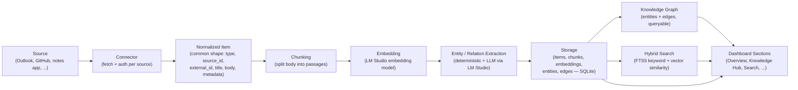

# 01 — System Architecture

Related: [README](../README.md) · [Database schema](02-database-schema.md) ·
[Knowledge graph design](03-knowledge-graph-design.md) ·
[Technology stack](04-technology-stack.md) · [API integrations](05-api-integrations.md) ·
[AI pipeline](07-ai-pipeline.md) · [Outlook collector](15-outlook-collector.md)

## Overview

PID is a single Next.js (App Router) full-stack application, backed by SQLite, plus a background
job worker in the same codebase. There is no PID cloud service: the app, the database, the worker,
and the AI runtime (LM Studio) all run as local processes on the user's machine. A small,
optional **companion collector** process handles sources that can only be reached from the desktop
— the Outlook desktop client and the browser — and hands normalized data back to the main app
over a local-only channel.

The architecture is organized as five layers, strictly one-directional in their dependencies:

```text
UI  ->  API routes  ->  Services  ->  Ingestion / Connectors  ->  Storage
                              ^
                    Background worker (shares Services + Storage)
```

Two things sit *outside* this stack as external local processes the app talks to over localhost:
**LM Studio** (all AI) and the **companion collector** (desktop-only sources).

## Component diagram

```mermaid
flowchart TB
    subgraph Client["Browser (localhost)"]
        UI["Next.js UI\n(React Server + Client Components)"]
    end

    subgraph App["PID Application Process (Node.js)"]
        API["API Routes\n(Next.js Route Handlers)"]

        subgraph Services["Service Layer"]
            SvcOverview["Overview Service"]
            SvcKnowledge["Knowledge Hub Service"]
            SvcMemory["AI Memory Service"]
            SvcResearch["Research Assistant Service"]
            SvcDecision["Decision Support Service"]
            SvcAnalytics["Analytics Service"]
            SvcGoals["Goal Tracking Service"]
            SvcJournal["AI Journal Service"]
            SvcSearch["Search Service"]
            SvcInsights["Insights Service"]
            SvcReview["Review Service"]
            SvcAssistant["AI Assistant Service"]
            SvcGraph["Knowledge Graph Service"]
            SvcAI["AI Orchestration Service"]
        end

        subgraph Ingestion["Ingestion Layer"]
            ConnMgr["Connector Manager"]
            ConnSample["Sample-Data Connector"]
            ConnGraph["Microsoft Graph Connector"]
            ConnGoogle["Google Connector"]
            ConnSlack["Slack / Teams Connector"]
            ConnGitHub["GitHub Connector"]
            ConnOther["... other source connectors"]
            Pipeline["Normalize -> Chunk -> Embed -> Extract Pipeline"]
        end

        subgraph Worker["Background Job Worker"]
            JobQueue["Job Queue (SQLite-backed)"]
            JobRunner["Scheduled + On-Demand Jobs\n(sync, embed, extract, review-gen)"]
        end

        subgraph Storage["Storage Layer (SQLite file, on-disk)"]
            DBCore["Core Tables\n(sources, items, chunks, embeddings, items_fts)"]
            DBDomain["Domain Tables\n(events, emails, tasks, notes, ...)"]
            DBGraph["Graph Tables\n(entities, edges)"]
            DBApp["App Tables\n(goals, journal_entries, insights, reviews, ...)"]
        end
    end

    subgraph External["External Local Processes"]
        LMStudio["LM Studio Server\nOpenAI-compatible API\nhttp://localhost:1234/v1"]
        Companion["Companion Collector\n(desktop-only sources:\nOutlook desktop, browser bookmarks)"]
    end

    UI -->|"HTTP (fetch / server actions)"| API
    API --> Services
    Services --> SvcGraph
    Services --> SvcAI
    Services -->|"read/write"| Storage
    SvcAI -->|"OpenAI-compatible calls"| LMStudio

    API -->|"trigger sync / enqueue job"| JobQueue
    JobRunner --> ConnMgr
    JobRunner --> Pipeline
    JobRunner -->|"read/write"| Storage
    JobRunner -->|"embedding calls"| LMStudio

    ConnMgr --> ConnSample
    ConnMgr --> ConnGraph
    ConnMgr --> ConnGoogle
    ConnMgr --> ConnSlack
    ConnMgr --> ConnGitHub
    ConnMgr --> ConnOther
    ConnMgr -->|"local-only IPC / HTTP"| Companion

    Pipeline --> DBCore
    Pipeline --> DBDomain
    Pipeline --> DBGraph

    ConnGraph -.->|"HTTPS (opt-in)"| MSGraphAPI["Microsoft Graph API"]
    ConnGoogle -.->|"HTTPS (opt-in)"| GoogleAPI["Google APIs"]
    ConnSlack -.->|"HTTPS (opt-in)"| SlackAPI["Slack / Teams API"]
    ConnGitHub -.->|"HTTPS (opt-in)"| GitHubAPI["GitHub API"]
```



Only the dotted edges leave the machine, and only for connectors the user has explicitly enabled.
Everything else — UI, API, services, ingestion, worker, storage, LM Studio, and the companion
collector — communicates over `localhost` or direct process calls.

## Data-flow diagram

This traces one item (an email, a note, a paper, ...) from its source to the dashboard.



Notes on this flow:

- **Normalization** happens inside each connector: every source maps its native shape onto the
  common `items` record defined in [02-database-schema.md](02-database-schema.md), so everything
  downstream is source-agnostic.
- **Chunking and embedding** run in the background worker, not inline with ingestion requests, so
  a slow LM Studio call never blocks a connector sync.
- **Extraction** produces both deterministic edges (e.g., an email's participants become `Person`
  entities linked by `mentions`) and LLM-derived edges; see
  [03-knowledge-graph-design.md](03-knowledge-graph-design.md) for the three linking mechanisms.
- **Hybrid search** and **graph queries** are the two read paths every dashboard section is built
  on; see [07-ai-pipeline.md](07-ai-pipeline.md) for how RAG combines them with citations.

## Module boundaries

| Layer | Responsibility | Depends on | Must not depend on |
|---|---|---|---|
| UI (`app/`, React components) | Render dashboard sections, forms, chat; call API routes only. | API routes | Services, Storage, connectors, LM Studio directly |
| API routes (`app/api/**/route.ts`) | HTTP boundary: auth of local requests, input validation, call into services, shape responses. | Services | Storage internals, connector internals |
| Services (`services/*`) | Business logic per dashboard section; orchestrate graph queries, search, and AI calls. | Knowledge Graph Service, AI Orchestration Service, Storage (via a data-access module) | UI, HTTP concerns, connector-specific code |
| Knowledge Graph Service | Read/write API over `entities`/`edges`; resolution, traversal, similarity linking. | Storage | Connectors, UI |
| AI Orchestration Service | Single chokepoint for all LM Studio calls (chat, embeddings); prompt templates; retries/timeouts. | LM Studio (HTTP) | Storage (receives data, doesn't query it directly) |
| Ingestion / Connectors (`connectors/*`) | Implement the `Connector` interface per source; auth, fetch, normalize. | External source APIs (opt-in), Companion Collector (for desktop sources) | Services, UI |
| Pipeline (`ingestion/pipeline`) | Chunk -> embed -> extract for normalized items, source-agnostic. | AI Orchestration Service, Knowledge Graph Service, Storage | Connector internals |
| Background worker (`worker/*`) | Scheduled and on-demand jobs: connector syncs, pipeline runs, review generation, insight generation. | Ingestion, Services, Storage | UI (worker is headless) |
| Storage (`db/*`, Drizzle schema) | Schema, migrations, typed data access. | SQLite file on disk | Everything above (storage has no upward dependencies) |

This one-directional dependency rule is what keeps the seeded sample-data connector swappable for
real connectors, and what keeps LM Studio swappable for another OpenAI-compatible endpoint,
without touching UI or service code. See [04-technology-stack.md](04-technology-stack.md) for the
concrete libraries used at each layer and [13-open-source-tools.md](13-open-source-tools.md) for
third-party dependencies.

## The companion collector

Most connectors run entirely inside the main app process and talk to cloud APIs directly (Graph,
Google, Slack, GitHub, ...). A few sources are only reachable from the desktop session the user is
logged into:

- **Outlook desktop / classic MAPI access** — needed when an account has no usable cloud or IMAP
  tap (e.g., certain on-prem Exchange configurations); requires COM automation against the running
  Outlook client. Full tap-selection logic lives in
  [15-outlook-collector.md](15-outlook-collector.md).
- **Browser bookmarks** — live in the browser's local profile store, not behind any API.

For these, a small, optional **companion collector** process runs alongside the main app, performs
the desktop-local access, normalizes what it finds into the same item shape every other connector
produces, and hands it to the Connector Manager over a local-only channel (localhost HTTP or IPC —
never a network hop off the machine). From the Ingestion layer's point of view, the companion
collector is just another connector source; the rest of the pipeline (chunk, embed, extract,
store) is identical.

## Background worker

The worker runs in the same codebase and process family as the app (see
[04-technology-stack.md](04-technology-stack.md) for whether it's a separate Node process or an
in-process scheduler) and owns everything that shouldn't block a user-facing request:

| Job type | Trigger | Work |
|---|---|---|
| Connector sync | Schedule (per-connector interval) or manual "Sync now" | Fetch new/changed items via a connector, normalize, enqueue for the pipeline |
| Pipeline run | After a sync produces new/changed items | Chunk, embed (LM Studio), extract entities/edges, write to storage |
| Insight generation | Schedule (e.g., nightly) | Scan recent graph activity for patterns/anomalies, write `insights` rows |
| Review generation | Schedule (weekly/monthly) | Synthesize a `reviews` row from the period's items, goals, and insights |
| Maintenance | Schedule | Re-embed on model change, vacuum, FTS rebuild, `sync_state` cleanup |

Jobs are tracked in the `jobs` table (see [02-database-schema.md](02-database-schema.md)) so the
UI can show sync status without the worker exposing any network port beyond localhost.

## Dashboard sections mapped to services

Every dashboard section is a thin UI layer over exactly one primary service (which itself may call
the Knowledge Graph Service and the AI Orchestration Service):

| Dashboard section | Primary service | Reads from | Uses AI Orchestration for |
|---|---|---|---|
| Executive Overview | Overview Service | Items, tasks, events, insights (recent window) | Daily brief summarization |
| Knowledge Hub | Knowledge Hub Service | Items, chunks, entities/edges | — (browse/facet, AI optional) |
| AI Memory | AI Memory Service | `ai_conversations`, entities/edges | Memory extraction from conversations |
| Research Assistant | Research Assistant Service | Papers, documents, chunks, embeddings | Summarization, citation-backed Q&A (RAG) |
| Decision Support | Decision Support Service | `decisions`, linked entities/edges | Option analysis, rationale drafting |
| Personal Analytics | Analytics Service | Domain tables (health, finance, ...) | Trend narration |
| Goal Tracking | Goal Tracking Service | `goals`, `milestones`, `habits`, `habit_logs` | Progress narration, suggested next actions |
| AI Journal | AI Journal Service | `journal_entries`, day's ingested items | Prompt generation, reflection summarization |
| Smart Search | Search Service | `items_fts`, embeddings (hybrid) | Query understanding, result synthesis |
| AI Insights | Insights Service | `insights`, entities/edges | Pattern/anomaly detection |
| Weekly/Monthly Reviews | Review Service | `reviews`, period's items/goals/insights | Review synthesis |
| AI Assistant | AI Assistant Service | Everything, via Knowledge Graph + Search | Full conversational RAG |

Every "Uses AI Orchestration for" call is routed through the single AI Orchestration Service
chokepoint described above, so LM Studio's base URL and model name (see
[07-ai-pipeline.md](07-ai-pipeline.md)) are configured once and apply everywhere.
