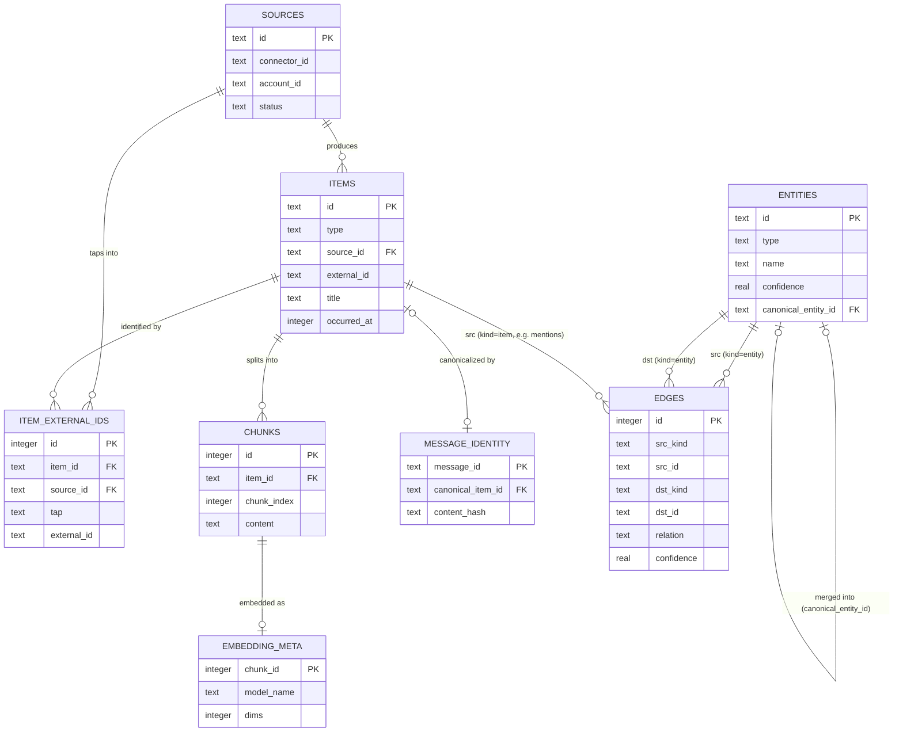
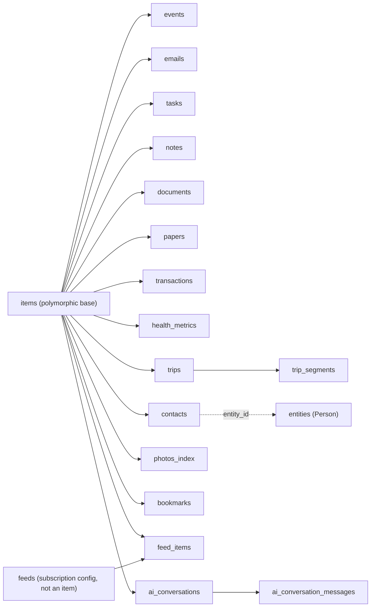

# 02 — Database Schema

Related: [README](../README.md) · [System architecture](01-system-architecture.md) ·
[Knowledge graph design](03-knowledge-graph-design.md) · [API integrations](05-api-integrations.md)
(planned) · [Outlook collector](15-outlook-collector.md) (planned)

## Overview

PID has exactly one database: a single SQLite file, opened by the Next.js app and the background
worker via `better-sqlite3`, schema-managed by **Drizzle ORM** (per the locked decisions in the
[README](../README.md)). There is no per-source database and no external vector store — full-text
search (**FTS5**) and vector similarity (**sqlite-vec**) both live as virtual tables inside the
same file, so a single `.sqlite` file is the entire durable state of the product.

The schema has four groups of tables, matching the storage layer in
[01-system-architecture.md](01-system-architecture.md#component-diagram):

| Group | Tables | Purpose |
|---|---|---|
| **Core** | `sources`, `items`, `item_external_ids`, `chunks`, `embeddings`, `embedding_meta`, `items_fts` | The polymorphic ingestion spine every connector writes to, and the two search indexes built on top of it. |
| **Graph** | `entities`, `edges` | The property graph. Full design rationale in [03-knowledge-graph-design.md](03-knowledge-graph-design.md); this doc owns the canonical DDL. |
| **Domain** | `events`, `emails`, `tasks`, `notes`, `documents`, `papers`, `transactions`, `health_metrics`, `trips`, `trip_segments`, `contacts`, `photos_index`, `bookmarks`, `feeds`, `feed_items`, `ai_conversations`, `ai_conversation_messages` | Type-specific columns for each ingested content type, extending `items` 1:1. |
| **App** | `goals`, `milestones`, `habits`, `habit_logs`, `journal_entries`, `insights`, `reviews`, `decisions`, `jobs`, `settings`, `sync_state`, `message_identity` | State that PID itself creates and owns — not mirrored from any external source. |

## Conventions

These conventions apply to every table below unless a table explicitly overrides one:

| Convention | Rule |
|---|---|
| Primary keys | `TEXT` **ULID** (26-char, lexicographically time-sortable) for any row referenced across ingestion boundaries or by the user (`sources`, `items`, `entities`, `goals`, ...). Plain `INTEGER PRIMARY KEY AUTOINCREMENT` for high-volume, internally-referenced-only rows (`chunks`, `edges`, `jobs`, `habit_logs`, ...). |
| Timestamps | `INTEGER` Unix epoch **milliseconds**. Drizzle column mode `timestamp_ms`. No `TEXT` datetimes, so all timestamp math stays integer arithmetic in SQL. |
| Booleans | `INTEGER` 0/1. Drizzle column mode `boolean`. |
| JSON | `TEXT` column holding a JSON string, read/written through SQLite's built-in JSON1 functions (`json_extract`, `->>`) when queried directly. Drizzle column mode `json` with a `$type<...>()` annotation. |
| Money | `INTEGER` minor units (cents) plus a currency code — never `REAL`. |
| Foreign keys | Declared and enforced (`PRAGMA foreign_keys = ON` is set at connection time by the storage layer). `ON DELETE CASCADE` for owned children (a `chunk` has no meaning without its `item`); `ON DELETE SET NULL` for soft references (a `job` outliving the `item` it once processed). |
| Soft delete | Only `items.is_deleted` — domain/app tables cascade-delete with their parent `item`; app-owned tables (`goals`, `decisions`, ...) hard-delete. |
| Extensibility | Enum-shaped columns (`items.type`, `entities.type`, `edges.relation`, ...) are plain `TEXT`, documented with a recommended value set, not a rigid SQL `CHECK` list — new connectors and entity types must not require a migration. |

Migrations are plain Drizzle Kit SQL migration files checked into `db/migrations/`; there is no
separate schema-description format — the `sqliteTable()` definitions below **are** the schema, and
the two virtual tables (`embeddings`, `items_fts`) are created by raw-SQL migrations that Drizzle
Kit ships alongside the generated ones (Drizzle's schema builder has no native virtual-table
support). See [04-technology-stack.md](04-technology-stack.md) (planned) for tooling detail and
[11-scalability.md](11-scalability.md) (planned) for `PRAGMA journal_mode = WAL` and file-size
guidance.

---

## Core tables

`items` is the unified record for **every ingested thing** — the row every domain table extends
1:1 and the row every chunk, embedding, and FTS match ultimately points back to. `sources` is the
registry of configured connector instances (one row per account/connector pair) that `items.source_id`
points into. `item_external_ids` and `message_identity` exist because a single real-world thing
(an email, an event) can be **ingested more than once, by more than one tap** — see
[15-outlook-collector.md](15-outlook-collector.md) (planned) — and need to collapse to one `items`
row.

### SQL DDL

```sql
CREATE TABLE sources (
    id              TEXT PRIMARY KEY,               -- ULID
    connector_id    TEXT NOT NULL,                   -- matches Connector.id, see docs/05
    account_id      TEXT NOT NULL,                   -- external account identifier (email, username, folder path, repo slug)
    display_name    TEXT NOT NULL,
    category        TEXT NOT NULL,                   -- email|calendar|tasks|notes|documents|papers|cloud_storage|code|chat|bookmarks|finance|health|travel|photos|contacts|feed|weather|ai_conversation|sample
    config          TEXT,                             -- JSON, connector-specific non-secret settings
    enabled         INTEGER NOT NULL DEFAULT 1,
    status          TEXT NOT NULL DEFAULT 'ok',        -- ok|stale|auth_failed|needs_consent|tap_unavailable
    status_reason   TEXT,
    last_sync_at    INTEGER,
    created_at      INTEGER NOT NULL,
    updated_at      INTEGER NOT NULL,
    UNIQUE (connector_id, account_id)
);

CREATE TABLE items (
    id              TEXT PRIMARY KEY,               -- ULID
    type            TEXT NOT NULL,                   -- event|email|task|note|document|paper|transaction|health_metric|trip|contact|photo|bookmark|feed_item|ai_conversation
    source_id       TEXT NOT NULL REFERENCES sources(id) ON DELETE CASCADE,
    external_id     TEXT NOT NULL,                   -- native id from whichever tap first created this row
    title           TEXT,
    body            TEXT,
    body_format     TEXT NOT NULL DEFAULT 'text',     -- text|markdown|html
    url             TEXT,
    occurred_at     INTEGER,                          -- the semantically relevant instant (sent/created/happened)
    content_hash    TEXT,                             -- normalized hash of title+body, used for change detection
    metadata        TEXT,                             -- JSON, type- and connector-specific extras
    is_deleted      INTEGER NOT NULL DEFAULT 0,
    created_at      INTEGER NOT NULL,
    updated_at      INTEGER NOT NULL,
    ingested_at     INTEGER NOT NULL,
    UNIQUE (source_id, external_id)
);

-- Every native identifier that has ever resolved to this canonical item, across every tap that
-- has ever reported it (e.g. a Graph delta sync and a COM backfill both see the same email).
CREATE TABLE item_external_ids (
    id               INTEGER PRIMARY KEY AUTOINCREMENT,
    item_id          TEXT NOT NULL REFERENCES items(id) ON DELETE CASCADE,
    source_id        TEXT NOT NULL REFERENCES sources(id) ON DELETE CASCADE,
    tap              TEXT NOT NULL,                   -- graph|imap|com|caldav|rss|manual|filesystem|api
    external_id      TEXT NOT NULL,                   -- stringified native id
    raw_identifiers  TEXT,                             -- JSON, structured parts, e.g. {"uidvalidity":.,"uid":.,"modseq":.} or {"entryId":.,"storeId":.}
    first_seen_at    INTEGER NOT NULL,
    last_seen_at     INTEGER NOT NULL,
    UNIQUE (source_id, tap, external_id)
);

CREATE TABLE chunks (
    id          INTEGER PRIMARY KEY AUTOINCREMENT,
    item_id     TEXT NOT NULL REFERENCES items(id) ON DELETE CASCADE,
    chunk_index INTEGER NOT NULL,
    content     TEXT NOT NULL,
    token_count INTEGER,
    char_start  INTEGER,
    char_end    INTEGER,
    created_at  INTEGER NOT NULL,
    UNIQUE (item_id, chunk_index)
);

-- sqlite-vec virtual table. rowid is deliberately set equal to chunks.id on insert
-- (`INSERT INTO embeddings(rowid, embedding) VALUES (?, ?)`) so a KNN hit joins straight back to
-- its chunk with no side table. 768 matches the default LM Studio embedding model
-- (nomic-embed-text); the dimension is a build-time constant re-declared if the configured
-- embedding model changes (see the re-embed maintenance job in docs/01).
CREATE VIRTUAL TABLE embeddings USING vec0(
    embedding FLOAT[768]
);

-- Provenance for each embedding row that vec0 itself can't hold (model may change over the life
-- of the database; re-embedding jobs need to know what produced the vector they're replacing).
CREATE TABLE embedding_meta (
    chunk_id    INTEGER PRIMARY KEY REFERENCES chunks(id) ON DELETE CASCADE,
    model_name  TEXT NOT NULL,
    dims        INTEGER NOT NULL,
    created_at  INTEGER NOT NULL
);

-- FTS5 external-content table over items. `items` keeps its implicit integer rowid even though
-- its declared primary key is the TEXT ulid `id` (SQLite only aliases rowid when the PK column is
-- declared INTEGER), so content_rowid='rowid' is valid here.
CREATE VIRTUAL TABLE items_fts USING fts5(
    title,
    body,
    content = 'items',
    content_rowid = 'rowid'
);

-- Keep items_fts in sync with items.
CREATE TRIGGER items_ai AFTER INSERT ON items BEGIN
    INSERT INTO items_fts(rowid, title, body) VALUES (new.rowid, new.title, new.body);
END;
CREATE TRIGGER items_ad AFTER DELETE ON items BEGIN
    INSERT INTO items_fts(items_fts, rowid, title, body) VALUES ('delete', old.rowid, old.title, old.body);
END;
CREATE TRIGGER items_au AFTER UPDATE ON items BEGIN
    INSERT INTO items_fts(items_fts, rowid, title, body) VALUES ('delete', old.rowid, old.title, old.body);
    INSERT INTO items_fts(rowid, title, body) VALUES (new.rowid, new.title, new.body);
END;
```

### Drizzle sketch

```ts
// db/schema/core.ts
import { sqliteTable, text, integer, uniqueIndex, index } from "drizzle-orm/sqlite-core";

export const sources = sqliteTable("sources", {
  id: text("id").primaryKey(),
  connectorId: text("connector_id").notNull(),
  accountId: text("account_id").notNull(),
  displayName: text("display_name").notNull(),
  category: text("category").notNull(),
  config: text("config", { mode: "json" }).$type<Record<string, unknown>>(),
  enabled: integer("enabled", { mode: "boolean" }).notNull().default(true),
  status: text("status").notNull().default("ok"),
  statusReason: text("status_reason"),
  lastSyncAt: integer("last_sync_at", { mode: "timestamp_ms" }),
  createdAt: integer("created_at", { mode: "timestamp_ms" }).notNull(),
  updatedAt: integer("updated_at", { mode: "timestamp_ms" }).notNull(),
}, (t) => ({
  connectorAccountUq: uniqueIndex("sources_connector_account_uq").on(t.connectorId, t.accountId),
}));

export const items = sqliteTable("items", {
  id: text("id").primaryKey(),
  type: text("type").notNull(),
  sourceId: text("source_id").notNull().references(() => sources.id, { onDelete: "cascade" }),
  externalId: text("external_id").notNull(),
  title: text("title"),
  body: text("body"),
  bodyFormat: text("body_format").notNull().default("text"),
  url: text("url"),
  occurredAt: integer("occurred_at", { mode: "timestamp_ms" }),
  contentHash: text("content_hash"),
  metadata: text("metadata", { mode: "json" }).$type<Record<string, unknown>>(),
  isDeleted: integer("is_deleted", { mode: "boolean" }).notNull().default(false),
  createdAt: integer("created_at", { mode: "timestamp_ms" }).notNull(),
  updatedAt: integer("updated_at", { mode: "timestamp_ms" }).notNull(),
  ingestedAt: integer("ingested_at", { mode: "timestamp_ms" }).notNull(),
}, (t) => ({
  sourceExternalUq: uniqueIndex("items_source_external_uq").on(t.sourceId, t.externalId),
  typeIdx: index("items_type_idx").on(t.type),
  occurredAtIdx: index("items_occurred_at_idx").on(t.occurredAt),
}));

export const itemExternalIds = sqliteTable("item_external_ids", {
  id: integer("id").primaryKey({ autoIncrement: true }),
  itemId: text("item_id").notNull().references(() => items.id, { onDelete: "cascade" }),
  sourceId: text("source_id").notNull().references(() => sources.id, { onDelete: "cascade" }),
  tap: text("tap").notNull(),
  externalId: text("external_id").notNull(),
  rawIdentifiers: text("raw_identifiers", { mode: "json" }).$type<Record<string, unknown>>(),
  firstSeenAt: integer("first_seen_at", { mode: "timestamp_ms" }).notNull(),
  lastSeenAt: integer("last_seen_at", { mode: "timestamp_ms" }).notNull(),
}, (t) => ({
  sourceTapExternalUq: uniqueIndex("item_ext_ids_source_tap_external_uq").on(t.sourceId, t.tap, t.externalId),
  itemIdx: index("item_ext_ids_item_idx").on(t.itemId),
}));

export const chunks = sqliteTable("chunks", {
  id: integer("id").primaryKey({ autoIncrement: true }),
  itemId: text("item_id").notNull().references(() => items.id, { onDelete: "cascade" }),
  chunkIndex: integer("chunk_index").notNull(),
  content: text("content").notNull(),
  tokenCount: integer("token_count"),
  charStart: integer("char_start"),
  charEnd: integer("char_end"),
  createdAt: integer("created_at", { mode: "timestamp_ms" }).notNull(),
}, (t) => ({
  itemChunkUq: uniqueIndex("chunks_item_chunk_uq").on(t.itemId, t.chunkIndex),
}));

export const embeddingMeta = sqliteTable("embedding_meta", {
  chunkId: integer("chunk_id").primaryKey().references(() => chunks.id, { onDelete: "cascade" }),
  modelName: text("model_name").notNull(),
  dims: integer("dims").notNull(),
  createdAt: integer("created_at", { mode: "timestamp_ms" }).notNull(),
});

// `embeddings` (vec0) and `items_fts` (fts5) are virtual tables created by raw-SQL migrations —
// Drizzle Kit has no builder for them. Query them with drizzle's `sql` template, typed by hand:
//   sql<{ chunk_id: number; distance: number }>`
//     SELECT rowid AS chunk_id, distance FROM embeddings
//     WHERE embedding MATCH ${queryVector} ORDER BY distance LIMIT ${k}`
```

---

## Graph tables

`entities` and `edges` hold the property graph. This doc defines the canonical DDL; the *design
rationale* — the entity/edge type taxonomy, the three linking mechanisms, resolution, query
patterns, and visualization — lives entirely in
[03-knowledge-graph-design.md](03-knowledge-graph-design.md) to avoid duplicating that discussion
here.

One structural note that matters for the DDL: an edge's endpoints can be **either an entity or an
item** (`src_kind`/`dst_kind`). This is what lets a single `edges` table represent both grounding
("this email **mentions** this Person") and inference ("this Paper is **authored_by** this
Person") without a separate join table. Because SQLite has no polymorphic foreign key, `src_id`/
`dst_id` are unconstrained `TEXT` at the schema level; referential integrity across the two
possible target tables is enforced by the Knowledge Graph Service (the sole writer to these
tables — see [01-system-architecture.md](01-system-architecture.md#module-boundaries)), not by SQL.

```sql
CREATE TABLE entities (
    id                  TEXT PRIMARY KEY,           -- ULID
    type                TEXT NOT NULL,               -- Person|Organization|Project|Paper|Topic|Place|Event|Tool|Goal|...
    name                TEXT NOT NULL,
    aliases             TEXT,                         -- JSON string[]
    description         TEXT,
    attributes          TEXT,                         -- JSON, type-specific properties
    canonical_entity_id TEXT REFERENCES entities(id), -- set when this row was merged into another (dedupe)
    confidence          REAL NOT NULL DEFAULT 1.0,
    mention_count       INTEGER NOT NULL DEFAULT 0,
    provenance          TEXT,                         -- JSON [{item_id, method, confidence, extracted_at}]
    first_seen_at       INTEGER NOT NULL,
    last_seen_at        INTEGER NOT NULL,
    created_at          INTEGER NOT NULL,
    updated_at          INTEGER NOT NULL
);

CREATE TABLE edges (
    id                     INTEGER PRIMARY KEY AUTOINCREMENT,
    src_kind               TEXT NOT NULL CHECK (src_kind IN ('entity', 'item')),
    src_id                 TEXT NOT NULL,
    dst_kind               TEXT NOT NULL CHECK (dst_kind IN ('entity', 'item')),
    dst_id                 TEXT NOT NULL,
    relation               TEXT NOT NULL,              -- mentions|authored_by|attended|relates_to|part_of|located_in|similar_to|...
    weight                 REAL NOT NULL DEFAULT 1.0,
    confidence             REAL NOT NULL DEFAULT 1.0,
    method                 TEXT NOT NULL,               -- deterministic|llm_extraction|embedding_similarity
    primary_source_item_id TEXT REFERENCES items(id) ON DELETE SET NULL,
    provenance             TEXT,                         -- JSON [{item_id, method, confidence, extracted_at}]
    attributes              TEXT,                         -- JSON
    created_at              INTEGER NOT NULL,
    updated_at              INTEGER NOT NULL
);

CREATE INDEX edges_src_idx ON edges(src_kind, src_id);
CREATE INDEX edges_dst_idx ON edges(dst_kind, dst_id);
CREATE INDEX edges_relation_idx ON edges(relation);
CREATE INDEX entities_type_name_idx ON entities(type, name);
CREATE INDEX entities_canonical_idx ON entities(canonical_entity_id);

-- sqlite-vec virtual table for entity-level descriptive embeddings (name + description +
-- concatenated high-confidence mention contexts). rowid is set equal to entities.rowid on insert,
-- the same pattern used by the chunk-level `embeddings` table above. This is what powers the
-- embedding-similarity linking mechanism and `similar_to` edges — see
-- docs/03-knowledge-graph-design.md#3-embedding-similarity.
CREATE VIRTUAL TABLE entity_embeddings USING vec0(
    embedding FLOAT[768]
);

CREATE TABLE entity_embedding_meta (
    entity_id   TEXT PRIMARY KEY REFERENCES entities(id) ON DELETE CASCADE,
    model_name  TEXT NOT NULL,
    dims        INTEGER NOT NULL,
    created_at  INTEGER NOT NULL
);
```

```ts
// db/schema/graph.ts
import { sqliteTable, text, integer, real, index } from "drizzle-orm/sqlite-core";

export const entities = sqliteTable("entities", {
  id: text("id").primaryKey(),
  type: text("type").notNull(),
  name: text("name").notNull(),
  aliases: text("aliases", { mode: "json" }).$type<string[]>(),
  description: text("description"),
  attributes: text("attributes", { mode: "json" }).$type<Record<string, unknown>>(),
  canonicalEntityId: text("canonical_entity_id"),
  confidence: real("confidence").notNull().default(1.0),
  mentionCount: integer("mention_count").notNull().default(0),
  provenance: text("provenance", { mode: "json" }).$type<ProvenanceEntry[]>(),
  firstSeenAt: integer("first_seen_at", { mode: "timestamp_ms" }).notNull(),
  lastSeenAt: integer("last_seen_at", { mode: "timestamp_ms" }).notNull(),
  createdAt: integer("created_at", { mode: "timestamp_ms" }).notNull(),
  updatedAt: integer("updated_at", { mode: "timestamp_ms" }).notNull(),
}, (t) => ({
  typeNameIdx: index("entities_type_name_idx").on(t.type, t.name),
  canonicalIdx: index("entities_canonical_idx").on(t.canonicalEntityId),
}));

export const edges = sqliteTable("edges", {
  id: integer("id").primaryKey({ autoIncrement: true }),
  srcKind: text("src_kind", { enum: ["entity", "item"] }).notNull(),
  srcId: text("src_id").notNull(),
  dstKind: text("dst_kind", { enum: ["entity", "item"] }).notNull(),
  dstId: text("dst_id").notNull(),
  relation: text("relation").notNull(),
  weight: real("weight").notNull().default(1.0),
  confidence: real("confidence").notNull().default(1.0),
  method: text("method").notNull(),
  primarySourceItemId: text("primary_source_item_id"),
  provenance: text("provenance", { mode: "json" }).$type<ProvenanceEntry[]>(),
  attributes: text("attributes", { mode: "json" }).$type<Record<string, unknown>>(),
  createdAt: integer("created_at", { mode: "timestamp_ms" }).notNull(),
  updatedAt: integer("updated_at", { mode: "timestamp_ms" }).notNull(),
}, (t) => ({
  srcIdx: index("edges_src_idx").on(t.srcKind, t.srcId),
  dstIdx: index("edges_dst_idx").on(t.dstKind, t.dstId),
  relationIdx: index("edges_relation_idx").on(t.relation),
}));

type ProvenanceEntry = { itemId: string; method: string; confidence: number; extractedAt: number };

export const entityEmbeddingMeta = sqliteTable("entity_embedding_meta", {
  entityId: text("entity_id").primaryKey().references(() => entities.id, { onDelete: "cascade" }),
  modelName: text("model_name").notNull(),
  dims: integer("dims").notNull(),
  createdAt: integer("created_at", { mode: "timestamp_ms" }).notNull(),
});

// `entity_embeddings` (vec0) is a virtual table created by a raw-SQL migration, same pattern as
// `embeddings` in db/schema/core.ts — queried via drizzle's `sql` template, not the schema builder.
```

---

## Domain tables

Every domain table below shares one shape: its primary key **is** `item_id`, a 1:1 extension of
`items` (table-per-type inheritance). `items` carries everything source-agnostic (title, body,
timestamps, metadata); the domain table carries only the columns that are meaningless for any
other type. Deleting an `items` row cascades to its domain row.

| `items.type` | Domain table | Extra columns beyond `item_id` |
|---|---|---|
| `event` | `events` | `start_at`, `end_at`, `all_day`, `location`, `organizer_email`, `attendees` (JSON), `status`, `response_status`, `recurrence_rule`, `recurrence_master_item_id`, `calendar_uid` |
| `email` | `emails` | `message_id`, `thread_id`, `from_address`, `from_name`, `to_addresses` (JSON), `cc_addresses` (JSON), `folder`, `is_read`, `has_attachments`, `importance` |
| `task` | `tasks` | `status`, `priority`, `due_at`, `completed_at`, `project`, `recurrence_rule` |
| `note` | `notes` | `notebook`, `tags` (JSON), `pinned` |
| `document` | `documents` | `file_path`, `mime_type`, `file_size_bytes`, `page_count`, `checksum` |
| `paper` | `papers` | `authors` (JSON), `venue`, `year`, `doi`, `arxiv_id`, `citation_count`, `abstract` |
| `transaction` | `transactions` | `amount_cents`, `currency`, `account`, `category`, `merchant`, `transaction_date` |
| `health_metric` | `health_metrics` | `metric_type`, `value`, `unit`, `recorded_at`, `source_device` |
| `trip` | `trips` (+ `trip_segments` child) | `destination`, `start_date`, `end_date`, `status` |
| `contact` | `contacts` | `display_name`, `emails` (JSON), `phones` (JSON), `company`, `entity_id` (link to the graph's `Person` entity) |
| `photo` | `photos_index` | `file_path`, `taken_at`, `gps_lat`, `gps_lon`, `camera_model`, `width`, `height`, `perceptual_hash` |
| `bookmark` | `bookmarks` | `url`, `folder_path`, `favicon_url` |
| `feed_item` | `feed_items` (child of `feeds`) | `feed_id`, `url`, `published_at`, `author` |
| `ai_conversation` | `ai_conversations` (+ `ai_conversation_messages` child) | `model_name`, `started_at`, `ended_at`, `message_count` |

`feeds` is a connector-level subscription registry (RSS/news feed URLs), not itself an `items` row
— its children (`feed_items`) are.

### SQL DDL

```sql
CREATE TABLE events (
    item_id                   TEXT PRIMARY KEY REFERENCES items(id) ON DELETE CASCADE,
    start_at                  INTEGER NOT NULL,
    end_at                    INTEGER,
    all_day                   INTEGER NOT NULL DEFAULT 0,
    location                  TEXT,
    organizer_email           TEXT,
    attendees                 TEXT,          -- JSON [{name,email,response_status}]
    status                    TEXT,           -- confirmed|tentative|cancelled
    response_status           TEXT,           -- accepted|declined|tentative|none
    recurrence_rule           TEXT,           -- RRULE, present on the recurrence master only
    recurrence_master_item_id TEXT REFERENCES items(id),
    calendar_uid              TEXT            -- iCalendar UID; cross-tap identity analog to message_identity
);
CREATE INDEX events_start_at_idx ON events(start_at);
CREATE INDEX events_master_idx ON events(recurrence_master_item_id);

CREATE TABLE emails (
    item_id          TEXT PRIMARY KEY REFERENCES items(id) ON DELETE CASCADE,
    message_id       TEXT NOT NULL,    -- RFC 5322 Message-ID; also the PK of message_identity
    thread_id        TEXT,
    from_address     TEXT,
    from_name        TEXT,
    to_addresses     TEXT,              -- JSON string[]
    cc_addresses     TEXT,              -- JSON string[]
    folder           TEXT,
    is_read          INTEGER NOT NULL DEFAULT 0,
    has_attachments  INTEGER NOT NULL DEFAULT 0,
    importance       TEXT
);
CREATE INDEX emails_message_id_idx ON emails(message_id);
CREATE INDEX emails_thread_id_idx ON emails(thread_id);

CREATE TABLE tasks (
    item_id         TEXT PRIMARY KEY REFERENCES items(id) ON DELETE CASCADE,
    status          TEXT NOT NULL DEFAULT 'open',   -- open|in_progress|done|cancelled
    priority        TEXT,                            -- low|medium|high
    due_at          INTEGER,
    completed_at    INTEGER,
    project         TEXT,
    recurrence_rule TEXT
);
CREATE INDEX tasks_due_status_idx ON tasks(due_at, status);

CREATE TABLE notes (
    item_id  TEXT PRIMARY KEY REFERENCES items(id) ON DELETE CASCADE,
    notebook TEXT,
    tags     TEXT,       -- JSON string[]
    pinned   INTEGER NOT NULL DEFAULT 0
);

CREATE TABLE documents (
    item_id         TEXT PRIMARY KEY REFERENCES items(id) ON DELETE CASCADE,
    file_path       TEXT,
    mime_type       TEXT,
    file_size_bytes INTEGER,
    page_count      INTEGER,
    checksum        TEXT
);

CREATE TABLE papers (
    item_id         TEXT PRIMARY KEY REFERENCES items(id) ON DELETE CASCADE,
    authors         TEXT,     -- JSON string[]
    venue           TEXT,
    year            INTEGER,
    doi             TEXT,
    arxiv_id        TEXT,
    citation_count  INTEGER,
    abstract        TEXT
);
CREATE INDEX papers_doi_idx ON papers(doi);

CREATE TABLE transactions (
    item_id          TEXT PRIMARY KEY REFERENCES items(id) ON DELETE CASCADE,
    amount_cents     INTEGER NOT NULL,
    currency         TEXT NOT NULL DEFAULT 'USD',
    account          TEXT,
    category         TEXT,
    merchant         TEXT,
    transaction_date INTEGER NOT NULL
);
CREATE INDEX transactions_date_idx ON transactions(transaction_date);
CREATE INDEX transactions_category_idx ON transactions(category);

CREATE TABLE health_metrics (
    item_id       TEXT PRIMARY KEY REFERENCES items(id) ON DELETE CASCADE,
    metric_type   TEXT NOT NULL,     -- steps|sleep_minutes|heart_rate|weight_kg|...
    value         REAL NOT NULL,
    unit          TEXT,
    recorded_at   INTEGER NOT NULL,
    source_device TEXT
);
CREATE INDEX health_metrics_type_recorded_idx ON health_metrics(metric_type, recorded_at);

CREATE TABLE trips (
    item_id     TEXT PRIMARY KEY REFERENCES items(id) ON DELETE CASCADE,
    destination TEXT,
    start_date  INTEGER,
    end_date    INTEGER,
    status      TEXT     -- planned|booked|in_progress|completed|cancelled
);

CREATE TABLE trip_segments (
    id                INTEGER PRIMARY KEY AUTOINCREMENT,
    trip_item_id      TEXT NOT NULL REFERENCES trips(item_id) ON DELETE CASCADE,
    segment_type      TEXT NOT NULL,   -- flight|hotel|car|train|other
    start_at          INTEGER,
    end_at            INTEGER,
    confirmation_code TEXT,
    details           TEXT              -- JSON
);
CREATE INDEX trip_segments_trip_idx ON trip_segments(trip_item_id);

CREATE TABLE contacts (
    item_id      TEXT PRIMARY KEY REFERENCES items(id) ON DELETE CASCADE,
    display_name TEXT NOT NULL,
    emails       TEXT,      -- JSON string[]
    phones       TEXT,      -- JSON string[]
    company      TEXT,
    entity_id    TEXT REFERENCES entities(id)   -- linked Person entity in the graph
);

CREATE TABLE photos_index (
    item_id          TEXT PRIMARY KEY REFERENCES items(id) ON DELETE CASCADE,
    file_path        TEXT NOT NULL,
    taken_at         INTEGER,
    gps_lat          REAL,
    gps_lon          REAL,
    camera_model     TEXT,
    width            INTEGER,
    height           INTEGER,
    perceptual_hash  TEXT
);
CREATE INDEX photos_taken_at_idx ON photos_index(taken_at);

CREATE TABLE bookmarks (
    item_id      TEXT PRIMARY KEY REFERENCES items(id) ON DELETE CASCADE,
    url          TEXT NOT NULL,
    folder_path  TEXT,
    favicon_url  TEXT
);

CREATE TABLE feeds (
    id                     TEXT PRIMARY KEY,     -- ULID
    source_id              TEXT NOT NULL REFERENCES sources(id) ON DELETE CASCADE,
    url                    TEXT NOT NULL,
    title                  TEXT,
    site_url               TEXT,
    etag                   TEXT,
    last_modified          TEXT,
    poll_interval_minutes  INTEGER NOT NULL DEFAULT 60,
    last_polled_at         INTEGER
);

CREATE TABLE feed_items (
    item_id      TEXT PRIMARY KEY REFERENCES items(id) ON DELETE CASCADE,
    feed_id      TEXT NOT NULL REFERENCES feeds(id) ON DELETE CASCADE,
    url          TEXT,
    published_at INTEGER,
    author       TEXT
);
CREATE INDEX feed_items_feed_idx ON feed_items(feed_id);

CREATE TABLE ai_conversations (
    item_id        TEXT PRIMARY KEY REFERENCES items(id) ON DELETE CASCADE,
    model_name     TEXT,
    started_at     INTEGER,
    ended_at       INTEGER,
    message_count  INTEGER NOT NULL DEFAULT 0
);

CREATE TABLE ai_conversation_messages (
    id                  INTEGER PRIMARY KEY AUTOINCREMENT,
    conversation_item_id TEXT NOT NULL REFERENCES ai_conversations(item_id) ON DELETE CASCADE,
    role                TEXT NOT NULL,     -- user|assistant|system|tool
    content             TEXT NOT NULL,
    token_count         INTEGER,
    created_at          INTEGER NOT NULL
);
CREATE INDEX ai_conv_messages_conv_idx ON ai_conversation_messages(conversation_item_id);
```

### Drizzle sketch

```ts
// db/schema/domain.ts
import { sqliteTable, text, integer, real, index } from "drizzle-orm/sqlite-core";
import { items, sources } from "./core";
import { entities } from "./graph";

export const events = sqliteTable("events", {
  itemId: text("item_id").primaryKey().references(() => items.id, { onDelete: "cascade" }),
  startAt: integer("start_at", { mode: "timestamp_ms" }).notNull(),
  endAt: integer("end_at", { mode: "timestamp_ms" }),
  allDay: integer("all_day", { mode: "boolean" }).notNull().default(false),
  location: text("location"),
  organizerEmail: text("organizer_email"),
  attendees: text("attendees", { mode: "json" }).$type<{ name?: string; email: string; responseStatus?: string }[]>(),
  status: text("status"),
  responseStatus: text("response_status"),
  recurrenceRule: text("recurrence_rule"),
  recurrenceMasterItemId: text("recurrence_master_item_id"),
  calendarUid: text("calendar_uid"),
}, (t) => ({ startAtIdx: index("events_start_at_idx").on(t.startAt) }));

export const emails = sqliteTable("emails", {
  itemId: text("item_id").primaryKey().references(() => items.id, { onDelete: "cascade" }),
  messageId: text("message_id").notNull(),
  threadId: text("thread_id"),
  fromAddress: text("from_address"),
  fromName: text("from_name"),
  toAddresses: text("to_addresses", { mode: "json" }).$type<string[]>(),
  ccAddresses: text("cc_addresses", { mode: "json" }).$type<string[]>(),
  folder: text("folder"),
  isRead: integer("is_read", { mode: "boolean" }).notNull().default(false),
  hasAttachments: integer("has_attachments", { mode: "boolean" }).notNull().default(false),
  importance: text("importance"),
}, (t) => ({
  messageIdIdx: index("emails_message_id_idx").on(t.messageId),
  threadIdIdx: index("emails_thread_id_idx").on(t.threadId),
}));

export const tasks = sqliteTable("tasks", {
  itemId: text("item_id").primaryKey().references(() => items.id, { onDelete: "cascade" }),
  status: text("status").notNull().default("open"),
  priority: text("priority"),
  dueAt: integer("due_at", { mode: "timestamp_ms" }),
  completedAt: integer("completed_at", { mode: "timestamp_ms" }),
  project: text("project"),
  recurrenceRule: text("recurrence_rule"),
}, (t) => ({ dueStatusIdx: index("tasks_due_status_idx").on(t.dueAt, t.status) }));

export const notes = sqliteTable("notes", {
  itemId: text("item_id").primaryKey().references(() => items.id, { onDelete: "cascade" }),
  notebook: text("notebook"),
  tags: text("tags", { mode: "json" }).$type<string[]>(),
  pinned: integer("pinned", { mode: "boolean" }).notNull().default(false),
});

export const documents = sqliteTable("documents", {
  itemId: text("item_id").primaryKey().references(() => items.id, { onDelete: "cascade" }),
  filePath: text("file_path"),
  mimeType: text("mime_type"),
  fileSizeBytes: integer("file_size_bytes"),
  pageCount: integer("page_count"),
  checksum: text("checksum"),
});

export const papers = sqliteTable("papers", {
  itemId: text("item_id").primaryKey().references(() => items.id, { onDelete: "cascade" }),
  authors: text("authors", { mode: "json" }).$type<string[]>(),
  venue: text("venue"),
  year: integer("year"),
  doi: text("doi"),
  arxivId: text("arxiv_id"),
  citationCount: integer("citation_count"),
  abstract: text("abstract"),
}, (t) => ({ doiIdx: index("papers_doi_idx").on(t.doi) }));

export const transactions = sqliteTable("transactions", {
  itemId: text("item_id").primaryKey().references(() => items.id, { onDelete: "cascade" }),
  amountCents: integer("amount_cents").notNull(),
  currency: text("currency").notNull().default("USD"),
  account: text("account"),
  category: text("category"),
  merchant: text("merchant"),
  transactionDate: integer("transaction_date", { mode: "timestamp_ms" }).notNull(),
}, (t) => ({
  dateIdx: index("transactions_date_idx").on(t.transactionDate),
  categoryIdx: index("transactions_category_idx").on(t.category),
}));

export const healthMetrics = sqliteTable("health_metrics", {
  itemId: text("item_id").primaryKey().references(() => items.id, { onDelete: "cascade" }),
  metricType: text("metric_type").notNull(),
  value: real("value").notNull(),
  unit: text("unit"),
  recordedAt: integer("recorded_at", { mode: "timestamp_ms" }).notNull(),
  sourceDevice: text("source_device"),
}, (t) => ({ typeRecordedIdx: index("health_metrics_type_recorded_idx").on(t.metricType, t.recordedAt) }));

export const trips = sqliteTable("trips", {
  itemId: text("item_id").primaryKey().references(() => items.id, { onDelete: "cascade" }),
  destination: text("destination"),
  startDate: integer("start_date", { mode: "timestamp_ms" }),
  endDate: integer("end_date", { mode: "timestamp_ms" }),
  status: text("status"),
});

export const tripSegments = sqliteTable("trip_segments", {
  id: integer("id").primaryKey({ autoIncrement: true }),
  tripItemId: text("trip_item_id").notNull().references(() => trips.itemId, { onDelete: "cascade" }),
  segmentType: text("segment_type").notNull(),
  startAt: integer("start_at", { mode: "timestamp_ms" }),
  endAt: integer("end_at", { mode: "timestamp_ms" }),
  confirmationCode: text("confirmation_code"),
  details: text("details", { mode: "json" }).$type<Record<string, unknown>>(),
}, (t) => ({ tripIdx: index("trip_segments_trip_idx").on(t.tripItemId) }));

export const contacts = sqliteTable("contacts", {
  itemId: text("item_id").primaryKey().references(() => items.id, { onDelete: "cascade" }),
  displayName: text("display_name").notNull(),
  emails: text("emails", { mode: "json" }).$type<string[]>(),
  phones: text("phones", { mode: "json" }).$type<string[]>(),
  company: text("company"),
  entityId: text("entity_id").references(() => entities.id),
});

export const photosIndex = sqliteTable("photos_index", {
  itemId: text("item_id").primaryKey().references(() => items.id, { onDelete: "cascade" }),
  filePath: text("file_path").notNull(),
  takenAt: integer("taken_at", { mode: "timestamp_ms" }),
  gpsLat: real("gps_lat"),
  gpsLon: real("gps_lon"),
  cameraModel: text("camera_model"),
  width: integer("width"),
  height: integer("height"),
  perceptualHash: text("perceptual_hash"),
}, (t) => ({ takenAtIdx: index("photos_taken_at_idx").on(t.takenAt) }));

export const bookmarks = sqliteTable("bookmarks", {
  itemId: text("item_id").primaryKey().references(() => items.id, { onDelete: "cascade" }),
  url: text("url").notNull(),
  folderPath: text("folder_path"),
  faviconUrl: text("favicon_url"),
});

export const feeds = sqliteTable("feeds", {
  id: text("id").primaryKey(),
  sourceId: text("source_id").notNull().references(() => sources.id, { onDelete: "cascade" }),
  url: text("url").notNull(),
  title: text("title"),
  siteUrl: text("site_url"),
  etag: text("etag"),
  lastModified: text("last_modified"),
  pollIntervalMinutes: integer("poll_interval_minutes").notNull().default(60),
  lastPolledAt: integer("last_polled_at", { mode: "timestamp_ms" }),
});

export const feedItems = sqliteTable("feed_items", {
  itemId: text("item_id").primaryKey().references(() => items.id, { onDelete: "cascade" }),
  feedId: text("feed_id").notNull().references(() => feeds.id, { onDelete: "cascade" }),
  url: text("url"),
  publishedAt: integer("published_at", { mode: "timestamp_ms" }),
  author: text("author"),
}, (t) => ({ feedIdx: index("feed_items_feed_idx").on(t.feedId) }));

export const aiConversations = sqliteTable("ai_conversations", {
  itemId: text("item_id").primaryKey().references(() => items.id, { onDelete: "cascade" }),
  modelName: text("model_name"),
  startedAt: integer("started_at", { mode: "timestamp_ms" }),
  endedAt: integer("ended_at", { mode: "timestamp_ms" }),
  messageCount: integer("message_count").notNull().default(0),
});

export const aiConversationMessages = sqliteTable("ai_conversation_messages", {
  id: integer("id").primaryKey({ autoIncrement: true }),
  conversationItemId: text("conversation_item_id").notNull().references(() => aiConversations.itemId, { onDelete: "cascade" }),
  role: text("role", { enum: ["user", "assistant", "system", "tool"] }).notNull(),
  content: text("content").notNull(),
  tokenCount: integer("token_count"),
  createdAt: integer("created_at", { mode: "timestamp_ms" }).notNull(),
}, (t) => ({ convIdx: index("ai_conv_messages_conv_idx").on(t.conversationItemId) }));
```

---

## App tables

State PID itself creates: goal tracking, journaling, generated insights and reviews,
decision-support records, the background job queue, settings, per-connector sync cursors, and the
cross-tap identity table.

### SQL DDL

```sql
CREATE TABLE goals (
    id           TEXT PRIMARY KEY,
    title        TEXT NOT NULL,
    description  TEXT,
    category     TEXT,
    status       TEXT NOT NULL DEFAULT 'active',   -- active|paused|completed|abandoned
    target_date  INTEGER,
    created_at   INTEGER NOT NULL,
    updated_at   INTEGER NOT NULL
);

CREATE TABLE milestones (
    id           TEXT PRIMARY KEY,
    goal_id      TEXT NOT NULL REFERENCES goals(id) ON DELETE CASCADE,
    title        TEXT NOT NULL,
    target_date  INTEGER,
    completed_at INTEGER,
    status       TEXT NOT NULL DEFAULT 'pending',  -- pending|in_progress|done
    sort_order   INTEGER NOT NULL DEFAULT 0
);
CREATE INDEX milestones_goal_idx ON milestones(goal_id);

CREATE TABLE habits (
    id            TEXT PRIMARY KEY,
    name          TEXT NOT NULL,
    cadence       TEXT NOT NULL,      -- daily|weekly|custom
    cadence_rule  TEXT,               -- cron-like spec when cadence='custom'
    target_count  INTEGER NOT NULL DEFAULT 1,
    unit          TEXT,
    goal_id       TEXT REFERENCES goals(id),
    active        INTEGER NOT NULL DEFAULT 1,
    created_at    INTEGER NOT NULL
);

CREATE TABLE habit_logs (
    id        INTEGER PRIMARY KEY AUTOINCREMENT,
    habit_id  TEXT NOT NULL REFERENCES habits(id) ON DELETE CASCADE,
    logged_at INTEGER NOT NULL,
    count     INTEGER NOT NULL DEFAULT 1,
    note      TEXT
);
CREATE INDEX habit_logs_habit_logged_idx ON habit_logs(habit_id, logged_at);

CREATE TABLE journal_entries (
    id               TEXT PRIMARY KEY,
    entry_date       INTEGER NOT NULL,
    prompt           TEXT,
    content          TEXT,
    mood             TEXT,
    tags             TEXT,      -- JSON string[]
    linked_item_ids  TEXT,      -- JSON string[]
    created_at       INTEGER NOT NULL,
    updated_at       INTEGER NOT NULL
);
CREATE INDEX journal_entry_date_idx ON journal_entries(entry_date);

CREATE TABLE insights (
    id                 TEXT PRIMARY KEY,
    kind               TEXT NOT NULL,     -- pattern|anomaly|connection|suggestion
    title              TEXT NOT NULL,
    body               TEXT,
    confidence         REAL,
    related_entity_ids TEXT,               -- JSON string[]
    related_item_ids   TEXT,               -- JSON string[]
    status             TEXT NOT NULL DEFAULT 'new',   -- new|seen|dismissed|acted
    generated_at       INTEGER NOT NULL
);
CREATE INDEX insights_status_generated_idx ON insights(status, generated_at);

CREATE TABLE reviews (
    id            TEXT PRIMARY KEY,
    period_type   TEXT NOT NULL,      -- weekly|monthly
    period_start  INTEGER NOT NULL,
    period_end    INTEGER NOT NULL,
    summary       TEXT,
    highlights    TEXT,                -- JSON
    generated_at  INTEGER NOT NULL,
    UNIQUE (period_type, period_start)
);

CREATE TABLE decisions (
    id                 TEXT PRIMARY KEY,
    title              TEXT NOT NULL,
    description        TEXT,
    status             TEXT NOT NULL DEFAULT 'open',   -- open|decided|revisited
    options            TEXT,      -- JSON
    criteria           TEXT,      -- JSON
    recommendation     TEXT,
    confidence         REAL,
    related_entity_ids TEXT,      -- JSON string[]
    related_item_ids   TEXT,      -- JSON string[]
    decided_at         INTEGER,
    created_at         INTEGER NOT NULL,
    updated_at         INTEGER NOT NULL
);

CREATE TABLE jobs (
    id           INTEGER PRIMARY KEY AUTOINCREMENT,
    type         TEXT NOT NULL,      -- connector_sync|pipeline_chunk|pipeline_embed|pipeline_extract|insight_generation|review_generation|maintenance_reembed|maintenance_vacuum|maintenance_fts_rebuild
    status       TEXT NOT NULL DEFAULT 'queued',   -- queued|running|succeeded|failed
    payload      TEXT,      -- JSON
    priority     INTEGER NOT NULL DEFAULT 0,
    attempts     INTEGER NOT NULL DEFAULT 0,
    max_attempts INTEGER NOT NULL DEFAULT 3,
    run_at       INTEGER NOT NULL,
    started_at   INTEGER,
    finished_at  INTEGER,
    error        TEXT,
    created_at   INTEGER NOT NULL
);
CREATE INDEX jobs_status_run_at_idx ON jobs(status, run_at);

CREATE TABLE settings (
    key        TEXT PRIMARY KEY,
    value      TEXT,       -- JSON
    updated_at INTEGER NOT NULL
);

-- Per-connector, per-account, per-resource, per-tap sync cursor. A single account can have
-- multiple rows: e.g. one Outlook account may run a COM backfill and a Graph delta sync in
-- parallel (docs/15), each with its own row and its own cursor.
CREATE TABLE sync_state (
    id               INTEGER PRIMARY KEY AUTOINCREMENT,
    source_id        TEXT NOT NULL REFERENCES sources(id) ON DELETE CASCADE,
    resource         TEXT NOT NULL,     -- mail|calendar|tasks|contacts|files|repo|channel|feed|...
    tap              TEXT NOT NULL,     -- graph|imap|com|caldav|rss|api|filesystem
    direction        TEXT NOT NULL DEFAULT 'incremental',   -- backfill|incremental
    cursor_type      TEXT,               -- delta_link|uidvalidity_uid_modseq|watermark|page_token
    cursor_value     TEXT,
    status           TEXT NOT NULL DEFAULT 'ok',   -- ok|stale|auth_failed|needs_consent|tap_unavailable
    status_reason    TEXT,
    last_attempt_at  INTEGER,
    last_success_at  INTEGER,
    created_at       INTEGER NOT NULL,
    updated_at       INTEGER NOT NULL,
    UNIQUE (source_id, resource, tap, direction)
);

-- Cross-tap dedupe for email/calendar identity. RFC 5322 Message-ID (or iCalendar UID for
-- recurring events) as primary key -> the one canonical items row that survives when multiple
-- taps report the same message, e.g. a COM backfill and a later Graph delta sync both see it.
CREATE TABLE message_identity (
    message_id           TEXT PRIMARY KEY,        -- RFC 5322 Message-ID header value
    canonical_item_id     TEXT NOT NULL REFERENCES items(id) ON DELETE CASCADE,
    content_hash          TEXT NOT NULL,            -- fallback identity when Message-ID is missing/malformed
    first_seen_tap        TEXT NOT NULL,
    first_seen_source_id  TEXT REFERENCES sources(id),
    seen_taps             TEXT NOT NULL DEFAULT '[]',  -- JSON string[] of every tap that has since reported this message
    created_at             INTEGER NOT NULL,
    updated_at             INTEGER NOT NULL
);
CREATE INDEX message_identity_canonical_idx ON message_identity(canonical_item_id);
CREATE INDEX message_identity_content_hash_idx ON message_identity(content_hash);
```

### Drizzle sketch

```ts
// db/schema/app.ts
import { sqliteTable, text, integer, real, uniqueIndex, index } from "drizzle-orm/sqlite-core";
import { items, sources } from "./core";

export const goals = sqliteTable("goals", {
  id: text("id").primaryKey(),
  title: text("title").notNull(),
  description: text("description"),
  category: text("category"),
  status: text("status").notNull().default("active"),
  targetDate: integer("target_date", { mode: "timestamp_ms" }),
  createdAt: integer("created_at", { mode: "timestamp_ms" }).notNull(),
  updatedAt: integer("updated_at", { mode: "timestamp_ms" }).notNull(),
});

export const milestones = sqliteTable("milestones", {
  id: text("id").primaryKey(),
  goalId: text("goal_id").notNull().references(() => goals.id, { onDelete: "cascade" }),
  title: text("title").notNull(),
  targetDate: integer("target_date", { mode: "timestamp_ms" }),
  completedAt: integer("completed_at", { mode: "timestamp_ms" }),
  status: text("status").notNull().default("pending"),
  sortOrder: integer("sort_order").notNull().default(0),
}, (t) => ({ goalIdx: index("milestones_goal_idx").on(t.goalId) }));

export const habits = sqliteTable("habits", {
  id: text("id").primaryKey(),
  name: text("name").notNull(),
  cadence: text("cadence").notNull(),
  cadenceRule: text("cadence_rule"),
  targetCount: integer("target_count").notNull().default(1),
  unit: text("unit"),
  goalId: text("goal_id").references(() => goals.id),
  active: integer("active", { mode: "boolean" }).notNull().default(true),
  createdAt: integer("created_at", { mode: "timestamp_ms" }).notNull(),
});

export const habitLogs = sqliteTable("habit_logs", {
  id: integer("id").primaryKey({ autoIncrement: true }),
  habitId: text("habit_id").notNull().references(() => habits.id, { onDelete: "cascade" }),
  loggedAt: integer("logged_at", { mode: "timestamp_ms" }).notNull(),
  count: integer("count").notNull().default(1),
  note: text("note"),
}, (t) => ({ habitLoggedIdx: index("habit_logs_habit_logged_idx").on(t.habitId, t.loggedAt) }));

export const journalEntries = sqliteTable("journal_entries", {
  id: text("id").primaryKey(),
  entryDate: integer("entry_date", { mode: "timestamp_ms" }).notNull(),
  prompt: text("prompt"),
  content: text("content"),
  mood: text("mood"),
  tags: text("tags", { mode: "json" }).$type<string[]>(),
  linkedItemIds: text("linked_item_ids", { mode: "json" }).$type<string[]>(),
  createdAt: integer("created_at", { mode: "timestamp_ms" }).notNull(),
  updatedAt: integer("updated_at", { mode: "timestamp_ms" }).notNull(),
}, (t) => ({ entryDateIdx: index("journal_entry_date_idx").on(t.entryDate) }));

export const insights = sqliteTable("insights", {
  id: text("id").primaryKey(),
  kind: text("kind").notNull(),
  title: text("title").notNull(),
  body: text("body"),
  confidence: real("confidence"),
  relatedEntityIds: text("related_entity_ids", { mode: "json" }).$type<string[]>(),
  relatedItemIds: text("related_item_ids", { mode: "json" }).$type<string[]>(),
  status: text("status").notNull().default("new"),
  generatedAt: integer("generated_at", { mode: "timestamp_ms" }).notNull(),
}, (t) => ({ statusGeneratedIdx: index("insights_status_generated_idx").on(t.status, t.generatedAt) }));

export const reviews = sqliteTable("reviews", {
  id: text("id").primaryKey(),
  periodType: text("period_type").notNull(),
  periodStart: integer("period_start", { mode: "timestamp_ms" }).notNull(),
  periodEnd: integer("period_end", { mode: "timestamp_ms" }).notNull(),
  summary: text("summary"),
  highlights: text("highlights", { mode: "json" }).$type<Record<string, unknown>>(),
  generatedAt: integer("generated_at", { mode: "timestamp_ms" }).notNull(),
}, (t) => ({ periodUq: uniqueIndex("reviews_period_uq").on(t.periodType, t.periodStart) }));

export const decisions = sqliteTable("decisions", {
  id: text("id").primaryKey(),
  title: text("title").notNull(),
  description: text("description"),
  status: text("status").notNull().default("open"),
  options: text("options", { mode: "json" }).$type<Record<string, unknown>[]>(),
  criteria: text("criteria", { mode: "json" }).$type<Record<string, unknown>[]>(),
  recommendation: text("recommendation"),
  confidence: real("confidence"),
  relatedEntityIds: text("related_entity_ids", { mode: "json" }).$type<string[]>(),
  relatedItemIds: text("related_item_ids", { mode: "json" }).$type<string[]>(),
  decidedAt: integer("decided_at", { mode: "timestamp_ms" }),
  createdAt: integer("created_at", { mode: "timestamp_ms" }).notNull(),
  updatedAt: integer("updated_at", { mode: "timestamp_ms" }).notNull(),
});

export const jobs = sqliteTable("jobs", {
  id: integer("id").primaryKey({ autoIncrement: true }),
  type: text("type").notNull(),
  status: text("status").notNull().default("queued"),
  payload: text("payload", { mode: "json" }).$type<Record<string, unknown>>(),
  priority: integer("priority").notNull().default(0),
  attempts: integer("attempts").notNull().default(0),
  maxAttempts: integer("max_attempts").notNull().default(3),
  runAt: integer("run_at", { mode: "timestamp_ms" }).notNull(),
  startedAt: integer("started_at", { mode: "timestamp_ms" }),
  finishedAt: integer("finished_at", { mode: "timestamp_ms" }),
  error: text("error"),
  createdAt: integer("created_at", { mode: "timestamp_ms" }).notNull(),
}, (t) => ({ statusRunAtIdx: index("jobs_status_run_at_idx").on(t.status, t.runAt) }));

export const settings = sqliteTable("settings", {
  key: text("key").primaryKey(),
  value: text("value", { mode: "json" }).$type<unknown>(),
  updatedAt: integer("updated_at", { mode: "timestamp_ms" }).notNull(),
});

export const syncState = sqliteTable("sync_state", {
  id: integer("id").primaryKey({ autoIncrement: true }),
  sourceId: text("source_id").notNull().references(() => sources.id, { onDelete: "cascade" }),
  resource: text("resource").notNull(),
  tap: text("tap").notNull(),
  direction: text("direction", { enum: ["backfill", "incremental"] }).notNull().default("incremental"),
  cursorType: text("cursor_type"),
  cursorValue: text("cursor_value"),
  status: text("status", { enum: ["ok", "stale", "auth_failed", "needs_consent", "tap_unavailable"] }).notNull().default("ok"),
  statusReason: text("status_reason"),
  lastAttemptAt: integer("last_attempt_at", { mode: "timestamp_ms" }),
  lastSuccessAt: integer("last_success_at", { mode: "timestamp_ms" }),
  createdAt: integer("created_at", { mode: "timestamp_ms" }).notNull(),
  updatedAt: integer("updated_at", { mode: "timestamp_ms" }).notNull(),
}, (t) => ({
  resourceTapDirectionUq: uniqueIndex("sync_state_source_resource_tap_dir_uq")
    .on(t.sourceId, t.resource, t.tap, t.direction),
}));

export const messageIdentity = sqliteTable("message_identity", {
  messageId: text("message_id").primaryKey(),
  canonicalItemId: text("canonical_item_id").notNull().references(() => items.id, { onDelete: "cascade" }),
  contentHash: text("content_hash").notNull(),
  firstSeenTap: text("first_seen_tap").notNull(),
  firstSeenSourceId: text("first_seen_source_id").references(() => sources.id),
  seenTaps: text("seen_taps", { mode: "json" }).notNull().default("[]").$type<string[]>(),
  createdAt: integer("created_at", { mode: "timestamp_ms" }).notNull(),
  updatedAt: integer("updated_at", { mode: "timestamp_ms" }).notNull(),
}, (t) => ({
  canonicalIdx: index("message_identity_canonical_idx").on(t.canonicalItemId),
  contentHashIdx: index("message_identity_content_hash_idx").on(t.contentHash),
}));
```

The per-account health enum on `sources.status` and `sync_state.status`
(`ok | stale | auth_failed | needs_consent | tap_unavailable`) is the same enum surfaced by the
Settings → Connections UI's `ConnectionHealthList` component
([09-dashboard-components.md](09-dashboard-components.md), planned) and defined in full — including
the state machine that drives it — in [15-outlook-collector.md](15-outlook-collector.md) (planned).
Keep the string values identical across those docs.

---

## Foreign keys and cascade rules

| Parent | Child | On delete | Why |
|---|---|---|---|
| `sources` | `items` | CASCADE | Removing a connector/account removes everything it ingested. |
| `sources` | `item_external_ids`, `feeds`, `sync_state` | CASCADE | Same lifecycle as the source. |
| `items` | `item_external_ids`, `chunks`, and every 1:1 domain table | CASCADE | Domain rows and chunks have no independent meaning. |
| `items` | `message_identity.canonical_item_id` | CASCADE | Identity mapping is meaningless without its canonical item. |
| `items` | `edges.primary_source_item_id` | SET NULL | An edge's provenance pointer shouldn't destroy the edge if the source item is later purged. |
| `chunks` | `embedding_meta` | CASCADE | Metadata about a vector has no meaning without the chunk (the vector row in `embeddings` is deleted by the same application-layer transaction, since sqlite-vec `vec0` does not support SQL foreign keys). |
| `goals` | `milestones`, `habits.goal_id` (nullable) | CASCADE / — | Milestones belong to a goal; habits merely *reference* one and outlive it. |
| `habits` | `habit_logs` | CASCADE | Logs have no meaning without the habit. |
| `entities` | `entities.canonical_entity_id` (self) | — (no cascade) | Resolution history should survive; see [03](03-knowledge-graph-design.md#entity-resolution-and-deduplication). |
| `entities`, `items` | `edges` (`src_id`/`dst_id`) | Not a SQL FK (polymorphic) | Enforced by the Knowledge Graph Service; see the [Graph tables](#graph-tables) note above. |

## Indexes summary

Beyond the per-table indexes already listed with each `CREATE TABLE`, the ones that matter most for
the read paths every dashboard section depends on ([01](01-system-architecture.md#dashboard-sections-mapped-to-services)):

| Index | Serves |
|---|---|
| `items_source_external_uq` | Connector sync upsert (`ON CONFLICT (source_id, external_id) DO UPDATE`). |
| `items_type_idx`, `items_occurred_at_idx` | Knowledge Hub faceting and Executive Overview's "recent window" query. |
| `items_fts` (virtual) | Smart Search keyword leg. |
| `embeddings` (virtual, sqlite-vec ANN) | Smart Search / RAG vector leg. |
| `edges_src_idx`, `edges_dst_idx` | Knowledge Graph Service neighbor lookups (both directions). |
| `entities_type_name_idx` | Entity resolution blocking key and Knowledge Hub entity search. |
| `jobs_status_run_at_idx` | Worker's "next runnable job" poll. |
| `sync_state_source_resource_tap_dir_uq` | Per-tap cursor lookup/upsert during a connector sync. |
| `message_identity` (PK) | Cross-tap dedupe check on every inbound email before an `items` row is created. |

## Entity-relationship diagram

Core and graph tables only — the full domain-table fan-out is shown separately below since an ER
diagram with all ~30 tables is unreadable. Cardinalities read left-to-right.



The domain-table extension pattern (every domain table's primary key is a foreign key into
`items`):



## Cross-references

- [03-knowledge-graph-design.md](03-knowledge-graph-design.md) — full design behind `entities` and
  `edges`: type taxonomy, the three linking mechanisms, resolution, query patterns, visualization.
- [01-system-architecture.md](01-system-architecture.md) — where this schema sits in the layered
  architecture and which service owns each table group.
- [05-api-integrations.md](05-api-integrations.md) (planned) and
  [15-outlook-collector.md](15-outlook-collector.md) (planned) — the connector- and
  collector-side use of `sync_state`, `item_external_ids`, and `message_identity` for incremental
  sync and cross-tap dedupe.
