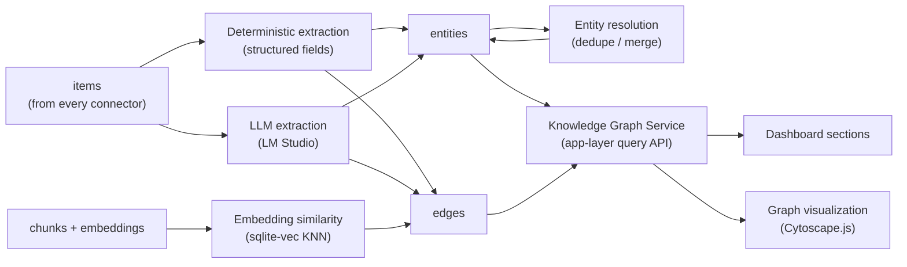
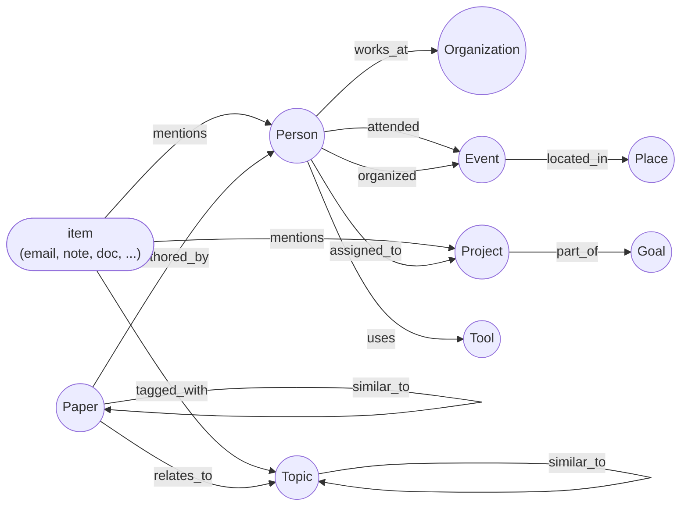

# 03 — Knowledge Graph Design

Related: [README](../README.md) · [System architecture](01-system-architecture.md) ·
[Database schema](02-database-schema.md) · [AI pipeline](07-ai-pipeline.md) ·
[Dashboard components](09-dashboard-components.md) ·
[Scalability](11-scalability.md)

## Overview

Every dashboard section in PID is ultimately a view over one thing: a **property graph** of typed
entities and typed relations between them, stored as two tables — `entities` and `edges` — inside
the same SQLite file as everything else (per the locked decision in the [README](../README.md);
canonical DDL in [02-database-schema.md](02-database-schema.md#graph-tables)). There is no separate
graph database process to install, back up, or keep in sync; the graph is just more rows in the one
file PID already owns.

The graph is populated by three independent, always-on **linking mechanisms** — deterministic
extraction, LLM extraction via LM Studio, and embedding-similarity linking — that all write into the
same two tables, so the graph gets richer as more connectors are enabled and more items are
ingested, without any mechanism needing to know about the others.



## Schema at a glance

Full DDL and Drizzle sketches are canonical in
[02-database-schema.md](02-database-schema.md#graph-tables); this table is a quick-reference only.

| Table | Key columns | Purpose |
|---|---|---|
| `entities` | `id`, `type`, `name`, `aliases`, `attributes`, `canonical_entity_id`, `confidence`, `mention_count`, `provenance` | One row per resolved real-world thing — a person, a project, a paper, ... |
| `edges` | `id`, `src_kind`/`src_id`, `dst_kind`/`dst_id`, `relation`, `weight`, `confidence`, `method`, `primary_source_item_id`, `provenance` | One row per typed relation, either between two entities or from an item to an entity. |

**Why edges can point at an item, not just at another entity.** A relation like *"this email
mentions this Person"* is naturally item → entity, while a relation like *"this Paper is
authored_by this Person"* is naturally entity → entity. Rather than splitting these into two
tables (a grounding join table plus a graph edge table), `edges.src_kind`/`dst_kind` let one row be
either kind, tagged `'item'` or `'entity'`. This keeps every relation — grounding *and*
inference — queryable through one index pair (`edges_src_idx`, `edges_dst_idx`) and one API. The
tradeoff, documented in [02](02-database-schema.md#graph-tables), is that `src_id`/`dst_id` are not
SQL foreign keys (SQLite has no polymorphic FK); the Knowledge Graph Service is the only writer and
is responsible for referential integrity.

Every `entities` and `edges` row carries **confidence** (how sure PID is that this entity/relation
is real and correctly typed) and **provenance** (which item(s) and which linking mechanism produced
it) — required because three different mechanisms with three different trust levels all write to
the same tables, and the UI (`EntityCard`, citations in RAG answers) needs to show *why* a fact is
in the graph, not just that it is.

## Entity type taxonomy

`entities.type` is an open `TEXT` column (see [Conventions](02-database-schema.md#conventions)), so
new types don't require a migration. The recommended baseline set:

| Type | Description | Typical `attributes` | Typical source |
|---|---|---|---|
| `Person` | An individual — sender, attendee, author, contact. | `emails[]`, `phones[]`, `title`, `company` | Email participants, calendar attendees, contacts, paper authors |
| `Organization` | A company, institution, or team. | `domain`, `industry` | Email domains, `contacts.company`, paper affiliations |
| `Project` | A body of work with a name, spanning tasks/notes/docs. | `status`, `repo_url` | Task `project` field, note tags, GitHub connector |
| `Paper` | A research paper or preprint. | `doi`, `arxiv_id`, `venue`, `year` | Papers connector, citation extraction |
| `Topic` | A subject/theme that spans items (e.g. "cybersickness", "quarterly planning"). | — | LLM extraction, tag/keyword clustering |
| `Place` | A physical location. | `lat`, `lon`, `address` | Event `location`, trip `destination`, photo GPS EXIF |
| `Event` | A calendar event or one-off happening. | `start_at`, `end_at` | Calendar connector (mirrors `events` domain row) |
| `Tool` | Software, a library, a service the user uses. | `homepage_url` | GitHub connector, notes, LLM extraction |
| `Goal` | A user-defined objective (mirrors an app-table `goals` row). | `target_date` | Goal Tracking section |

Adding a type is a product decision (does it need its own `EntityCard` treatment?), not a schema
change — see [09-dashboard-components.md](09-dashboard-components.md).

## Edge / relation type taxonomy

| Relation | Typical `src` (kind:type) | Typical `dst` (kind:type) | Meaning | Typical `method` |
|---|---|---|---|---|
| `mentions` | `item:*` | `entity:Person\|Organization\|Project\|Topic\|...` | The item's content references this entity. | `deterministic`, `llm_extraction` |
| `tagged_with` | `item:*` | `entity:Topic` | User- or AI-applied topical tag. | `deterministic`, `llm_extraction` |
| `authored_by` | `entity:Paper\|Document` | `entity:Person` | The work was authored by this person. | `deterministic`, `llm_extraction` |
| `attended` | `entity:Person` | `entity:Event` | The person attended or was invited to the event. | `deterministic` |
| `organized` | `entity:Person` | `entity:Event` | The person organized the event. | `deterministic` |
| `works_at` | `entity:Person` | `entity:Organization` | Employment or affiliation. | `deterministic`, `llm_extraction` |
| `assigned_to` | `entity:Person` | `entity:Project\|Goal` | Ownership or responsibility. | `deterministic` |
| `part_of` | `entity:Project` | `entity:Goal` | Hierarchical containment. | `deterministic` |
| `located_in` | `entity:Event\|Organization` | `entity:Place` | Physical location. | `deterministic`, `llm_extraction` |
| `cites` | `entity:Paper` | `entity:Paper` | Citation relation between papers. | `deterministic` (DOI/reference parse), `llm_extraction` |
| `relates_to` | `entity:*` | `entity:*` | Generic thematic relation the LLM judged relevant but that doesn't fit a narrower type. | `llm_extraction` |
| `similar_to` | `entity:*` | `entity:*` (same type as src) | Embedding cosine similarity above threshold. | `embedding_similarity` |

`relation` is likewise an open `TEXT` column; this table is the recommended baseline, not an
exhaustive `CHECK` list.

### Taxonomy diagram



## The three linking mechanisms

All three run as background-worker jobs after the ingestion pipeline stores a new/changed `items`
row ([01-system-architecture.md](01-system-architecture.md#background-worker)); none block the
connector sync itself.

### 1. Deterministic extraction

Structured fields already present on the normalized item or its domain row are turned directly into
entities/edges — no model call, near-zero cost, runs first and always.

| Source field | Produces |
|---|---|
| `emails.from_address` / `to_addresses` / `cc_addresses` | `Person` entities (resolved by email address), `mentions` edges from the email item to each participant |
| `events.attendees` / `organizer_email` | `Person` entities, `attended` / `organized` edges to the `Event` entity mirroring the item |
| `papers.authors` / `doi` | `Person` entities, `authored_by` edges; `Paper` ↔ `Paper` `cites` edges when reference lists parse cleanly |
| `tasks.project` / `notes.tags` | `Project` / `Topic` entities, `mentions` or `tagged_with` edges |
| `contacts.*` | `Person` entity (usually the *canonical* one other mechanisms merge into — see resolution below), backed by `contacts.entity_id` |
| `trips.destination`, `events.location`, `photos_index.gps_lat/lon` | `Place` entities, `located_in` edges |

Pseudocode:

```text
for item in newly_ingested_items:
  for field in deterministic_fields(item.type):
    for raw_value in extract(field, item):
      entity = resolve_or_create_entity(type=field.entity_type, key=normalize(raw_value))
      edge = upsert_edge(
        src = item if field.direction == "item_to_entity" else entity,
        dst = entity if field.direction == "item_to_entity" else other_entity,
        relation = field.relation,
        method = "deterministic",
        confidence = 1.0,               # structured field, no ambiguity
        source_item = item,
      )
```

Deterministic confidence is `1.0` by construction — the value came from a structured field, not an
inference — except entity *resolution* confidence (is "J. Smith" the same `Person` as
"Jane Smith"?), which is scored separately (see [Entity resolution](#entity-resolution-and-deduplication)).

### 2. LLM entity/relation extraction (LM Studio)

For free-text bodies (email body, notes, documents, journal entries, AI conversation turns), a
structured-output prompt against the locally running LM Studio instance extracts entities and
relations the deterministic pass can't see — a person named in prose but not in the `To:` line, a
topic, a `relates_to` link between two projects mentioned in the same paragraph. Full prompt
templates live in [07-ai-pipeline.md](07-ai-pipeline.md); the graph-relevant contract is:

```text
INPUT:  item.title, item.body (chunked if it exceeds the context budget), a short list of
        already-known entity names/aliases for this item's likely domain (to encourage reuse
        over duplication)
OUTPUT: JSON, schema-constrained:
        {
          "entities": [{ "type": "...", "name": "...", "aliases": ["..."] }],
          "relations": [{ "src": "<index into entities>", "dst": "<index or existing entity id>",
                           "relation": "...", "confidence": 0.0-1.0 }]
        }

for extraction in llm_extract(item):
  for e in extraction.entities:
    entity = resolve_or_create_entity(type=e.type, name=e.name, aliases=e.aliases)
  for r in extraction.relations:
    upsert_edge(
      src=resolve(r.src), dst=resolve(r.dst), relation=r.relation,
      method="llm_extraction", confidence=r.confidence, source_item=item,
    )
```

Because this pass is probabilistic, `confidence` is the model's own self-reported score
(instructed as part of the schema), never defaulted to `1.0`, and low-confidence edges are filtered
out of RAG citations and the default graph view below a configurable threshold (default `0.5`,
stored in `settings`). See [06-security-privacy-model.md](06-security-privacy-model.md)
for prompt-injection mitigations relevant to extracting structured data from untrusted ingested
content.

### 3. Embedding similarity

The pipeline already produces one embedding per chunk for hybrid search
([02-database-schema.md](02-database-schema.md#core-tables)). The same vectors are reused to link
entities: an entity's *descriptive embedding* — computed from its `name` + `description` +
concatenated high-confidence mention contexts — is compared via `sqlite-vec` cosine/L2 KNN against
other entities of the **same type**, and a `similar_to` edge is created/updated whenever the score
clears a threshold (default cosine similarity ≥ `0.85`, also a `settings` value).

```sql
-- Example: top-10 nearest Topic entities to entity :id, above threshold.
SELECT e.id, e.name, distance
FROM entity_embeddings                          -- sqlite-vec virtual table, rowid = entities.rowid
JOIN entities e ON e.rowid = entity_embeddings.rowid
WHERE entity_embeddings.embedding MATCH (SELECT embedding FROM entity_embeddings WHERE rowid = :entity_rowid)
  AND e.type = :type
  AND distance <= :max_distance
ORDER BY distance
LIMIT 10;
```

`similar_to` is the one relation where `weight` (not just `confidence`) carries real information —
it stores the similarity score itself, so the UI can render edge thickness by closeness and the
Knowledge Graph Service can cut the graph at different similarity bands without re-querying vectors.
This mechanism is also what powers "related papers" / "related notes" surfaces in the Research
Assistant and Knowledge Hub sections without any LLM call at query time.

## Entity resolution and deduplication

The three mechanisms above routinely mint entities that refer to the same real-world thing under
different names ("Jane Smith" from an email header, "J. Smith" from an LLM extraction, "jane@corp.com"
from a contact). Resolution runs as its own worker job after each linking pass, not inline, so
linking stays fast and resolution can be re-run wholesale (e.g., after tuning thresholds) without
re-extracting anything.

**Blocking.** Never compare every entity to every other entity. Candidates are limited to the same
`type` plus a cheap blocking key: normalized lowercase name for `Person`/`Organization`/`Project`,
normalized domain for `Organization`, DOI/arXiv ID for `Paper`.

**Scoring.** Within a block, candidate pairs are scored on a weighted combination of:

| Signal | Weight | Notes |
|---|---|---|
| Name string similarity (Jaro-Winkler / trigram) | 0.3 | Catches "J. Smith" vs "Jane Smith" |
| Alias/attribute overlap (shared email, shared DOI, shared phone) | 0.4 | Strongest signal when present — near-deterministic |
| Description/context embedding similarity | 0.3 | Catches semantically-same entities with dissimilar names |

**Merge.** Pairs scoring above a merge threshold (default `0.8`) are merged: the entity with the
higher `mention_count` (ties broken by earliest `first_seen_at`) survives; the other has its
`canonical_entity_id` set to the survivor's `id` and is never deleted (so provenance and any edge
still pointing at the old id remain resolvable). Reads always resolve through
`canonical_entity_id` — see [Graph query patterns](#graph-query-patterns-in-the-app-layer) below.
The survivor absorbs the loser's `aliases`, `attributes` (non-conflicting keys), and
`provenance`, and `mention_count` is summed.

```text
for (a, b) in candidate_pairs(block):
  score = 0.3*name_sim(a,b) + 0.4*attribute_overlap(a,b) + 0.3*embedding_sim(a,b)
  if score >= MERGE_THRESHOLD:
    survivor, loser = pick_survivor(a, b)
    loser.canonical_entity_id = survivor.id
    survivor.aliases = union(survivor.aliases, loser.aliases, [loser.name])
    survivor.mention_count += loser.mention_count
    survivor.provenance = union(survivor.provenance, loser.provenance)
  elif score >= REVIEW_THRESHOLD:      # default 0.6
    enqueue_for_manual_review(a, b)    # surfaced on the entity's EntityCard, docs/09
```

Pairs scoring between the review threshold and the merge threshold are **not** auto-merged; they're
queued for a one-click confirm/reject in the `EntityCard` UI
([09-dashboard-components.md](09-dashboard-components.md)), which is also where a bad
auto-merge can be manually undone (clear `canonical_entity_id`).

## Graph query patterns in the app layer

All graph reads go through the Knowledge Graph Service
([01-system-architecture.md](01-system-architecture.md#module-boundaries)); no dashboard service
queries `entities`/`edges` directly. Every pattern below transparently resolves `canonical_entity_id`
(i.e., a query against a merged-away entity id is redirected to its survivor).

**1-hop neighbors** (used by `EntityCard`, "who/what is connected to this"):

```sql
SELECT * FROM edges
WHERE (src_kind = 'entity' AND src_id = :entity_id)
   OR (dst_kind = 'entity' AND dst_id = :entity_id)
ORDER BY confidence DESC, weight DESC;
```

**Item grounding** ("which items mention this entity" — the citation list behind every RAG answer):

```sql
SELECT i.* FROM edges e
JOIN items i ON i.id = e.src_id AND e.src_kind = 'item'
WHERE e.dst_kind = 'entity' AND e.dst_id = :entity_id AND e.relation = 'mentions'
ORDER BY i.occurred_at DESC;
```

**Multi-hop traversal** (e.g. "how is Person A connected to Project B", used by Decision Support
and AI Assistant when a direct edge doesn't exist), via a bounded recursive CTE:

```sql
WITH RECURSIVE path(entity_id, depth, trail) AS (
  SELECT :start_entity_id, 0, :start_entity_id
  UNION ALL
  SELECT
    CASE WHEN e.src_kind='entity' AND e.src_id = path.entity_id THEN e.dst_id ELSE e.src_id END,
    path.depth + 1,
    path.trail || '>' || CASE WHEN e.src_kind='entity' AND e.src_id = path.entity_id THEN e.dst_id ELSE e.src_id END
  FROM edges e JOIN path
    ON (e.src_kind='entity' AND e.src_id = path.entity_id)
    OR (e.dst_kind='entity' AND e.dst_id = path.entity_id)
  WHERE path.depth < 3 AND e.confidence >= 0.5
)
SELECT * FROM path WHERE entity_id = :target_entity_id ORDER BY depth LIMIT 1;
```

Capped at depth 3 deliberately — see [When to migrate](#when-and-why-to-migrate-to-a-dedicated-graph-db)
for why this is also the first scaling signal to watch.

**Semantic + graph combined** ("papers related to topic Y" in Research Assistant): run the
`similar_to` embedding query above scoped to `type='Paper'`/`type='Topic'`, then join `mentions`
edges to fetch grounding items — this is exactly how hybrid search's vector leg
([02-database-schema.md](02-database-schema.md#core-tables)) and the graph share infrastructure
without duplicating it.

## Visualization approach (Cytoscape.js)

The Knowledge Hub's graph view and any "explore from here" affordance on an `EntityCard`
([09-dashboard-components.md](09-dashboard-components.md)) render through **Cytoscape.js**
(chosen and justified in [04-technology-stack.md](04-technology-stack.md)).

**Data adapter.** The Knowledge Graph Service's neighbor/traversal responses are mapped straight to
Cytoscape elements:

```ts
type CyElements = {
  nodes: { data: { id: string; label: string; type: string; confidence: number } }[];
  edges: { data: { id: string; source: string; target: string; label: string; weight: number } }[];
};

function toCytoscape(entities: Entity[], edges: Edge[]): CyElements {
  return {
    nodes: entities.map((e) => ({
      data: { id: e.id, label: e.name, type: e.type, confidence: e.confidence },
    })),
    edges: edges
      .filter((e) => e.srcKind === "entity" && e.dstKind === "entity")   // item-kind edges shown on demand only
      .map((e) => ({
        data: { id: String(e.id), source: e.srcId, target: e.dstId, label: e.relation, weight: e.weight },
      })),
  };
}
```

`mentions`/`tagged_with` edges (item → entity) are hidden by default — they'd make every graph a
star pattern around whichever item is most connected — and shown only when the user drills into an
entity's grounding items (a list, not graph nodes, to avoid item-count blowup).

| Concern | Choice |
|---|---|
| Exploratory layout (default) | `fcose` / `cose-bilkent` force-directed — good for "what's near this entity" browsing |
| Hierarchical layout (Goal → Project → Task chains, `part_of`) | `dagre` / `elk` |
| Ego-graph focus (one entity + its neighborhood) | `concentric`, centered on the focal node |
| Node sizing | `mention_count` (log-scaled) |
| Edge styling | Opacity/width by `confidence`/`weight`; dashed for `method='llm_extraction'` below the review threshold |
| Interaction | Click a node → lazily fetch and append its neighbors (`/api/graph/:id/neighbors`, paginated); type/relation/confidence filters in a side panel; search-to-focus by `name`/`aliases` (fuzzy) |
| Performance | Initial render capped to top-N nodes by `mention_count`/`confidence` (default 150) with a "load more" affordance; viewport culling; neighbor fetches debounced |

## When and why to migrate to a dedicated graph DB

SQLite's `entities`/`edges` design, including the recursive-CTE traversal above, is expected to
comfortably serve a single user's graph for years — see
[11-scalability.md](11-scalability.md) for the full data-volume analysis. Watch for these
concrete trigger conditions rather than migrating preemptively:

| Trigger | Symptom | Response |
|---|---|---|
| Edge count in the low millions | Recursive-CTE traversals beyond 2–3 hops noticeably slow the AI Assistant / Decision Support graph queries | First: tighten indexes/depth caps, cache common traversals; only then consider migration |
| Need for graph algorithms SQL can't express well | PageRank-style "most central entity," community detection, weighted shortest path at scale | These are the strongest signal — SQL recursive CTEs can approximate but not efficiently compute them |
| High-frequency concurrent graph writes | Multiple extraction jobs contending on the same SQLite writer becomes a bottleneck (see WAL limits in [11](11-scalability.md)) | Batch/queue writes first; migration is a last resort given PID's single-writer worker design |

**Candidates, in order of fit with the local-first constraint:**

1. **Kùzu** — embedded (no server process), local file, Cypher query support; the natural first
   step because it preserves "no local server, no network egress" without changing PID's
   deployment story.
2. **Memgraph** / **Neo4j Community** — full server-based graph databases if embedded options prove
   insufficient; both can run as another local process alongside LM Studio, still honoring
   local-first, but add an operational dependency PID doesn't have today.

**Migration path**, regardless of target: keep `entities`/`edges` in SQLite as the system of record
initially and add a nightly export/mirror to the graph DB for analytics-only queries (PageRank,
community detection) that the dashboard reads from a read replica. Only cut SQLite over as the
write path once the mirrored approach proves insufficient — this avoids a risky big-bang migration
of a single user's only copy of their data.

## Cross-references

- [02-database-schema.md](02-database-schema.md) — canonical `entities`/`edges` DDL and Drizzle
  sketches, foreign-key/index summary, and the full core-table ER diagram.
- [01-system-architecture.md](01-system-architecture.md) — Knowledge Graph Service's place in the
  module boundaries and its role in the data-flow diagram.
- [07-ai-pipeline.md](07-ai-pipeline.md) — LLM extraction prompt templates in full, and
  how RAG citations consume the item-grounding query pattern above.
- [09-dashboard-components.md](09-dashboard-components.md) — `EntityCard` and
  `KnowledgeGraphView` component contracts that consume this design.
- [11-scalability.md](11-scalability.md) — data-volume projections behind the graph-DB
  migration triggers above.
