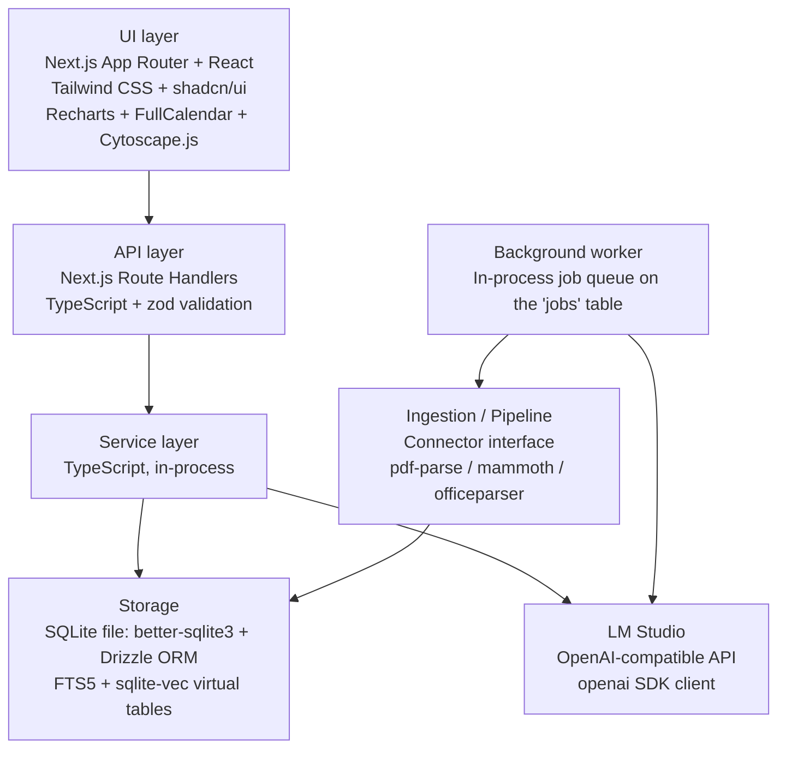

# 04 — Technology Stack

Related: [README](../README.md) · [System architecture](01-system-architecture.md) ·
[Database schema](02-database-schema.md) · [Knowledge graph design](03-knowledge-graph-design.md) ·
[API integrations](05-api-integrations.md) (planned) · [AI pipeline](07-ai-pipeline.md) (planned) ·
[Deployment](12-deployment.md) (planned) · [Open-source tools catalog](13-open-source-tools.md)

## Overview

This document is the opinionated companion to [13-open-source-tools.md](13-open-source-tools.md):
where that doc is a broad menu of OSS options per concern, this doc says **what PID actually uses**
and why, layer by layer, following the module boundaries laid out in
[01-system-architecture.md](01-system-architecture.md#module-boundaries). Every choice below is
constrained by the two non-negotiables in the [README](../README.md) — **all data stays on-device**
and **all AI is local AI via LM Studio** — which rules out any option that requires a second local
server process (Redis, Postgres, a standalone vector DB) or a network hop off the machine.



## Summary table

| Layer | Choice | Why | Alternative(s) considered |
|---|---|---|---|
| Framework | **Next.js 15 (App Router)** | Single codebase for UI *and* API routes; React Server Components keep client JS light across twelve data-heavy dashboard sections; file-based routing scales cleanly to that many sections; first-class TypeScript support. | Remix (smaller local-first ecosystem, no built-in RSC); Vite + Express SPA (would mean hand-rolling the API/SSR layer Next.js gives for free). |
| Language | **TypeScript 5.x, strict mode** | End-to-end type safety from the Drizzle schema through services to UI props — exactly the bug class a schema-heavy, plugin-based connector architecture is prone to. | Plain JavaScript + JSDoc types (weaker enforcement at module boundaries, rejected). |
| Database engine | **SQLite (file-based) via `better-sqlite3`** | Synchronous, in-process, zero network hop; matches the locked decision that "a single `.sqlite` file is the entire durable state of the product" ([02-database-schema.md](02-database-schema.md)). | PostgreSQL / MySQL (require a running server process — violates local-first, adds an install step for a single-user app). |
| ORM / migrations | **Drizzle ORM + Drizzle Kit** | Typed schema-as-code with a thin, SQL-shaped API (no query-builder magic to fight); has a clean raw-SQL escape hatch, needed because FTS5/`vec0` virtual tables have no native schema-builder support (see [02](02-database-schema.md#core-tables)). | Prisma (heavier client runtime, no native SQLite virtual-table support); Kysely (good typed SQL builder, but thinner migration tooling than Drizzle Kit). |
| Vector search | **sqlite-vec** (`vec0` virtual tables) | Runs inside the same SQLite file and process as everything else — no separate vector database to install or keep in sync. | Standalone vector DB (Chroma, Qdrant, Milvus) — all rejected as an extra local service the README's local-first model doesn't need. |
| Full-text search | **SQLite FTS5** (built-in) | Zero extra dependency; external-content table (`items_fts`) stays in sync with `items` via triggers, no reindex job needed on every write. | MeiliSearch / Typesense (better search UX out of the box, but another local server process to run and update). |
| UI styling | **Tailwind CSS** | Utility-first styling keeps twelve dashboard sections visually consistent without a growing custom CSS file; pairs directly with shadcn/ui's Tailwind-based components. | CSS Modules / vanilla-extract (more boilerplate at this surface area, no shared design-token story). |
| Component library | **shadcn/ui** (Radix UI primitives, copied into the repo, not installed as an opaque dependency) | Accessible primitives (keyboard nav, ARIA) with code that lives in-repo, so every component is fully restylable with no extra runtime dependency surface. | MUI / Ant Design (heavier bundles, harder to restyle away from their default look toward a bespoke dashboard). |
| Charts | **Recharts** | Declarative, composable React charts that pick up Tailwind theme tokens directly; sufficient for the time-series/trend charts Personal Analytics, Goal Tracking, and Reviews need. | visx (lower-level, D3-based — more code for the same standard charts; kept in the toolbox in [13](13-open-source-tools.md) for bespoke one-offs). |
| Calendar UI | **FullCalendar**, MIT-licensed core + community plugins (`daygrid`, `timegrid`, `list`, `interaction`) | Most complete open-source calendar available for React — month/week/day/list views and drag-and-drop out of the box — directly matching the Outlook-sourced `events` domain table ([02](02-database-schema.md#domain-tables)). Only the free plugin set is used; FullCalendar's paid resource-timeline plugin is explicitly avoided. | `react-big-calendar` (simpler API, noticeably weaker recurrence rendering and drag-and-drop). |
| Graph visualization | **Cytoscape.js**, with `fcose`/`dagre`/`elk` layout plugins | Already the chosen library in [03-knowledge-graph-design.md](03-knowledge-graph-design.md#visualization-approach-cytoscapejs); its layout-algorithm ecosystem and confidence/weight-driven edge styling fit the entity graph's needs directly. | D3-force (lower-level — would mean reimplementing the layouts Cytoscape ships); Sigma.js / `react-force-graph` (strong WebGL performance, weaker layout-plugin ecosystem at PID's graph scale). |
| Background jobs | **In-process queue on the `jobs` SQLite table** — a polling worker loop in the same Node process family, no separate job-runner service | The `jobs` table is already the system of record ([02-database-schema.md](02-database-schema.md#app-tables)); a single-user app has no concurrency need that justifies a second infrastructure dependency. | BullMQ (requires Redis); Agenda (requires MongoDB); a separate worker process pool (unneeded concurrency for one user, adds inter-process complexity). |
| File parsing — PDF | **pdf-parse** (wraps `pdfjs-dist`) | Pure JS/Node, no native binary to compile; text extraction quality is sufficient for research papers and documents. | `pdfjs-dist` directly (lower-level, more code) — kept available for cases needing layout-aware extraction. |
| File parsing — DOCX | **mammoth** | Converts `.docx` to clean HTML/text while preserving heading/list structure; small, well-scoped, widely used. | `docx4js`, `textract` (less actively maintained). |
| File parsing — PPTX | **officeparser**, with a JSZip + `fast-xml-parser` custom slide-XML walk as fallback | PPTX has no single dominant OSS parser; `officeparser` covers the common case (per-slide text) and the fallback path handles anything it misses without adding a second runtime. | Spawning `python-pptx` as a subprocess (rejected — pulls a Python runtime into an otherwise pure-Node app). |
| AI runtime client | **`openai` npm SDK**, pointed at LM Studio's OpenAI-compatible endpoint (`baseURL`/model configurable in `settings`) | LM Studio speaks the OpenAI wire protocol, so the official client works against it unmodified with zero cloud coupling; this is the single chokepoint client used by the AI Orchestration Service ([01-system-architecture.md](01-system-architecture.md#module-boundaries)). | A bespoke `fetch` wrapper (reimplements what the SDK already does); LangChain/LlamaIndex (heavier abstraction than a single-provider chokepoint service needs — see [07-ai-pipeline.md](07-ai-pipeline.md), planned). |
| Desktop packaging | **Electron shell** wrapping the Next.js server, producing installers (`.dmg`/`.exe`/AppImage); a plain `node` launch path remains available for power users/dev | Gives a non-technical single user a double-click app with a dock/tray icon and optional autostart, matching the README's "runs entirely on that user's own machine" framing — without requiring a terminal. | Tauri (smaller binaries, but adds a Rust toolchain to the build pipeline); shipping only a "start server, open browser tab" script (kept as the dev/power-user path, not the default distributable — see [12-deployment.md](12-deployment.md), planned). |

## Database & search layer, in detail

`better-sqlite3` is used over the async `node-sqlite3` binding because PID's storage layer never
needs concurrent async I/O in flight to the same file from a single Node process — a synchronous,
blocking driver is *simpler* here, not a downgrade, and it's what lets services and the worker share
one connection model without a callback/promise translation layer. `PRAGMA journal_mode = WAL` is
set at connection time (see [11-scalability.md](11-scalability.md), planned) so the UI's read
queries aren't blocked by the worker's writes.

`sqlite-vec` and FTS5 both live as virtual tables in the same file Drizzle otherwise manages, which
is why [02-database-schema.md](02-database-schema.md#core-tables) generates their DDL via raw-SQL
migrations rather than Drizzle's schema builder — the builder has no virtual-table primitive, and
adding one upstream isn't worth blocking on for a two-table need.

## Background jobs, in detail

The worker described in [01-system-architecture.md](01-system-architecture.md#background-worker) is
deliberately *not* a message-queue-backed system. A poll loop (default interval a few seconds) runs:

```sql
UPDATE jobs SET status = 'running', started_at = :now
WHERE id = (
  SELECT id FROM jobs
  WHERE status = 'queued' AND run_at <= :now
  ORDER BY priority DESC, run_at ASC
  LIMIT 1
)
RETURNING *;
```

`better-sqlite3` executes this synchronously inside SQLite's own locking, so a single-writer,
single-worker-process design needs no additional mutex or distributed lock — the same guarantee
BullMQ+Redis would provide, without a second service. This is revisited only if
[11-scalability.md](11-scalability.md) (planned) identifies a real throughput ceiling; see the
"when to migrate to a dedicated graph DB" pattern in
[03-knowledge-graph-design.md](03-knowledge-graph-design.md#when-and-why-to-migrate-to-a-dedicated-graph-db)
for the same style of trigger-condition thinking applied to storage.

## LM Studio integration, in detail

All chat completion and embedding calls are made through the official `openai` SDK configured with:

```ts
const client = new OpenAI({
  baseURL: settings.lmStudioBaseUrl ?? "http://localhost:1234/v1",
  apiKey: "not-needed", // LM Studio ignores this; the SDK requires a non-empty string
});
```

Model name and base URL are read from the `settings` table
([02-database-schema.md](02-database-schema.md#app-tables)), never hardcoded, so a user can point
PID at a different LM Studio instance (e.g., on another machine on the LAN) or a different
OpenAI-compatible local server (Ollama's OpenAI-compat endpoint, llama.cpp's server mode) without a
code change. Full prompt templates, retry/timeout policy, and RAG composition are specified in
[07-ai-pipeline.md](07-ai-pipeline.md) (planned); this doc only fixes the client library.

## Desktop packaging, in detail

Two run modes ship from the same codebase:

| Mode | How it runs | Audience |
|---|---|---|
| Packaged app | Electron main process spawns the Next.js server on a local port, opens a `BrowserWindow` against it, adds a tray icon for start/stop/status | Default distributable — the "download and double-click" experience |
| Dev / power-user | `next build && next start` (or `next dev`), open `http://localhost:3000` in any browser | Contributors, and users comfortable running a terminal command |

Both modes talk to the same on-disk SQLite file and the same LM Studio instance; Electron adds no
new data path, only a native window shell. Full packaging, code-signing, and update-channel detail
lives in [12-deployment.md](12-deployment.md) (planned).

## Supporting tooling

A few smaller choices round out the stack; the exhaustive list with licenses lives in
[13-open-source-tools.md](13-open-source-tools.md).

| Concern | Choice | Note |
|---|---|---|
| Package manager | pnpm | Fast, disk-efficient installs; strict dependency resolution catches phantom-dependency bugs early in a plugin-heavy connector architecture. |
| Validation | zod | Validates API route input and connector-normalized output against the shared item shape; pairs naturally with Drizzle's inferred types. |
| Linting / formatting | ESLint + Prettier | Standard, widely supported; no strong reason to adopt Biome yet given ESLint's plugin coverage for Next.js-specific rules. |
| Testing | Vitest (unit/service) + Playwright (E2E) | See [13-open-source-tools.md](13-open-source-tools.md#testing) for the full rationale and adjacent libraries. |

## Cross-references

- [01-system-architecture.md](01-system-architecture.md) — the layered architecture and module
  boundaries these technology choices implement.
- [02-database-schema.md](02-database-schema.md) — canonical DDL for every table these choices read
  and write.
- [03-knowledge-graph-design.md](03-knowledge-graph-design.md) — the graph model that motivates the
  Cytoscape.js and sqlite-vec choices above.
- [07-ai-pipeline.md](07-ai-pipeline.md) (planned) — how the LM Studio client above is used for
  prompting, RAG, and extraction.
- [13-open-source-tools.md](13-open-source-tools.md) — the broader menu of OSS options this document
  chose from, plus licenses and maturity notes for every library named here.
