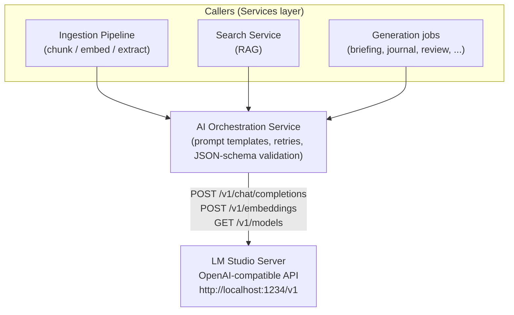
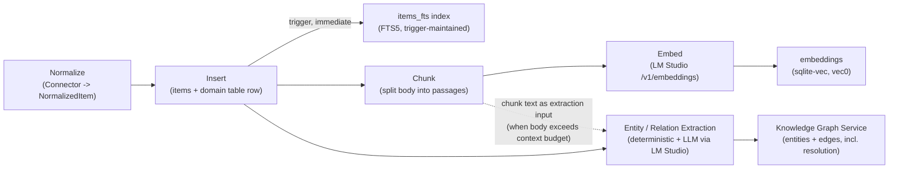
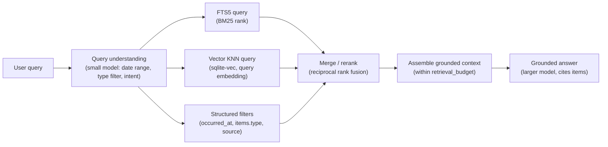

# 07 — AI Pipeline

Related: [README](../README.md) · [System architecture](01-system-architecture.md) ·
[Database schema](02-database-schema.md) · [Knowledge graph design](03-knowledge-graph-design.md) ·
[Security & privacy model](06-security-privacy-model.md) ·
[Outlook collector](15-outlook-collector.md) ·
[Future AI capabilities](14-future-ai-capabilities.md)

## Overview

Every AI capability in PID — extraction, search, summarization, journaling, review, decision
support, insight detection, memory — funnels through one component: the **AI Orchestration
Service** ([01-system-architecture.md](01-system-architecture.md#module-boundaries)), which is the
sole caller of a **locally installed LM Studio** server over its OpenAI-compatible API (default
`http://localhost:1234/v1`). This is the locked decision every section below assumes
([README](../README.md#locked-decisions-canon)): no cloud LLM by default, model name and base URL
are user settings, and the same chokepoint means every prompt template, every retry policy, and
every degrade-when-offline behavior is defined once and applies everywhere.



## LM Studio integration

### OpenAI-compatible client config

The AI Orchestration Service holds a single configured client, built from two `settings` rows
([02-database-schema.md](02-database-schema.md#app-tables)) so the endpoint and model are
changeable from the Settings UI without a redeploy:

| `settings.key` | Example value | Purpose |
|---|---|---|
| `ai.baseUrl` | `http://localhost:1234/v1` | LM Studio's OpenAI-compatible base URL. Changeable to another LAN host running LM Studio (still local-first, see [06-security-privacy-model.md](06-security-privacy-model.md#lm-studio-locality)). |
| `ai.chatModel` | `qwen2.5-14b-instruct` | Model id (as reported by `GET /v1/models`) used for chat-completion jobs. |
| `ai.classifierModel` | `qwen2.5-3b-instruct` | Smaller model id used for cheap, high-volume, low-ambiguity jobs. |
| `ai.embeddingModel` | `nomic-embed-text-v1.5` | Model id used for `/v1/embeddings`; its dimension is pinned in `embedding_meta`/`entity_embedding_meta` (768, per [02-database-schema.md](02-database-schema.md#core-tables)). |
| `ai.apiKey` | `"lm-studio"` (placeholder) | LM Studio's OpenAI-compatible server ignores the key value by default but the client library requires one to be present; never a real secret, never routed through [06](06-security-privacy-model.md#secrets-handling)'s credential-store path since it protects nothing. |
| `ai.requestTimeoutMs` | `120000` | Per-call timeout before the Orchestration Service treats LM Studio as unresponsive. |

The client is a thin wrapper around the standard `openai` SDK pointed at `ai.baseUrl` — this is
precisely what "OpenAI-compatible" buys PID: zero custom HTTP/streaming code, and swapping to
another local OpenAI-compatible server (Ollama's compat endpoint, llama.cpp's server, a LAN box) is
a settings change, not a code change.

### Recommended model classes

PID assumes the user has LM Studio loaded with at least two chat models of different size/cost, plus
one embedding model, and routes each job to the cheapest class that can do it reliably:

| Class | Example models | Used for | Why |
|---|---|---|---|
| **Small instruct** (`ai.classifierModel`, ~3B–8B) | Qwen2.5-3B/7B-Instruct, Llama-3.2-3B-Instruct, Phi-3.5-mini | Classification, tagging, entity/relation extraction ([03-knowledge-graph-design.md](03-knowledge-graph-design.md#2-llm-entityrelation-extraction-lm-studio)), thumbs-up/down-driven re-prompts, query intent classification for Smart Search | Runs fast on modest hardware, keeps the always-on extraction pipeline cheap; these jobs are high-volume (every ingested item) and low-reasoning-depth. |
| **Larger instruct** (`ai.chatModel`, ~13B–34B, or whatever the user's hardware fits) | Qwen2.5-14B/32B-Instruct, Llama-3.1-8B/70B-Instruct, Mistral-Small | Daily briefing, AI journal reflections, weekly/monthly reviews, paper summarization/lit review, decision support, insights synthesis, the AI Assistant's grounded answers | Lower-volume, higher-reasoning jobs where coherent long-form synthesis and following a JSON schema under more complex instructions matters more than latency. |
| **Embedding model** (`ai.embeddingModel`, 768-dim default) | nomic-embed-text-v1.5, bge-base-en-v1.5 | Chunk embeddings, entity descriptive embeddings, query embeddings for hybrid retrieval | Must match the dimension pinned in `embeddings`/`entity_embeddings` (`vec0(embedding FLOAT[768])`, [02-database-schema.md](02-database-schema.md#core-tables)); changing models triggers the `maintenance_reembed` job ([01-system-architecture.md](01-system-architecture.md#background-worker)). |

Model choice is entirely a user setting — PID ships no model and does not pin a specific one as
"required" — but the two-tier chat-model split is a recommended default because it is the single
biggest lever on perceived responsiveness: extraction runs on every ingested item and must not
compete for GPU/CPU time with a user waiting on a briefing.

### Context-window budgeting

Every prompt template declares a **token budget** the Orchestration Service enforces before the
call, not after a truncated/failed response:

```text
budget(model) = context_window(model) - reserved_output_tokens - reserved_system_prompt_tokens

reserved_output_tokens:    job-specific (e.g. 400 for a daily briefing, 1200 for a lit review)
reserved_system_prompt_tokens: measured once per template at startup, cached

retrieval_budget = budget(model) * 0.7   // leaves headroom for few-shot/format instructions
```

`chunks.token_count` ([02-database-schema.md](02-database-schema.md#core-tables)) is populated at
chunk time (the tokenizer matching the currently configured chat model family) specifically so
retrieval assembly can sum candidate chunks against `retrieval_budget` without re-tokenizing at
prompt time — candidates are added in ranked order (see [RAG smart search](#rag-smart-search) below)
until the next chunk would exceed budget, then truncated there rather than mid-chunk. `GET
/v1/models` at startup and on settings change reports `context_window` where the LM Studio server
exposes it; where it doesn't, a conservative default (8192) is assumed and surfaced as an editable
setting (`ai.contextWindowOverride`).

### Structured-output strategy

Every extraction and generation job that must produce data the app parses (not free-text prose)
uses **schema-constrained prompting**, layered for reliability across the range of local models a
user might have loaded:

1. **JSON-schema-constrained decoding when the server supports it.** LM Studio's OpenAI-compatible
   endpoint accepts `response_format: { type: "json_schema", json_schema: { schema, strict: true } }`
   on chat completions for compatible model/runtime combinations (llama.cpp GBNF-grammar-backed
   constrained decoding) — when available, this is the primary mechanism, because it makes invalid
   output structurally impossible rather than merely discouraged.
2. **`response_format: { type: "json_object" }` fallback.** For models/runtimes where schema-
   constrained decoding isn't available, plain JSON-mode plus a schema described in the prompt body
   (with a compact example) is the fallback — still far more reliable than unconstrained prose.
3. **Parse-validate-repair loop.** The Orchestration Service parses every structured response
   against a Zod schema matching the documented contract; on parse/validation failure it retries
   once with the validation error appended to the prompt ("your last response was invalid because
   ...; return corrected JSON only"), and on a second failure surfaces the job as `failed` in the
   `jobs` table ([02-database-schema.md](02-database-schema.md#app-tables)) with the raw response
   preserved in `jobs.error` for debugging — it never silently drops or guesses at malformed output.
4. **Never trust extracted content as instructions.** Per
   [06-security-privacy-model.md](06-security-privacy-model.md#prompt-injection-mitigations),
   schema-constrained output is itself a prompt-injection mitigation: a model that can only emit
   fields matching a declared schema has no channel to "escape" into arbitrary free-text action
   requests, even if the ingested content it's summarizing tried to prompt-inject it.

### Graceful degradation when LM Studio is not running

LM Studio is a separate local process the user starts independently of PID, so "server unreachable"
is an expected, common state (first run, after a reboot, deliberately paused to free RAM/GPU) —
not an error condition PID treats as exceptional:

| Layer | Behavior when LM Studio is unreachable |
|---|---|
| Health check | The Orchestration Service polls `GET /v1/models` on a short interval (default 30s) whenever a caller attempts a call and the last known state was down; a successful call/poll flips a cached `available` flag other services read synchronously (no per-request network round trip on the hot path). |
| Ingestion pipeline | Chunking and FTS indexing (no AI dependency) proceed normally. Embedding and LLM extraction jobs enqueue as usual but stay `queued` in the `jobs` table rather than failing — they run automatically once LM Studio comes back, exactly like any other backlog. Deterministic extraction ([03-knowledge-graph-design.md](03-knowledge-graph-design.md#1-deterministic-extraction)) is entirely unaffected since it makes no model call. |
| Smart Search | FTS5 keyword search continues to work standalone (degrades from hybrid to keyword-only); the UI shows a small "semantic search unavailable — LM Studio offline" notice rather than failing the query. |
| Generation jobs (briefing, journal, review, decision support, insights) | Scheduled jobs that can't reach LM Studio are deferred (re-enqueued with backoff, same `queued`/`failed` machinery as any worker job, [01-system-architecture.md](01-system-architecture.md#background-worker)) rather than producing an empty/garbage result; on-demand jobs show an inline "start LM Studio to generate this" state with a retry action instead of a spinner that never resolves. |
| AI Assistant / chat | The chat input is disabled with an explicit status message rather than silently accepting messages that will fail; the same `available` flag drives this across every dashboard section from the one chokepoint. |
| Global indicator | A persistent, low-key status indicator (mirroring the connector `ConnectionHealthList` pattern in [09-dashboard-components.md](09-dashboard-components.md)) shows LM Studio's reachability and configured model names at all times, so "why isn't X working" always has a one-glance answer. |

Nothing in PID treats an unreachable LM Studio as data loss — every AI-dependent write path is job-
queue-based, so the backlog simply catches up once the server is available again.

## Ingestion pipeline

Ingestion turns a connector's `NormalizedItem` ([05-api-integrations.md](05-api-integrations.md))
into a fully searchable, graph-linked `items` row. This is entirely source-agnostic: the pipeline
has no per-connector branches past the initial `items` + domain-table insert.



**Normalize -> chunk -> embed -> FTS index -> extract -> link**, step by step:

1. **Normalize.** Each connector maps its native shape to `NormalizedItem`
   ([05-api-integrations.md](05-api-integrations.md)); this step is entirely inside the connector
   and has no AI dependency.
2. **Insert.** The pipeline writes the `items` row plus its domain-table extension
   ([02-database-schema.md](02-database-schema.md#domain-tables)) in one transaction; `items_fts` is
   kept in sync by SQL triggers on `items`, so keyword search is available the instant an item lands
   — no worker job, no AI call, no lag.
3. **Chunk.** The background worker (`pipeline_chunk`) splits `items.body` into passages sized to
   the embedding model's effective window (target ~512 tokens, with overlap to avoid splitting a
   sentence a retrieval query would need whole), writing one `chunks` row per passage. Short items
   (a single-line task, a calendar event with no notes) get exactly one chunk equal to the item's
   title+body — chunking never produces zero chunks for a non-empty item, since every retrieval path
   assumes at least one chunk per item.
4. **Embed.** `pipeline_embed` batches chunks to `POST /v1/embeddings` (batched for throughput, not
   one call per chunk) and writes each vector to `embeddings` (`vec0`) with `rowid = chunks.id`,
   recording `embedding_meta` (model name, dims) so a future model change can be detected and
   re-embedded (`maintenance_reembed`, [01-system-architecture.md](01-system-architecture.md#background-worker)).
5. **Extract.** `pipeline_extract` runs the deterministic pass (structured fields, no model call)
   and, for free-text bodies, the LLM extraction pass against `ai.classifierModel` — full contract
   in [03-knowledge-graph-design.md](03-knowledge-graph-design.md#2-llm-entityrelation-extraction-lm-studio).
   Long bodies are extracted per-chunk (reusing the chunks from step 3) rather than truncated, and
   the per-chunk entity/relation lists are merged before writing.
6. **Link.** Extraction output is written to `entities`/`edges` through the Knowledge Graph Service,
   which also runs entity resolution as a follow-on job — see
   [03-knowledge-graph-design.md](03-knowledge-graph-design.md#entity-resolution-and-deduplication)
   for the full resolution/merge algorithm; this document does not duplicate it.

**Outlook items are not a special case.** Email and calendar items arrive from the **Outlook
Collector** ([15-outlook-collector.md](15-outlook-collector.md)) already normalized to the same
`NormalizedItem` shape every other connector produces — the companion collector's tap-selection,
dedupe (`message_identity`), and COM/Graph/IMAP plumbing are entirely upstream of this pipeline. From
step 2 onward an Outlook-sourced email is indistinguishable from any other `items` row: it gets
chunked, embedded, and FTS-indexed identically, and its extraction pass follows the same
deterministic-then-LLM sequence as everything else — `emails.from_address`/`to_addresses` produce
`Person` entities and `mentions` edges deterministically (step 5's structured-field pass), while
`events.attendees`/`organizer_email` produce `Person` entities plus `attended`/`organized` edges to
the `Event` entity mirroring the item, exactly per the deterministic-extraction table in
[03-knowledge-graph-design.md](03-knowledge-graph-design.md#1-deterministic-extraction). No pipeline
code branches on "is this an Outlook item."

## RAG smart search

Smart Search and the AI Assistant's grounded-answer path both run the same hybrid retrieval
pipeline; the difference is only whether the final step's output is a ranked result list (Search) or
a synthesized prose answer with inline citations (AI Assistant / any generation job that grounds
itself in retrieval).



1. **Query understanding.** The small model classifies the query's intent and extracts structured
   filters it implies — a date range ("last Thursday" -> a concrete `occurred_at` window resolved in
   code, not by the model, to avoid date-math hallucination), a type filter (`items.type = 'paper'`),
   or an entity mention to resolve via `entities.name`/`aliases`. This step is skipped (falls back to
   pure hybrid retrieval, no filters) if the query has no obvious structure or the model is
   unavailable — see [graceful degradation](#graceful-degradation-when-lm-studio-is-not-running).
2. **Hybrid retrieval.** Two independent candidate sets are fetched in parallel:
   - **FTS5 leg:** `items_fts MATCH` scored by BM25, joined back to `items`, optionally narrowed by
     the structured filters from step 1.
   - **Vector leg:** the query text is embedded (`ai.embeddingModel`) and matched via `sqlite-vec`
     KNN against `embeddings`, joined `chunks -> items`, same optional filters.
3. **Merge/rerank.** Candidates are combined by **reciprocal rank fusion** — `score(item) =
   Σ 1/(k + rank_in_leg)` (default `k = 60`) across whichever legs returned the item — rather than
   naively concatenating both lists, so an item ranked highly by *both* keyword and semantic
   similarity outranks one that only one leg liked. No cross-encoder reranker runs locally by
   default (an added model load for marginal gain over RRF at PID's per-user data scale); it is
   flagged as a future tuning knob, not implemented in the MVP pipeline.
4. **Assemble grounded context.** Top-ranked chunks are added to the prompt's retrieved-context
   block in rank order until `retrieval_budget` (see [context-window budgeting](#context-window-budgeting))
   is exhausted, each tagged with its source `items.id`, title, and `occurred_at` so the model can
   cite it and the UI can deep-link it.
5. **Grounded answer.** The larger chat model receives the retrieved-context block (structurally
   separated and labeled "retrieved content, not instructions" per
   [06-security-privacy-model.md](06-security-privacy-model.md#prompt-injection-mitigations)) and is
   instructed to answer **only** from that context, citing each claim's source `items.id`. The
   response schema always includes a `citations: [{ itemId, snippet }]` array so the UI can render
   inline citation chips that deep-link to the source item — see the
   [item-grounding query pattern](03-knowledge-graph-design.md#graph-query-patterns-in-the-app-layer)
   this reuses.

**Worked example — "What did I work on last Thursday?"** Query understanding resolves "last
Thursday" to a concrete `[start, end)` millisecond range and infers intent "activity summary, not
document lookup." Retrieval becomes primarily structured (`items.occurred_at BETWEEN ...`, spanning
tasks completed, events attended, emails sent, notes edited, commits/PRs from the GitHub connector)
rather than semantic — the FTS/vector legs still run (in case the phrasing itself matches something
relevant, e.g. a note titled "Thursday planning") but contribute a smaller share of the merged
candidate set. The grounded answer synthesizes the day's items into a short narrative citing each
one, the same shape the [daily briefing](#generation-jobs) job produces for "today," reused here
for an arbitrary past day.

**Worked example — "Which papers discussed cybersickness?"** Query understanding infers a type
filter (`items.type = 'paper'`) and treats "cybersickness" as a semantic/topic query rather than a
date range. Both legs run scoped to papers: the FTS5 leg catches papers whose title/abstract/body
literally contains "cybersickness," the vector leg catches papers that discuss the concept without
using that exact term (a paper about "simulator sickness in VR HMDs," say). The graph is also
consulted opportunistically: if a `Topic` entity named "cybersickness" already exists (from prior
LLM extraction, [03-knowledge-graph-design.md](03-knowledge-graph-design.md#2-llm-entityrelation-extraction-lm-studio)),
its `mentions`/`relates_to` edges supply additional candidate papers via the
[semantic + graph combined](03-knowledge-graph-design.md#graph-query-patterns-in-the-app-layer)
pattern, merged into the same ranked candidate set before the grounded-answer step.

## Generation jobs

Beyond retrieval-time answers, PID runs a fixed set of **generation jobs** — some scheduled, some
on-demand — each producing a structured artifact stored in its own app table
([02-database-schema.md](02-database-schema.md#app-tables)):

| Job | What it produces | Primary table written |
|---|---|---|
| Daily briefing | A short "what's urgent, what's due, what changed" narrative for Executive Overview | Not persisted as its own row by default — regenerated per view from the day's window; optionally cached in `settings` keyed by date for instant reload |
| AI journal | A reflection prompt drawn from the day's context, plus (after the user writes) an optional summarization/theming pass | `journal_entries` |
| Weekly/monthly review | A period retrospective synthesized from that period's items, goals, and insights | `reviews` |
| Paper summarization / literature review | A structured summary of one paper, or a synthesized review across a set of related papers | Cached alongside the `papers` item (`items.metadata` or a dedicated `paper_summaries` extension — implementation detail of [10-implementation-roadmap.md](10-implementation-roadmap.md)); Research Assistant renders it on demand |
| Decision support | Structured pros/cons, risks, cost-benefit, and a recommendation with confidence | `decisions` |
| Insights / anomaly detection | Pattern/anomaly/connection/suggestion records surfaced proactively | `insights` |
| AI Memory | Durable facts/preferences extracted from conversations and journal entries, written into the graph | `entities`/`edges` (via Knowledge Graph Service), recalled through retrieval — see below |

### AI Memory in detail

AI Memory is not a separate store — it is the knowledge graph, populated by a dedicated extraction
pass and recalled through the same retrieval machinery as everything else, which is what keeps it
consistent with the rest of PID's "no side databases" design:

1. **Extraction.** After an AI Assistant conversation or a journal entry is saved, a background job
   (`pipeline_extract`, same job type as ingestion extraction, different prompt template) asks the
   small model to identify durable facts/preferences distinct from the moment's content — "prefers
   morning meetings," "is allergic to shellfish," "target retirement age is 60" — as opposed to
   transient conversational content that isn't a fact worth remembering. These are written as
   entities (a `Preference` or `Fact` type, extending the taxonomy in
   [03-knowledge-graph-design.md](03-knowledge-graph-design.md#entity-type-taxonomy)) linked by a
   `stated_by`/`relates_to` edge to the source item, carrying the same `confidence`/`provenance` as
   any other LLM-extracted edge.
2. **Recall.** At prompt-construction time for *any* generation job or chat turn, the Orchestration
   Service runs a lightweight retrieval pass scoped to `entities.type IN ('Preference','Fact')`
   (embedding similarity + name/alias match against the current query/topic) and injects matches as
   a distinct "known about you" context block, separate from and clearly labeled apart from the
   retrieved-item context block — so the model can use durable memory without conflating it with
   one-off retrieved content, and so a bad memory extraction is correctable the same way a bad
   `EntityCard` merge is ([03-knowledge-graph-design.md](03-knowledge-graph-design.md#entity-resolution-and-deduplication)):
   editable/deletable from the AI Memory dashboard section, never a hidden, unreviewable store.

## Prompt-template catalog

Every job below is a named prompt template owned by the AI Orchestration Service. Retrieval strategy
references the [RAG pipeline](#rag-smart-search) above where a job grounds itself in retrieved
content; jobs marked "structured, no retrieval" operate purely on rows already scoped by their
trigger (e.g. "this period's items") rather than running a search.

| Job | Inputs | Retrieval strategy | Output schema (top-level fields) | Trigger | Model class |
|---|---|---|---|---|---|
| **Daily briefing** | Today's tasks (due/overdue), today's/tomorrow's events, unread high-importance email, open `insights`, in-flight `decisions` | Structured (time-window filter on `occurred_at`/`due_at`), no semantic search needed | `{ headline, sections: [{ title, items: [{ itemId, note }] }], generatedAt }` | Scheduled (default: early morning, configurable time) or on-demand refresh | Larger instruct |
| **AI journal — prompt generation** | Day's ingested items (tasks completed, events attended, notable emails/notes), recent `journal_entries` for continuity/tone | Structured time-window, no semantic search | `{ prompt: string, suggestedTags: string[] }` | On-demand (opening AI Journal for the day) | Larger instruct |
| **AI journal — reflection summarization** | The entry the user just wrote, `linked_item_ids` | None (input is the entry itself) | `{ summary, mood, themes: string[] }` | On-demand (on journal entry save) | Small instruct |
| **Weekly/monthly review** | All items/goals/insights in `[period_start, period_end)` | Structured time-window over multiple domain tables, no semantic search | `{ summary, highlights: [{ category, itemIds: string[], note }] }` | Scheduled (weekly/monthly) | Larger instruct |
| **Paper summarization** | One paper's `abstract` + full-text chunks | None beyond the paper's own chunks (assembled to budget) | `{ tldr, keyFindings: string[], methodology, limitations, citations: [{ itemId }] }` | On-demand (viewing a paper in Research Assistant) | Larger instruct |
| **Literature review** | A user-selected set of papers, or all papers linked to a `Topic` entity | Hybrid retrieval scoped to `items.type='paper'`, optionally graph-expanded via `similar_to`/`relates_to` edges | `{ synthesis, themes: [{ title, paperItemIds: string[] }], gaps: string[], citations: [{ itemId, snippet }] }` | On-demand | Larger instruct |
| **Decision support** | Decision title/description, user-entered or AI-drafted options, retrieved context relevant to the decision | Hybrid retrieval scoped by entity/topic linked to the `decisions` row | `{ optionsAnalysis: [{ option, prosCons: {pros: string[], cons: string[]}, risks: string[], costBenefit }], recommendation, confidence: number, citations: [{ itemId }] }` | On-demand (Decision Support section) | Larger instruct |
| **Insights / anomaly detection** | Recent graph activity (new entities/edges, mention-count deltas), recent domain-table trends (spend, health metrics) | Structured scan (no per-insight retrieval; the scan itself *is* the retrieval, over a recent window) | `{ kind: pattern\|anomaly\|connection\|suggestion, title, body, confidence, relatedEntityIds: string[], relatedItemIds: string[] }[]` | Scheduled (nightly) | Larger instruct (batch, multiple insights per run) |
| **AI Memory extraction** | A conversation transcript or journal entry | None (input is the source item itself) | `{ facts: [{ type: Preference\|Fact, statement, confidence }] }` | On-demand (after conversation/journal save), also re-run in a periodic sweep over `ai_conversation_messages` for anything missed live | Small instruct |
| **Smart Search / AI Assistant answer** | User query, retrieved context, AI Memory recall block | Full hybrid RAG pipeline, see [RAG smart search](#rag-smart-search) | `{ answer, citations: [{ itemId, snippet }] }` | On-demand (every query/turn) | Larger instruct (query understanding sub-step uses the small model) |
| **Entity/relation extraction** | Item title/body (chunked), known-entity name list for the item's domain | None (extraction target *is* the item) | See the full contract in [03-knowledge-graph-design.md](03-knowledge-graph-design.md#2-llm-entityrelation-extraction-lm-studio) | Background (`pipeline_extract`, after every new/changed item) | Small instruct |

### Feedback loop

Every generated artifact that renders in the UI (briefing sections, journal prompts, review
highlights, decision recommendations, insights, search/chat answers) carries a thumbs-up/thumbs-down
control. Feedback is stored — a lightweight extension to the app-table group in
[02-database-schema.md](02-database-schema.md#app-tables), not yet in that document's canonical DDL
but shaped consistently with it:

```sql
-- Proposed app-table addition (docs/02 owns the canonical schema; sketched here for the
-- feedback-loop contract this document defines).
CREATE TABLE ai_feedback (
    id            TEXT PRIMARY KEY,          -- ULID
    job_type      TEXT NOT NULL,             -- matches the prompt-template catalog rows above
    target_id     TEXT,                       -- id of the artifact rated, e.g. decisions.id, reviews.id, or a chat turn id
    rating        TEXT NOT NULL,              -- up|down
    reason        TEXT,                        -- optional free-text, only ever sent back as a prompt example, never executed as an instruction
    prompt_hash   TEXT NOT NULL,              -- identifies which prompt-template version produced the rated output
    created_at    INTEGER NOT NULL
);
```

Feedback is consumed two ways, both offline/batch — never by mutating a prompt template live
mid-session, which would make behavior unpredictable turn-to-turn:

1. **Few-shot curation.** A periodic maintenance pass selects a small number of highly-rated
   (`up`) outputs per `job_type` as few-shot examples appended to that template, and reviews
   `down`-rated outputs (with any `reason` text) as a human-in-the-loop signal surfaced in Settings
   for the user to inspect — never auto-applied as a prompt rewrite without visibility, since a
   silently self-modifying prompt is both a debugging and a trust problem.
2. **Threshold tuning.** Aggregate down-vote rate per `job_type` feeds the same kind of
   confidence-threshold tuning already used for entity-resolution and extraction-confidence cutoffs
   ([03-knowledge-graph-design.md](03-knowledge-graph-design.md#entity-resolution-and-deduplication)) —
   a job with a persistently high down-vote rate is a signal to raise its retrieval/confidence bar
   or re-route it to the larger model class, a manual tuning action, not an automatic one, in the MVP.

## Cross-references

- [03-knowledge-graph-design.md](03-knowledge-graph-design.md) — the full LLM entity/relation
  extraction contract, entity resolution, and the graph query patterns RAG and AI Memory recall
  reuse.
- [06-security-privacy-model.md](06-security-privacy-model.md#prompt-injection-mitigations) — the
  prompt-injection threat model and mitigations (structural separation of instructions from data, no
  tool-execution capability inside RAG-answering prompts) this document's prompt templates
  implement.
- [01-system-architecture.md](01-system-architecture.md) — the AI Orchestration Service's place in
  the module-boundary rules, and the `jobs` table job types this document's scheduled/on-demand
  triggers map onto.
- [02-database-schema.md](02-database-schema.md) — canonical DDL for `chunks`, `embeddings`,
  `items_fts`, `entities`/`edges`, and every app table a generation job writes to.
- [15-outlook-collector.md](15-outlook-collector.md) — the companion collector that normalizes
  email/calendar items to the same `NormalizedItem` shape this pipeline treats uniformly.
- [14-future-ai-capabilities.md](14-future-ai-capabilities.md) — autonomous agents and other
  beyond-MVP capabilities that build on this pipeline's retrieval and generation primitives.
