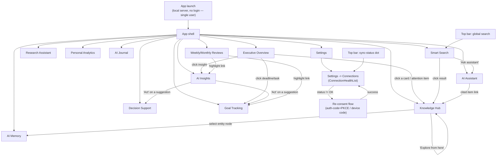

# 08 — UI Wireframes

Related: [README](../README.md) · [System architecture](01-system-architecture.md) ·
[Database schema](02-database-schema.md) · [Knowledge graph design](03-knowledge-graph-design.md) ·
[Technology stack](04-technology-stack.md) · [Outlook collector](15-outlook-collector.md) ·
[Dashboard components](09-dashboard-components.md)

## Overview

This document is the text-based wireframe set for every screen in PID: the app shell, the
Settings → Connections screen, and one wireframe per dashboard section. It is deliberately
low-fidelity — ASCII box layouts and Mermaid flows, both of which render natively on GitHub — so it
stays a design reference, not a pixel spec. Component-level detail (props, data contracts, chart
types, loading/empty/error states) for every named block lives in
[09-dashboard-components.md](09-dashboard-components.md); this document says *where things go*, that
one says *what they are*.

### Design principles (canon)

Every wireframe below assumes the following, locked for the whole product:

| Principle | What it means here |
|---|---|
| Modern, minimal | Generous whitespace, restrained chrome, content (not decoration) fills the viewport. |
| Dark / light mode | Every screen is drawn once and themed via CSS variables — see [Dark/light notes](#darklight-notes). |
| Responsive, mobile-friendly | Sidebar collapses to a bottom bar / drawer below the `md` breakpoint — see [Responsive breakpoints](#responsive-breakpoints). |
| Fast | Server-rendered shells, streamed content, skeleton states over spinners — see [09](09-dashboard-components.md#loadingemptyerror-state-conventions). |
| Highly visual, interactive | Cards, charts, timelines, heatmaps, calendar views, kanban boards, a knowledge-graph canvas — not tables of text. |
| Privacy-first | Every screen that shows connector data also shows that data's freshness/health — see [degrade loudly](#settings--connections-degrade-loudly). |

---

## App shell

### Desktop layout

```text
+------------------------------------------------------------------------------+
| [≡] PID     [ 🔍  Search everything…            ⌘K ]     ⏺ Synced 2m ago  ☾  ⚙ |
+---------------+----------------------------------------------------------------+
| ⌂ Overview    |  Page header: title, date range / filter controls, actions     |
| ◧ Knowledge   |  --------------------------------------------------------------|
|   Hub         |                                                                |
| ◔ AI Memory   |                                                                |
| 🔬 Research   |                     < page content area >                     |
| ⚖ Decisions   |                                                                |
| 📈 Analytics  |                                                                |
| 🎯 Goals      |                                                                |
| 📓 Journal    |                                                                |
| 🔎 Smart      |                                                                |
|   Search      |                                                                |
| 💡 Insights   |                                                                |
| 🗓 Reviews    |                                                                |
| 💬 Assistant  |                                                                |
|               |                                                                |
| ------------- |                                                                |
| ⚙ Settings    |                                                                |
+---------------+----------------------------------------------------------------+
```

- **Sidebar** — fixed width (~240px), collapsible to icon-only rail via the `[≡]` toggle. Twelve
  section links in the order defined in [README's feature table](../README.md#feature-set), plus
  a pinned `Settings` link (Connections, Appearance, AI Runtime, Privacy) below a divider. Active
  route is highlighted; each icon carries a text label at rest and a tooltip when the rail is
  collapsed.
- **Top bar** — three fixed elements, always visible regardless of scroll:
  - **Global search** (`⌘K` / `Ctrl+K` opens a command-palette variant) — natural-language or
    keyword, routes to Smart Search with the query pre-filled.
  - **Sync-status indicator** — a single rolled-up dot + label summarizing every connector's
    `sources.status` (see [02-database-schema.md](02-database-schema.md#core-tables)): green
    "Synced Xm ago" when all `OK`, amber "Attention needed" when any account is `STALE`,
    `AUTH_FAILED`, `NEEDS_CONSENT`, or `TAP_UNAVAILABLE`. Clicking it opens Settings → Connections
    directly — this is the ambient, always-visible half of "degrade loudly."
  - **Theme toggle** (`☾`/`☀`) and a settings gear shortcut.
- **Content area** — a `PageHeader` (title, contextual filters, primary action) followed by the
  section's own layout, detailed per-section below.

### Mobile layout (< `md`)

```text
+-----------------------------------+
| [≡]  PID        🔍   ⏺   ☾        |
+-----------------------------------+
|                                   |
|         < page content,          |
|           single column,         |
|           stacked cards >        |
|                                   |
|                                   |
+-----------------------------------+
| ⌂     ◧      🔎      💬      ≡    |
| Home  Hub   Search  Chat   More  |
+-----------------------------------+
```

- Sidebar collapses entirely; `[≡]` opens a full-height slide-over drawer with the same twelve
  links + Settings.
- A five-item **bottom tab bar** surfaces the four most-used destinations (Overview, Knowledge Hub,
  Smart Search, AI Assistant) plus a `More` sheet for everything else — chosen so the two "what's
  going on" / "what should I do" entry points and the two most interaction-heavy surfaces (search,
  chat) are always one tap away.
- All multi-column layouts (kanban, graph + inspector, matrix) reflow to a single scrollable column
  or a swipeable tab set; see each section's mobile note below.

### Settings → Connections ("degrade loudly")

This is the canonical surface for the per-account health model defined in
[15-outlook-collector.md §7](15-outlook-collector.md#7-degrade-loudly-ux) and generalized to every
connector via `sources.status` / `sync_state.status`
([02-database-schema.md](02-database-schema.md#core-tables)). Component: `ConnectionHealthList` —
see [09-dashboard-components.md](09-dashboard-components.md#connectionhealthlist).

```text
+------------------------------------------------------------------------------+
| Settings > Connections                                    [ + Add account ]  |
+------------------------------------------------------------------------------+
| Account                    Category      Tap    Status         Last sync     |
|--------------------------------------------------------------------------    |
| ana.smith@corp.com         Email+Cal     graph  ● OK            2m ago       |
| research.acct@gmail.com    Email         imap   ◐ STALE         41m ago      |
|   ⚠ Expected every ~2–5m; retrying with backoff.                             |
|                                                              [ Sync now ]     |
|--------------------------------------------------------------------------    |
| old.division@tenant.com    Email+Cal     graph  ✕ AUTH_FAILED   3d ago       |
|   ⚠ Sign-in expired; reconnect required.                                     |
|                                                              [ Reconnect ]    |
|--------------------------------------------------------------------------    |
| corp-org@tenant.com        Email+Cal     none   ▲ NEEDS_CONSENT  never       |
|   ⚠ Your organization hasn't approved PID's mail/calendar access.            |
|   Ask your admin to grant consent, or install Classic Outlook for a          |
|   local fallback.                                                            |
|                          [ Copy admin consent URL ] [ Reconnect ]            |
|--------------------------------------------------------------------------    |
| legacy-pop@isp.net         Email+Cal     none   ⊘ TAP_UNAVAILABLE  12d ago   |
|   ⚠ POP account requires Classic Outlook (COM); none available on this      |
|   machine.                                                                    |
|                                                    [ Install Classic Outlook ]|
+------------------------------------------------------------------------------+
```

- **Status badges** use exactly five values, styled distinctly (color + icon, never color alone —
  see [Accessibility note](#darklight-notes)):

  | Badge | Underlying `status` value | Color | Icon | Meaning |
  |---|---|---|---|---|
  | `OK` | `ok` | green | ● | Last sync succeeded within expected cadence. |
  | `STALE` | `stale` | amber | ◐ | Poll interval exceeded (~3× expected cadence); still retrying. |
  | `AUTH_FAILED` | `auth_failed` | red | ✕ | Refresh token rejected; may self-classify to `NEEDS_CONSENT`. |
  | `NEEDS_CONSENT` | `needs_consent` | red | ▲ | Revoked/expired grant, or an admin-consent wall (`AADSTS90094`). Requires user action. |
  | `TAP_UNAVAILABLE` | `tap_unavailable` | gray | ⊘ | No resolvable tap on this machine (e.g. POP without Classic Outlook, New Outlook cliff). |

- Every non-`OK` row shows its `status_reason` inline and a **re-consent / remediation CTA**
  matching [15-outlook-collector.md §7.2–7.3](15-outlook-collector.md#72-re-consent-flow): `Reconnect`
  re-runs the auth-code+PKCE flow and resumes from the last durable cursor (never forces a fresh
  backfill); `NEEDS_CONSENT` rows additionally offer `Copy admin consent URL` for the org-wall case.
- Any dashboard card built from a non-`OK` source shows a small inline staleness badge next to its
  data (see each section below) — the row-level detail here is the drill-down, not the only place
  the signal appears.
- **Mobile**: rows become stacked cards (account name + badge on one line, reason text below,
  action button full-width).

---

## Section wireframes

Every wireframe below renders inside the content area of the [app shell](#app-shell) — the sidebar
and top bar are omitted from these frames for legibility. Component names in `code font` map 1:1 to
[09-dashboard-components.md](09-dashboard-components.md).

### Executive Overview

```text
+------------------------------------------------------------------------------+
| Good morning, Yasas.            Tue, Jul 9 2026        [ Refresh briefing ]  |
+------------------------------------------------------------------------------+
| +-------------------------------------------+  +---------------------------+ |
| | 🧠 AI Daily Briefing          (BriefingCard)| | Productivity Score        | |
| | "Three deadlines land today; your 10am     | |   (ProductivityGauge)     | |
| |  with Priya moved to 2pm. The Q3 budget    | |        ╭───────╮          | |
| |  email needs a reply before EOD."          | |        │  78   │          | |
| |                          [ Ask follow-up ] | |        ╰───────╯          | |
| +-------------------------------------------+ |  ▲ 4 pts vs. last week    | |
|                                                +---------------------------+ |
| +---------------------------+  +---------------------------+ +------------+ |
| | Today's Schedule           |  | Deadlines                | | Weather    | |
| |   (AgendaTimeline)         |  |   (DeadlineList)         | | (WeatherTile)|
| | 09:00 Standup              |  | ● Q3 budget reply  (2h)  | |  ⛅ 24°C   | |
| | 10:00 ⚠ 1:1 — Priya  ⏰2pm |  | ● Grant review    (EOD)  | |  Partly    | |
| | 12:30 Lunch                |  | ○ Paper revisions (3d)   | |  cloudy    | |
| | 14:00 1:1 — Priya (moved)  |  |                           | |            | |
| +---------------------------+  +---------------------------+ +------------+ |
|                                                                                |
| +---------------------------+  +----------------------------------------+   |
| | Important Emails           |  | Priority Tasks         (TaskKanban,   |   |
| |   (top 3, StatTile list)   |  |  compact "Today" column)              |   |
| | ✉ Priya — "Re: Q3 budget"  |  | ☐ Finalize slides  High               |   |
| | ✉ Finance — "Invoice due"  |  | ☐ Reply to reviewer High              |   |
| | ✉ IT — "Password expiry"   |  | ☑ Book travel       Medium            |   |
| +---------------------------+  +----------------------------------------+   |
|                                                                                |
| +------------------------------------------------------------------------+  |
| | Needs Your Attention                                                    |  |
| |  ⚠ research.acct@gmail.com is STALE (41m) — data below may lag.        |  |
| |  💡 3 new insights ready to review   →                                  |  |
| +------------------------------------------------------------------------+  |
+------------------------------------------------------------------------------+
```

- Card grid: 3-column on desktop (`lg`), 2-column on `md`, single column stacked on mobile, in the
  visual priority order shown (briefing + score first, schedule/deadlines/weather second, tasks and
  emails third, attention strip last/pinned).
- **Empty state**: no events/tasks/deadlines today → briefing reads "Nothing urgent today — here's
  what's coming this week," schedule/deadline cards show a calm "Clear day" illustration instead of
  an empty table.

### Knowledge Hub

```text
+------------------------------------------------------------------------------+
| Knowledge Hub          [ 🔍 Filter within Hub… ]      [Grid] [Graph] view    |
+------------------------------------------------------------------------------+
| Collections        |  Grid view (default)                                   |
|---------------------|---------------------------------------------------    |
| ☑ Projects      142 |  +--------+ +--------+ +--------+ +--------+          |
| ☐ Research       58 |  | 📄 Doc | | ✉ Mail | | 📝 Note| | 📑 Paper|          |
| ☐ Teaching       31 |  | Title  | | Title  | | Title  | | Title  |          |
| ☐ Personal       97 |  | snippet| | snippet| | snippet| | snippet|          |
| ☐ Finance        64 |  +--------+ +--------+ +--------+ +--------+          |
| ☐ Travel         12 |  +--------+ +--------+ +--------+ +--------+          |
| ☐ Ideas          40 |  |  ...   | |  ...   | |  ...   | |  ...   |          |
| ☐ Reading        23 |  +--------+ +--------+ +--------+ +--------+          |
|---------------------|                                                        |
| Type   Date   Tag    |                     [ Load more ]                    |
| filters (facets)     |                                                        |
+------------------------------------------------------------------------------+

Graph view (toggled):
+------------------------------------------------------------------------------+
| Knowledge Hub          [ 🔍 Search entities… ]      [Grid] [Graph] view      |
+----------------------+---------------------------------------------------    |
| Filters               |            (Person)                                 |
| Type: ☑Person ☑Org    |               \                                     |
|  ☑Project ☑Topic ...  |          (Project)---(Topic)                        |
| Confidence: ▬▬▬▬▬○    |               |            \                        |
| Relation: mentions,   |            (Paper)---(Paper)                        |
|  works_at, cites...   |               (KnowledgeGraphView, Cytoscape.js)     |
|                        |------------------------------------------------    |
| Selected: "Priya Rao"  | Entity inspector          (EntityCard)              |
|  (EntityCard)          |  Type: Person · 14 mentions · confidence 0.94       |
|                        |  Grounding items: 6 emails, 2 events   [ View all ] |
+------------------------------------------------------------------------------+
```

- Left rail lists the collections named in the README's ingested-sources set (Project, Research,
  Teaching, Personal, Finance, Travel, Ideas, Reading), each a saved facet over `items.type`/
  `metadata`, plus type/date/tag facets underneath.
- **Graph view** renders via `KnowledgeGraphView` (Cytoscape.js, `fcose` default layout) per
  [03-knowledge-graph-design.md §Visualization approach](03-knowledge-graph-design.md#visualization-approach-cytoscapejs):
  click a node to lazily fetch neighbors, select a node to open its `EntityCard` inspector panel on
  the right, type/relation/confidence filters on the left.
- **Mobile**: grid view becomes a single-column feed; graph view becomes a full-screen canvas with
  the filter rail and inspector as bottom sheets.
- **Empty state**: no items ingested yet → illustrated "Connect a source to populate your Knowledge
  Hub" with a `[ Go to Settings → Connections ]` action.

### Research Assistant

```text
+------------------------------------------------------------------------------+
| Research Assistant     [ 🔍 Ask a research question… ]                       |
+------------------------------------------------------------------------------+
| Library                |  Answer / focused paper                            |
|-------------------------|-------------------------------------------------- |
| [Papers] [Docs] [All]   |  Q: "What did the cybersickness paper conclude    |
|                          |     about frame-rate thresholds?"                |
| 📑 Reducing Cybersickness|                                                    |
|    Chen et al., 2024    |  A: Frame rates below 72Hz correlated with a      |
|    (PaperSummaryCard)   |     significant increase in reported symptoms     |
|                          |     [1][2]. The authors recommend...              |
| 📑 VR Locomotion Survey  |                          (CitedAnswer)             |
|    Osei, 2023            |  [1] Reducing Cybersickness, §4.2  → open         |
|                          |  [2] VR Locomotion Survey, §2       → open        |
| 📄 Grant proposal draft  |-------------------------------------------------- |
|                          |  Summary                        (PaperSummaryCard)|
| [ + Add paper/doc ]      |  Key findings · Method · Limitations · Citations  |
+------------------------------------------------------------------------------+
```

- Two-pane layout: library list (filterable by paper/document, searchable) on the left, a
  citation-backed Q&A thread plus the focused paper's structured summary on the right.
- **Mobile**: tabs replace the two panes (`Library` / `Answer`).
- **Empty state**: no papers/docs ingested → prompt to enable the Papers or Documents connector;
  Q&A box stays active but explains it can only answer once sources exist.

### Decision Support

```text
+------------------------------------------------------------------------------+
| Decision Support                                    [ + New decision ]       |
+------------------------------------------------------------------------------+
| Open decisions          |  "Switch CI provider?"                            |
|--------------------------|------------------------------------------------- |
| ● Switch CI provider     |  Status: open   Linked: 3 entities, 5 items       |
| ● Hire contractor?       |                                                    |
| ○ Renew office lease     |  Decision Matrix              (DecisionMatrix)    |
|   (decided)               |            Cost   Speed  Risk   Score            |
|                            |  Option A   ●●●○   ●●●●   ●●○○   7.2            |
|                            |  Option B   ●●○○   ●●○○   ●●●●   6.8            |
|                            |  Option C   ●●●●   ●●●○   ●●●○   8.1  ★ Rec.    |
|                            |------------------------------------------------ |
|                            |  AI recommendation: "Option C balances cost     |
|                            |  and reliability given your team's history..." |
|                            |  Rationale draft            [ Edit ] [ Decide ] |
+------------------------------------------------------------------------------+
```

- List/detail layout; `DecisionMatrix` renders options × criteria as a scored, sortable grid with
  the AI's recommended option starred.
- **Mobile**: list and detail become separate stacked screens (tap a decision to drill in).
- **Empty state**: "No open decisions — capture one from an email, note, or start from scratch."

### Personal Analytics

```text
+------------------------------------------------------------------------------+
| Personal Analytics      [ This Month ▾ ]  [ Health | Finance | Habits | All ]|
+------------------------------------------------------------------------------+
| +----------------+ +----------------+ +----------------+ +----------------+ |
| | Steps (avg/day)| | Sleep (avg)    | | Spend (MTD)    | | Habit streak    |
| | 8,412  ▲ 6%    | | 7h 12m  ▼ 4%   | | $2,140         | | 14 days 🔥      |
| |   (StatTile)   | |   (StatTile)   | |   (StatTile)   | |   (StatTile)   | |
| +----------------+ +----------------+ +----------------+ +----------------+ |
|                                                                                |
| +--------------------------------------+  +------------------------------+  |
| | Steps over time         (TrendChart) |  | Spending breakdown            |  |
| |  ▁▂▃▅▇▆▄▃▂▅▇█▆▄▃▂▁▃▅▇▆                |  |  (SpendingBreakdown, donut)   |  |
| |  Jun 10 ─────────────── Jul 9         |  |   Rent 42% · Food 21% · ...   |  |
| +--------------------------------------+  +------------------------------+  |
|                                                                                |
| +------------------------------------------------------------------------+  |
| | Habit consistency                                    (HabitHeatmap)     |  |
| | Mon ▢▢■■□■■  Tue ■■■□■■■  Wed ■■□■■■■  ...  (52-week GitHub-style grid) |  |
| +------------------------------------------------------------------------+  |
+------------------------------------------------------------------------------+
```

- Top row: `StatTile` KPI strip (period-over-period delta). Middle row: a `TrendChart` (line/area,
  domain selectable via the tab bar) beside a `SpendingBreakdown` donut when Finance is selected.
  Bottom: a full-width `HabitHeatmap` (calendar-heatmap grid).
- **Mobile**: KPI strip becomes a horizontally-scrollable row; charts stack full-width.
- **Empty state**: category-specific — e.g. "Connect a finance source to see spending trends" for
  an unconfigured domain, shown per-widget rather than blocking the whole page.

### Goal Tracking

```text
+------------------------------------------------------------------------------+
| Goal Tracking                                          [ + New goal ]        |
+------------------------------------------------------------------------------+
| +----------------------------------+  +----------------------------------+  |
| | Ship PID v1                       |  | Run a half marathon                |
| |   (GoalProgressCard)             |  |   (GoalProgressCard)               |
| |   ▰▰▰▰▰▰▰▱▱▱  68%                 |  |   ▰▰▰▱▱▱▱▱▱▱  24%                  |
| |   Target: Sep 30 2026            |  |   Target: Nov 2 2026               |
| +----------------------------------+  +----------------------------------+  |
|                                                                                |
| Ship PID v1 — Milestones                              (MilestoneTimeline)    |
| ●───────●───────●───────○───────○───────○                                   |
| Design  Schema  Ingestion  UI    Beta   Launch                               |
| done    done    done    (now)  Aug 15  Sep 30                                |
|                                                                                |
| Linked activity: 3 habits, 41 items                        [ View all → ]   |
+------------------------------------------------------------------------------+
```

- Goal grid up top (`GoalProgressCard` per goal, progress ring/bar + target date), a horizontal
  `MilestoneTimeline` for the selected/expanded goal below, and a linked-activity strip tying back
  to the items/habits that actually moved the goal.
- **Mobile**: goal cards stack single-column; milestone timeline becomes vertical.
- **Empty state**: "No goals yet — turn an idea from your Knowledge Hub into a goal" CTA.

### AI Journal

```text
+------------------------------------------------------------------------------+
| AI Journal                              [ ◀ Jul 9 2026 ▶ ]  [ + New entry ]  |
+------------------------------------------------------------------------------+
| Calendar strip: Jun 30 ▪▪▪▪▪▪▪ Jul 7 ▪▪●                                     |
|--------------------------------------------------------------------------    |
| Prompt (AI-generated from today's context):                                  |
|  "You had a packed day with the Q3 budget deadline and a rescheduled         |
|   1:1 — how did that shift affect your focus?"                               |
|                                                                                |
| +------------------------------------------------------------------------+  |
| |                          (JournalEntry, rich text)                      |  |
| |  Today felt scattered until the 2pm sync with Priya clarified...        |  |
| |                                                                            |  |
| +------------------------------------------------------------------------+  |
| Mood: 🙂  Tags: #work #focus        Linked: Q3 budget email, 1:1 event      |
|                                                          [ Save entry ]      |
+------------------------------------------------------------------------------+
```

- A calendar strip for quick date navigation (density-shaded by whether an entry exists), an
  AI-generated prompt drawn from the day's ingested context, and a rich-text `JournalEntry` editor
  with mood/tag chips and auto-linked source items.
- **Mobile**: calendar strip collapses to a single date picker; editor is full-screen.
- **Empty state**: no entry for the selected day → prompt + blank editor, no error state.

### Smart Search

```text
+------------------------------------------------------------------------------+
| Smart Search                                                                  |
|  [ 🔍 "What did I decide about the CI provider last month?"          Search ]|
+------------------------------------------------------------------------------+
| Filters: Type ▾  Date ▾  Source ▾              12 results · 340ms            |
|--------------------------------------------------------------------------    |
| Synthesized answer                                    (CitedAnswer)          |
|  "You decided to switch to Option C (see Decision: 'Switch CI provider')     |
|   on Jun 14, citing cost and reliability [1][2]."                            |
|  [1] decisions: Switch CI provider  [2] email: "Re: CI options" → open       |
|--------------------------------------------------------------------------    |
| Results                                                                       |
|  ⚖ Decision — Switch CI provider              Jun 14   96% match            |
|  ✉ Email — Re: CI options                     Jun 12   88% match            |
|  📝 Note — CI migration plan                   Jun 10   81% match            |
+------------------------------------------------------------------------------+
```

- `SearchBar` at top (natural-language or keyword — hybrid FTS5 + vector, per
  [01-system-architecture.md](01-system-architecture.md#dashboard-sections-mapped-to-services)); a
  `CitedAnswer` synthesized summary above a conventional ranked result list, each result tagged
  with its source `items.type` icon and match score.
- **Mobile**: filters collapse into a single "Filters" sheet trigger; results remain a single list.
- **Empty state**: no query yet → recent searches + suggested queries; a query with zero results
  shows "No matches — try broadening filters or check Settings → Connections for stale sources."

### AI Insights

```text
+------------------------------------------------------------------------------+
| AI Insights                          [ All ] [ Patterns ] [ Anomalies ] [ Connections ] |
+------------------------------------------------------------------------------+
| +------------------------------------------------------------------------+  |
| | 💡 Pattern · new                                       (InsightFeed)    |  |
| | You've had 4 meetings with Priya rescheduled in the last 2 weeks.       |  |
| | Related: 1:1 — Priya (×4)                          [ Dismiss ] [ Act ]  |  |
| +------------------------------------------------------------------------+  |
| | ⚠ Anomaly · new                                                         |  |
| | June spending on "Software" is 3.1× your 6-month average.               |  |
| | Related: 6 transactions                            [ Dismiss ] [ Act ]  |  |
| +------------------------------------------------------------------------+  |
| | 🔗 Connection · seen                                                    |  |
| | "Cybersickness paper" and "VR onboarding project" share 3 concepts.     |  |
| | Related: 2 entities, 5 items                       [ Dismiss ] [ Act ]  |  |
| +------------------------------------------------------------------------+  |
+------------------------------------------------------------------------------+
```

- A single-column, reverse-chronological `InsightFeed` of cards, filterable by `insights.kind`
  (`pattern|anomaly|connection|suggestion`), each with dismiss/act affordances that write back to
  `insights.status`.
- **Mobile**: unchanged — already single-column by design.
- **Empty state**: "No new insights — check back after your next sync, or lower the sensitivity in
  Settings."

### Weekly/Monthly Reviews

```text
+------------------------------------------------------------------------------+
| Reviews                              [ Weekly ] [ Monthly ]   [ Jul 1–7 ▾ ]  |
+------------------------------------------------------------------------------+
| Summary                                                    (ReviewReport)    |
|  "A productive week: you closed 9 tasks, advanced 2 goals, and had 3         |
|   notable meetings. Spending stayed within budget."                          |
|--------------------------------------------------------------------------    |
| Highlights                                                                    |
|  ✅ Shipped UI wireframes milestone      🎯 Goal "Ship PID v1" +8%           |
|  💬 3 AI Insights acted on               📉 Spend 6% under budget            |
|--------------------------------------------------------------------------    |
| +----------------------+ +----------------------+ +----------------------+  |
| | Tasks completed: 9    | | Focus time: 18.5h     | | Meetings: 11         |  |
| |   (StatTile)          | |   (StatTile)          | |   (StatTile)         |  |
| +----------------------+ +----------------------+ +----------------------+  |
+------------------------------------------------------------------------------+
```

- A generated narrative (`ReviewReport`) up top, a highlights list, then a `StatTile` grid of the
  period's key numbers; a period-type toggle (`Weekly`/`Monthly`) and a date-range picker switch the
  underlying `reviews` row.
- **Mobile**: stat tiles wrap to two per row.
- **Empty state**: period not yet generated (job hasn't run) → "This review is generating…"
  skeleton, or `[ Generate now ]` if the scheduled job hasn't fired yet.

### AI Assistant (chat)

```text
+------------------------------------------------------------------------------+
| AI Assistant                                          Model: local (LM Studio)|
+------------------------------------------------------------------------------+
| You: What are my open action items from this week's emails?                  |
|                                                                                |
| Assistant:                                              (AssistantChat)      |
|  You have 3 open items: reply to the Q3 budget thread [1], confirm the       |
|  vendor call time [2], and send Priya the revised slides [3].                |
|  [1] email: "Re: Q3 budget"  [2] email: "Vendor call"  [3] task: "Slides"    |
|                                                                                |
|  [ 📎 New from this ]  [ 👍 ]  [ 👎 ]                                        |
|--------------------------------------------------------------------------    |
| [ Type a message…                                              ] [ Send ▶ ] |
+------------------------------------------------------------------------------+
```

- Standard chat transcript, assistant turns rendered as `CitedAnswer`-style responses with
  grounded citations back into `items`/`entities`; input bar pinned to the bottom; a
  model/connection indicator confirms the local LM Studio endpoint in use (never a cloud model).
- **Mobile**: full-screen chat, input bar respects the on-screen keyboard safe area.
- **Empty state**: fresh conversation → suggested starter prompts drawn from today's briefing
  context (e.g. "Summarize my week," "What's overdue?").

---

## Navigation flow



- There is no login screen — PID is a single-user, local app; the shell is the true entry point.
- Every section is reachable directly from the sidebar (flat navigation, no nesting beyond
  Settings → Connections), keeping the twelve sections one click apart at all times.
- Cross-links (Overview → Hub/Insights/Goals, Search → Hub/Assistant, Insights → Decisions/Goals)
  are the "what should I do about it" pathways the README's vision statement describes — insights
  and reviews always resolve to an actionable section, never a dead end.

---

## Empty states

| Section | Trigger | Treatment |
|---|---|---|
| Executive Overview | No events/tasks/deadlines today | "Clear day" illustration; briefing reframes to the week ahead |
| Knowledge Hub | No items ingested at all | "Connect a source" CTA → Settings → Connections |
| AI Memory | No `ai_conversations` yet | "Memory builds as you use AI Assistant / Journal" |
| Research Assistant | No papers/documents ingested | Prompt to enable Papers/Documents connector; Q&A box explains the limitation |
| Decision Support | No `decisions` rows | "Capture your first decision" CTA |
| Personal Analytics | A domain (health/finance/habits) has no data | Per-widget "Connect a source" note, other widgets unaffected |
| Goal Tracking | No `goals` rows | "Turn an idea into a goal" CTA |
| AI Journal | No entry for selected date | Prompt + blank editor, not an error |
| Smart Search | No query yet / zero results | Recent + suggested queries; zero-result tip to check Connections |
| AI Insights | No `insights` with `status='new'` | "Check back after your next sync" |
| Weekly/Monthly Reviews | Period not yet generated | Skeleton "generating…" or `[ Generate now ]` |
| AI Assistant | Fresh conversation | Suggested starter prompts from today's briefing |
| Settings → Connections | No connectors configured yet | "Add your first account" CTA (setup wizard) |

Every empty state is illustrated and actionable — never a bare "No data" string — consistent with
the "highly visual, interactive" canon requirement.

---

## Dark/light notes

- Theme is a single boolean stored in `settings` ([02-database-schema.md](02-database-schema.md#app-tables))
  and applied via a CSS custom-property theme (Tailwind `dark:` variants), defaulting to the OS
  preference on first launch, overridable via the top-bar toggle.
- Status colors (the five health badges, insight kinds, chart series) are chosen to hold sufficient
  contrast in both themes and are **never color-only** — every status badge pairs color with an
  icon and a text label (`● OK`, `✕ AUTH_FAILED`, etc.), and every chart series is distinguishable
  by shape/pattern in addition to hue, per [09-dashboard-components.md](09-dashboard-components.md#shadcnui-primitives-used).
- Charts (`TrendChart`, `HabitHeatmap`, `SpendingBreakdown`, `ProductivityGauge`) and the graph view
  (`KnowledgeGraphView`) both read the active theme's token palette so node/edge/series colors
  invert cleanly rather than being hardcoded.

## Responsive breakpoints

| Breakpoint | Width | Shell behavior | Grid behavior |
|---|---|---|---|
| `sm` | < 640px | Bottom tab bar + drawer nav; top bar collapses search into an icon | Single column everywhere |
| `md` | 640–1023px | Sidebar becomes an icon-only rail (labels on hover/tap) | 2-column card grids; kanban/matrix become swipeable tabs |
| `lg` | 1024–1439px | Full labeled sidebar | 3-column card grids; graph view + inspector side-by-side |
| `xl` | ≥ 1440px | Full labeled sidebar, wider content max-width | Up to 4-column card grids; charts gain more horizontal room |

All breakpoints follow Tailwind's default scale (per
[04-technology-stack.md](04-technology-stack.md#summary-table)); no custom breakpoint values are
introduced.

## Cross-references

- [09-dashboard-components.md](09-dashboard-components.md) — the component inventory and data
  contracts for every block named above.
- [01-system-architecture.md](01-system-architecture.md#dashboard-sections-mapped-to-services) —
  which service backs each section.
- [02-database-schema.md](02-database-schema.md) — the tables each section ultimately reads.
- [03-knowledge-graph-design.md](03-knowledge-graph-design.md#visualization-approach-cytoscapejs) —
  the Cytoscape.js data adapter and interaction model behind the Knowledge Hub's graph view.
- [15-outlook-collector.md §7](15-outlook-collector.md#7-degrade-loudly-ux) — the health state
  machine and re-consent flow the Settings → Connections screen surfaces.
