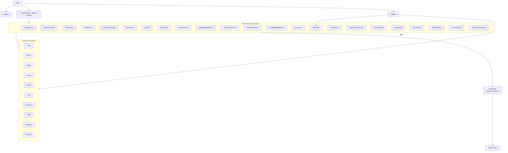

# 09 — Dashboard Components

Related: [README](../README.md) · [System architecture](01-system-architecture.md) ·
[Database schema](02-database-schema.md) · [Knowledge graph design](03-knowledge-graph-design.md) ·
[Technology stack](04-technology-stack.md) · [Outlook collector](15-outlook-collector.md) ·
[UI wireframes](08-ui-wireframes.md)

## Overview

This document inventories every reusable component behind the wireframes in
[08-ui-wireframes.md](08-ui-wireframes.md), in three layers:

1. **Layout components** — the app chrome every section renders inside.
2. **shadcn/ui primitives** — the accessible, Tailwind-based building blocks (Radix UI underneath,
   copied into the repo, not an opaque dependency — per
   [04-technology-stack.md](04-technology-stack.md#summary-table)) composed into everything above.
3. **PID-specific components** — the domain components named in each wireframe, each with its
   purpose, data contract, key props, chart type where relevant, and loading/empty/error behavior.

Every data contract below names the **primary service** that backs it (per
[01-system-architecture.md §Dashboard sections mapped to services](01-system-architecture.md#dashboard-sections-mapped-to-services))
and the **tables** it ultimately reads or writes (per
[02-database-schema.md](02-database-schema.md)). API routes follow one convention throughout:
`app/api/<section>/route.ts` (collection) and `app/api/<section>/[id]/route.ts` (resource), per
Next.js App Router Route Handlers ([04-technology-stack.md](04-technology-stack.md#summary-table));
components never call services or the database directly — only `fetch`/server actions against these
routes, per the UI layer's dependency rule in
[01-system-architecture.md §Module boundaries](01-system-architecture.md#module-boundaries).

## Component architecture

## Loading/empty/error state conventions

Three states are designed once and reused by every PID-specific component below, so the twelve
sections feel like one system rather than twelve bespoke screens:

| State | Convention |
|---|---|
| **Loading** | A shadcn/ui `Skeleton` shaped like the eventual content (never a bare spinner for card/list content; a small inline spinner is acceptable only inside buttons and the search input). Server Components stream in so the shell and nav are interactive immediately, per [04-technology-stack.md](04-technology-stack.md#summary-table). |
| **Empty** | An illustration + one sentence + one action, matching the [Empty states table](08-ui-wireframes.md#empty-states) in 08 — never a bare "No data" string. |
| **Error** | Two tiers: (1) **stale-but-present data** — render the last-known data with an inline staleness badge sourced from `sources.status`/`sync_state.status` (see [ConnectionHealthList](#connectionhealthlist)); (2) **no data at all** — a retry affordance plus, for AI-backed components, an explicit "LM Studio unreachable" message rather than a generic failure, since that failure mode is expected to happen locally and often (per [04-technology-stack.md §LM Studio integration](04-technology-stack.md#lm-studio-integration-in-detail)). |

---

## Layout components

### Shell

| | |
|---|---|
| Purpose | Top-level layout: composes `Sidebar`, `TopBar`, and the routed page content; owns the responsive collapse behavior described in [08-ui-wireframes.md §App shell](08-ui-wireframes.md#app-shell). |
| Data contract | None directly — reads the current route to set `activeSection`, and calls `GET /api/connections/summary` (Overview/Connection health aggregate over `sources`) once per navigation to feed the `TopBar` sync-status dot. |
| Key props | `children`, `activeSection` |
| States | N/A (structural component) |

### Sidebar

| | |
|---|---|
| Purpose | Persistent navigation across all twelve sections + Settings; collapses to an icon rail (`md`) or a drawer (`sm`). |
| Data contract | None — a static route table; no fetch. |
| Key props | `sections: NavSection[]`, `activeSection`, `collapsed`, `onToggleCollapse` |
| States | N/A |

### TopBar

| | |
|---|---|
| Purpose | Global search entry point, aggregated sync-status indicator, theme toggle. |
| Data contract | `GET /api/connections/summary` (Overview Service, rolling up `sources.status` across all rows) for the sync-status dot; search submits to `GET /api/search`. |
| Key props | `syncSummary: { status: HealthStatus; lastSyncAt: number }`, `onSearchSubmit`, `theme`, `onThemeToggle` |
| States | Loading: sync dot shows a neutral/gray pulsing state until the first summary resolves. Error: if the summary call itself fails, the dot shows `TAP_UNAVAILABLE`-style gray with a tooltip "Status unknown." |

### PageHeader

| | |
|---|---|
| Purpose | Per-section title, contextual filters/date-range controls, and a primary action slot (e.g. `+ New goal`, `+ New decision`). |
| Data contract | None — purely presentational, filled by the parent section. |
| Key props | `title`, `description?`, `filters?: ReactNode`, `actions?: ReactNode` |
| States | N/A |

---

## shadcn/ui primitives used

Copied into the repo per the locked decision in [04-technology-stack.md](04-technology-stack.md#summary-table)
(Radix UI underneath, fully restylable, no opaque runtime dependency). The set PID composes from:

| Primitive | Used for |
|---|---|
| `Card` | The base surface for nearly every PID-specific component (`BriefingCard`, `StatTile`, `GoalProgressCard`, ...). |
| `Button`, `DropdownMenu` | Actions, per-row menus (`Sync now`, `Dismiss`, `Act`). |
| `Badge` | Status pills — health enum, insight kind, task priority — always paired with an icon, never color-only. |
| `Avatar` | Person entities in `EntityCard`, attendee lists in `AgendaTimeline`. |
| `Dialog`, `Sheet` | Modals (`+ New decision`, `+ New goal`) and mobile drawers/bottom sheets. |
| `Tabs` | Domain switches (Personal Analytics' Health/Finance/Habits; mobile section tabs). |
| `Command` (cmdk) | The `⌘K` global command palette wrapping `SearchBar`. |
| `Popover`, `HoverCard`, `Tooltip` | Filter panels, collapsed-sidebar labels, citation previews in `CitedAnswer`. |
| `Skeleton` | Every loading state, per [conventions above](#loadingemptyerror-state-conventions). |
| `Progress` | `GoalProgressCard` bars, `ProductivityGauge` fallback (non-chart) rendering. |
| `Table` | `DecisionMatrix` grid, `ConnectionHealthList` desktop rows. |
| `Calendar` | Date navigation in `AI Journal`, date-range pickers in Analytics/Reviews (paired with FullCalendar for full month/week views per [04-technology-stack.md](04-technology-stack.md#summary-table)). |
| `Toast` (sonner) | Save confirmations (`JournalEntry`), reconnect success/failure. |
| `Separator`, `ScrollArea` | Sidebar sections, long lists (`InsightFeed`, `PaperSummaryCard` library). |
| `Input`, `Select`, `Switch`, `Checkbox`, `RadioGroup` | Filters, facets, `DecisionMatrix` criteria weighting, Settings toggles. |

---

## PID-specific components

### BriefingCard

| | |
|---|---|
| Purpose | AI-generated daily-brief summary ("what's urgent, what's due, what changed") anchoring Executive Overview. |
| Data contract | `GET /api/overview/briefing` → **Overview Service**, which reads recent `items` (events, emails, tasks), `insights`, and calls **AI Orchestration Service** for summarization ([01-system-architecture.md](01-system-architecture.md#dashboard-sections-mapped-to-services)). |
| Key props | `briefingText`, `generatedAt`, `sourceStatus: HealthStatus[]`, `onAskFollowUp(question)` |
| Chart type | — (text card) |
| Loading | 3-line `Skeleton` paragraph. |
| Empty | No urgent items → reframes to "Nothing urgent today — here's what's coming this week." |
| Error | LM Studio unreachable → falls back to a deterministic bullet list (top events/tasks/emails, no narrative) with a "Briefing unavailable — showing raw highlights" note. |

### AgendaTimeline

| | |
|---|---|
| Purpose | Vertical timeline of today's calendar events with a current-time indicator. |
| Data contract | `GET /api/overview/agenda` → **Overview Service** reading `events` joined to `items` (`start_at`, `end_at`, `location`, `attendees`), filtered to today. |
| Key props | `events: EventItem[]`, `nowIndicatorAt`, `onEventClick(itemId)` |
| Chart type | Timeline (custom list, not a charting-library chart) |
| Loading | Row-shaped `Skeleton` list. |
| Empty | "Clear day" illustration. |
| Error | Renders last-fetched agenda with a staleness `Badge` if the owning `sources.status` ≠ `OK`. |

### TaskKanban

| | |
|---|---|
| Purpose | Board of tasks grouped by status; used compact (Today column) on Executive Overview and full-board elsewhere tasks are surfaced. |
| Data contract | `GET /api/tasks?view=kanban` → **Overview Service** / **Goal Tracking Service** reading `tasks` (`status`, `priority`, `due_at`, `project`); `PATCH /api/tasks/:itemId` on drag-drop status change. |
| Key props | `columns: { status: TaskStatus; tasks: Task[] }[]`, `onDragEnd(taskId, newStatus)`, `onTaskClick(itemId)` |
| Chart type | — (kanban board) |
| Loading | Column-shaped `Skeleton` cards, 3 per column. |
| Empty | Per-column "No tasks" placeholder. |
| Error | Drag actions optimistically update, roll back with a `Toast` on `PATCH` failure. |

### DeadlineList

| | |
|---|---|
| Purpose | Ranked list of near-term deadlines (tasks due soon, milestone target dates). |
| Data contract | `GET /api/overview/deadlines` → **Overview Service** reading `tasks.due_at` and `milestones.target_date` within a rolling window. |
| Key props | `deadlines: Deadline[]`, `urgencyThresholdHours` |
| Chart type | — (list, urgency-colored) |
| Loading | `Skeleton` list rows. |
| Empty | "Nothing due" message. |
| Error | Stale `Badge` per item if its source is non-`OK`. |

### ProductivityGauge

| | |
|---|---|
| Purpose | Single composite productivity score (tasks completed, focus time, meeting load) with period-over-period delta. |
| Data contract | `GET /api/overview/productivity-score` → **Overview Service**, a computed metric over `tasks`, `events`, and `habit_logs`. |
| Key props | `score: number (0–100)`, `deltaVsPreviousPeriod`, `period` |
| Chart type | Radial gauge (Recharts `RadialBarChart`, per [04-technology-stack.md](04-technology-stack.md#summary-table)) |
| Loading | Circular `Skeleton`. |
| Empty | Score renders as `—` with "Not enough activity yet" when the underlying window has too few data points. |
| Error | Falls back to `Progress`-bar rendering if the chart library fails to mount (rare; noted for resilience, not expected in practice). |

### WeatherTile

| | |
|---|---|
| Purpose | Current conditions + high/low, from the opt-in weather source. |
| Data contract | `GET /api/overview/weather` → **Overview Service** reading the latest `items` row from the `weather`-category `source` (condition/temperature carried in `items.metadata` JSON, since weather has no dedicated domain table in [02-database-schema.md](02-database-schema.md#domain-tables)). |
| Key props | `tempC`, `condition`, `iconCode`, `highC`, `lowC` |
| Chart type | — (icon + numbers) |
| Loading | `Skeleton` block matching tile dimensions. |
| Empty | "Weather unavailable" if no weather source is configured → links to Settings → Connections. |
| Error | Staleness `Badge` if `last_sync_at` exceeds the feed's poll interval. |

### StatTile

| | |
|---|---|
| Purpose | Generic KPI tile (label, value, period-over-period delta, optional sparkline) reused across Personal Analytics, Weekly/Monthly Reviews, and the Overview's "Important Emails" mini-list rendering. |
| Data contract | Consumer-supplied — Personal Analytics calls `GET /api/analytics/stats`, Reviews calls `GET /api/reviews/:id` (both below); `StatTile` itself takes pre-computed values as props and issues no fetch of its own. |
| Key props | `label`, `value`, `delta?`, `deltaDirection?: 'up' \| 'down'`, `sparkline?: number[]`, `icon?` |
| Chart type | Optional inline sparkline (Recharts) |
| Loading | `Skeleton` matching tile shape. |
| Empty | Renders `—` for `value` with a muted "No data" caption. |
| Error | N/A — purely presentational; the parent section handles fetch errors. |

### TrendChart

| | |
|---|---|
| Purpose | Time-series line/area chart for any metric over a selectable date range (steps, sleep, spending, focus time). |
| Data contract | `GET /api/analytics/trend?metric=<m>&from=&to=` → **Analytics Service** reading `health_metrics`, `transactions`, or `habit_logs` depending on `metric`. |
| Key props | `series: { date: number; value: number }[]`, `metric`, `granularity: 'day' \| 'week' \| 'month'` |
| Chart type | Line/area chart (Recharts `LineChart`/`AreaChart`) |
| Loading | `Skeleton` block shaped like a chart canvas. |
| Empty | "Not enough data points yet — connect a source or wait for more history." |
| Error | Retry banner above a last-known-good cached render, if available. |

### HabitHeatmap

| | |
|---|---|
| Purpose | GitHub-style calendar heatmap of habit consistency, used in both Personal Analytics and Goal Tracking (per-goal habit view). |
| Data contract | `GET /api/analytics/habits/:habitId/heatmap` → **Analytics Service** / **Goal Tracking Service** reading `habit_logs` (`logged_at`, `count`) against `habits.target_count`. |
| Key props | `habitId`, `weeks: number`, `values: { date: number; count: number }[]` |
| Chart type | Calendar heatmap (custom SVG grid, intensity-shaded cells) |
| Loading | `Skeleton` grid matching the week/day layout. |
| Empty | "Start logging this habit" with a quick-log action. |
| Error | Stale `Badge` if the owning habit's logs haven't updated in longer than its `cadence`. |

### SpendingBreakdown

| | |
|---|---|
| Purpose | Category breakdown of spending for the selected period. |
| Data contract | `GET /api/analytics/spending?from=&to=` → **Analytics Service** reading `transactions` (`amount_cents`, `category`, `merchant`). |
| Key props | `categories: { category: string; amountCents: number }[]`, `totalCents`, `currency` |
| Chart type | Donut chart (Recharts `PieChart` with `innerRadius`) |
| Loading | `Skeleton` circle + legend rows. |
| Empty | "No transactions this period — connect a finance source." |
| Error | Staleness `Badge` if the finance source is non-`OK`. |

### GoalProgressCard

| | |
|---|---|
| Purpose | Per-goal summary card: progress bar/ring, target date, status. |
| Data contract | `GET /api/goals` → **Goal Tracking Service** reading `goals` and computing progress from `milestones` (done/total) and/or linked `habit_logs`. |
| Key props | `goal: Goal`, `progressPct`, `targetDate`, `status: 'active' \| 'paused' \| 'completed' \| 'abandoned'` |
| Chart type | Progress ring/bar (shadcn/ui `Progress`, or a small Recharts `RadialBarChart` for the ring variant) |
| Loading | `Skeleton` card. |
| Empty | N/A per-card (the section-level empty state — "No goals yet" — covers the zero-goals case). |
| Error | Staleness `Badge` if linked activity's source is non-`OK`. |

### MilestoneTimeline

| | |
|---|---|
| Purpose | Horizontal (desktop) / vertical (mobile) timeline of a goal's milestones. |
| Data contract | `GET /api/goals/:goalId/milestones` → **Goal Tracking Service** reading `milestones` (`title`, `target_date`, `completed_at`, `status`, `sort_order`). |
| Key props | `milestones: Milestone[]`, `currentMilestoneId?` |
| Chart type | Timeline (custom, node-and-connector layout) |
| Loading | `Skeleton` row of connected placeholder nodes. |
| Empty | "No milestones yet — add one" inline action. |
| Error | N/A beyond standard fetch-retry. |

### KnowledgeGraphView

| | |
|---|---|
| Purpose | Interactive entity-relationship graph canvas — the Knowledge Hub's graph view and any "explore from here" affordance. |
| Data contract | `GET /api/graph/:entityId/neighbors` (paginated) and `GET /api/graph/search?q=` → **Knowledge Graph Service** reading `entities`/`edges`, mapped to Cytoscape elements exactly as specified in [03-knowledge-graph-design.md §Visualization approach](03-knowledge-graph-design.md#visualization-approach-cytoscapejs). |
| Key props | `rootEntityId?`, `elements: CyElements`, `layout: 'fcose' \| 'dagre' \| 'concentric'`, `filters: { types?: string[]; relations?: string[]; minConfidence?: number }`, `onNodeSelect(entityId)` |
| Chart type | Force-directed / hierarchical graph (Cytoscape.js, per [04-technology-stack.md](04-technology-stack.md#summary-table)) |
| Loading | Canvas-shaped `Skeleton` with a centered spinner (graph layout computation is the one place a bare spinner is acceptable, per [conventions above](#loadingemptyerror-state-conventions)). |
| Empty | "No entities match these filters — broaden your filters" with a `[ Reset filters ]` action. |
| Error | "Graph service unavailable" banner; canvas remains interactive with the last-successful element set if one exists. |

### EntityCard

| | |
|---|---|
| Purpose | Inspector panel for a single entity — type, confidence, mention count, grounding items — shown on graph-node selection and from Knowledge Hub facets. |
| Data contract | `GET /api/graph/entities/:entityId` → **Knowledge Graph Service** reading `entities` (including `provenance`) plus a bounded `mentions`/`tagged_with` edge query for grounding items. |
| Key props | `entity: Entity`, `groundingItems: Item[]`, `onExploreNeighbors(entityId)` |
| Chart type | — (detail card) |
| Loading | `Skeleton` card matching entity-detail layout. |
| Empty | N/A — only rendered once an entity is selected. |
| Error | "Couldn't load this entity" with retry. |

### SearchBar

| | |
|---|---|
| Purpose | The single search input used both in the top bar (`⌘K` command palette) and atop Smart Search — natural-language or keyword. |
| Data contract | Submits to `GET /api/search?q=` → **Search Service** (hybrid FTS5 + vector per [01-system-architecture.md](01-system-architecture.md#dashboard-sections-mapped-to-services)); issues no fetch itself beyond debounced suggestion lookups. |
| Key props | `value`, `onChange`, `onSubmit(query)`, `suggestions?: string[]`, `isLoading` |
| Chart type | — |
| Loading | Inline spinner within the input's trailing icon slot (the one component-level exception to "no bare spinners," since it's a small, expected, in-line affordance). |
| Empty | Suggestion dropdown shows recent + suggested queries when the input is empty and focused. |
| Error | N/A — dumb/controlled component; the results surface (Smart Search page) owns error state. |

### CitedAnswer

| | |
|---|---|
| Purpose | RAG-synthesized answer with numbered, clickable citations back to source `items`/`chunks` — used in Smart Search, Research Assistant, and AI Assistant. |
| Data contract | Result of `POST /api/search`, `POST /api/research/ask`, or `POST /api/assistant/chat` (all three route through **AI Orchestration Service** for generation, per [01-system-architecture.md](01-system-architecture.md#dashboard-sections-mapped-to-services)), returning `{ answer: string; citations: { itemId, chunkId, label }[] }`. |
| Key props | `answerText`, `citations: Citation[]`, `onCitationClick(itemId)` |
| Chart type | — (text + citation chips) |
| Loading | `Skeleton` paragraph with a "thinking…" shimmer. |
| Empty | "No answer could be generated from your data" — distinct from a zero-result search (handled by the parent list). |
| Error | "AI Orchestration unavailable — showing raw results only" fallback, degrading to an unsynthesized result list rather than blocking the page. |

### PaperSummaryCard

| | |
|---|---|
| Purpose | Structured summary of a research paper: key findings, method, limitations, citation graph. |
| Data contract | `GET /api/research/papers/:itemId` → **Research Assistant Service** reading `papers` (`authors`, `venue`, `year`, `doi`, `abstract`) plus a cached or on-demand AI Orchestration summarization pass. |
| Key props | `paper: Paper`, `summary?: { findings; method; limitations }`, `citations: Paper[]`, `onGenerateSummary()` |
| Chart type | — (structured text card) |
| Loading | `Skeleton` card with section placeholders. |
| Empty | Summary not yet generated → `[ Generate summary ]` action (on-demand, not automatic, to avoid unnecessary LM Studio calls). |
| Error | "Summarization failed — retry" without losing the paper's raw metadata display. |

### DecisionMatrix

| | |
|---|---|
| Purpose | Scored options × criteria grid for a decision, with the AI-recommended option highlighted. |
| Data contract | `GET /api/decisions/:id` / `PATCH /api/decisions/:id` → **Decision Support Service** reading/writing `decisions` (`options` JSON, `criteria` JSON, `recommendation`, `confidence`). |
| Key props | `options: DecisionOption[]`, `criteria: Criterion[]`, `scores: number[][]`, `recommendedOptionId?` |
| Chart type | Scored grid (shadcn/ui `Table` with weighted-score cell rendering; no chart library needed) |
| Loading | `Skeleton` table. |
| Empty | "Add options and criteria to compare" with inline add controls. |
| Error | Edits are optimistic; a failed `PATCH` rolls back with a `Toast`. |

### InsightFeed

| | |
|---|---|
| Purpose | Reverse-chronological feed of AI-surfaced patterns, anomalies, and connections; also powers the Executive Overview "Needs Your Attention" strip in a condensed form. |
| Data contract | `GET /api/insights?status=new&kind=` → **Insights Service** reading `insights`; `PATCH /api/insights/:id` to update `status` (`new\|seen\|dismissed\|acted`) on dismiss/act. |
| Key props | `insights: Insight[]`, `filterKind?: 'pattern' \| 'anomaly' \| 'connection' \| 'suggestion'`, `onDismiss(id)`, `onAct(id)` |
| Chart type | — (card feed) |
| Loading | `Skeleton` cards, 3–4 placeholders. |
| Empty | "No new insights — check back after your next sync." |
| Error | Failed dismiss/act actions roll back with a `Toast`; feed itself shows a retry banner on fetch failure. |

### JournalEntry

| | |
|---|---|
| Purpose | Rich-text journal editor for a given date, with an AI-generated prompt and auto-linked source items. |
| Data contract | `GET /api/journal/:date` / `PUT /api/journal/:date` → **AI Journal Service** reading/writing `journal_entries` (`prompt`, `content`, `mood`, `tags`, `linked_item_ids`); prompt generation calls **AI Orchestration Service** against the day's ingested `items`. |
| Key props | `entryDate`, `prompt?`, `content`, `mood?`, `tags: string[]`, `linkedItemIds: string[]`, `onSave(entry)` |
| Chart type | — (rich-text editor) |
| Loading | `Skeleton` lines in place of the editor while the entry (and its prompt) loads. |
| Empty | No entry for the selected date → blank editor pre-filled with the generated prompt, not an error. |
| Error | "Failed to save — retry" `Toast`; unsaved content is preserved client-side. |

### ReviewReport

| | |
|---|---|
| Purpose | Synthesized weekly/monthly retrospective narrative plus highlights. |
| Data contract | `GET /api/reviews?periodType=weekly\|monthly&periodStart=` → **Review Service** reading `reviews` (`summary`, `highlights` JSON), generated by a scheduled background job (per [01-system-architecture.md §Background worker](01-system-architecture.md#background-worker)) that synthesizes over the period's `items`, `goals`, and `insights`. |
| Key props | `periodType`, `periodStart`, `periodEnd`, `summary`, `highlights: Highlight[]` |
| Chart type | — (narrative + highlight list; paired with `StatTile`s for the numeric summary) |
| Loading | `Skeleton` paragraph + highlight-row placeholders. |
| Empty | Period not yet generated → "This review is generating…" skeleton, or `[ Generate now ]` if the scheduled job hasn't fired. |
| Error | "Review generation failed — retry" surfaced from the job's `jobs.error` column. |

### AssistantChat

| | |
|---|---|
| Purpose | Full conversational RAG interface over the entire knowledge graph. |
| Data contract | `POST /api/assistant/chat` (streamed) → **AI Assistant Service**, which reads via **Knowledge Graph Service** + **Search Service** and calls **AI Orchestration Service**; persists turns to `ai_conversations`/`ai_conversation_messages`. |
| Key props | `conversationId`, `messages: ChatMessage[]`, `onSend(text)`, `modelName` (surfaced from `settings.lmStudioModel` so the local-only model is always visible, per [04-technology-stack.md §LM Studio integration](04-technology-stack.md#lm-studio-integration-in-detail)) |
| Chart type | — (chat transcript, assistant turns rendered via `CitedAnswer`) |
| Loading | Streaming token-by-token render with a typing indicator (not a full-response skeleton, since responses stream). |
| Empty | Fresh conversation → suggested starter prompts drawn from the day's briefing context. |
| Error | "LM Studio unreachable — check Settings → AI Runtime" banner; message input stays enabled so the user isn't blocked from retrying. |

### ConnectionHealthList

| | |
|---|---|
| Purpose | The per-account "degrade loudly" surface — Settings → Connections — showing every connector account's sync health with a re-consent CTA, per [15-outlook-collector.md §7](15-outlook-collector.md#7-degrade-loudly-ux). |
| Data contract | `GET /api/connections` → reads `sources` joined to `sync_state` (`status`, `status_reason`, `last_success_at`) across every connector, not just Outlook; `POST /api/connections/:sourceId/reconnect` triggers the auth-code+PKCE / device-code flow and resumes from the last durable cursor; `POST /api/connections/:sourceId/sync-now` enqueues an on-demand `connector_sync` job (`jobs` table). |
| Key props | `accounts: { sourceId; displayName; category; tap; status: HealthStatus; statusReason?; lastSyncAt? }[]`, `onReconnect(sourceId)`, `onSyncNow(sourceId)` |
| Chart type | — (status table/card list) |
| Loading | `Skeleton` rows matching the table layout. |
| Empty | "Add your first account" CTA opening the connector setup wizard. |
| Error | This component **is** the error/health surface for the rest of the app — see the exact five-value enum table below. |

`HealthStatus` — the display-layer enum every status `Badge` in this system renders, mapped 1:1 from
the lowercase `status` columns on `sources`/`sync_state` in
[02-database-schema.md §Core tables](02-database-schema.md#core-tables) and
[§App tables](02-database-schema.md#app-tables):

| `HealthStatus` (UI) | DB `status` value | Badge | Meaning |
|---|---|---|---|
| `OK` | `ok` | green ● | Last sync succeeded within expected cadence. |
| `STALE` | `stale` | amber ◐ | Poll interval exceeded; still retrying with backoff. |
| `AUTH_FAILED` | `auth_failed` | red ✕ | Refresh token rejected. |
| `NEEDS_CONSENT` | `needs_consent` | red ▲ | Revoked/expired grant or an admin-consent wall; requires user action. |
| `TAP_UNAVAILABLE` | `tap_unavailable` | gray ⊘ | No resolvable tap on this machine. |

---

## Dashboard section → components → data sources

| Section | Components | Primary service | Data sources |
|---|---|---|---|
| Executive Overview | `BriefingCard`, `AgendaTimeline`, `TaskKanban` (compact), `DeadlineList`, `ProductivityGauge`, `WeatherTile`, `StatTile`, `InsightFeed` (attention strip) | Overview Service | `items`, `events`, `emails`, `tasks`, `insights`, `sources`/`sync_state` |
| Knowledge Hub | `SearchBar` (in-hub), `EntityCard`, `KnowledgeGraphView` | Knowledge Hub Service, Knowledge Graph Service | `items`, `chunks`, `entities`, `edges` |
| AI Memory | `EntityCard`, `CitedAnswer` | AI Memory Service | `ai_conversations`, `ai_conversation_messages`, `entities`, `edges` |
| Research Assistant | `SearchBar`, `CitedAnswer`, `PaperSummaryCard` | Research Assistant Service | `papers`, `documents`, `chunks`, `embeddings` |
| Decision Support | `DecisionMatrix`, `CitedAnswer` | Decision Support Service | `decisions`, linked `entities`/`edges` |
| Personal Analytics | `StatTile`, `TrendChart`, `HabitHeatmap`, `SpendingBreakdown` | Analytics Service | `health_metrics`, `transactions`, `habit_logs` |
| Goal Tracking | `GoalProgressCard`, `MilestoneTimeline`, `HabitHeatmap`, `TaskKanban` | Goal Tracking Service | `goals`, `milestones`, `habits`, `habit_logs` |
| AI Journal | `JournalEntry` | AI Journal Service | `journal_entries`, day's `items` |
| Smart Search | `SearchBar`, `CitedAnswer` | Search Service | `items_fts`, `embeddings` |
| AI Insights | `InsightFeed` | Insights Service | `insights`, `entities`, `edges` |
| Weekly/Monthly Reviews | `ReviewReport`, `StatTile` | Review Service | `reviews`, period's `items`/`goals`/`insights` |
| AI Assistant | `AssistantChat`, `CitedAnswer` | AI Assistant Service | Everything, via Knowledge Graph Service + Search Service |
| Settings → Connections | `ConnectionHealthList` | (cross-cutting; not a dashboard section service) | `sources`, `sync_state` |

## Cross-references

- [08-ui-wireframes.md](08-ui-wireframes.md) — the layout each component above renders inside, plus
  the app shell, mobile variant, navigation flow, and empty-state catalog.
- [01-system-architecture.md §Dashboard sections mapped to services](01-system-architecture.md#dashboard-sections-mapped-to-services) —
  canonical section → service mapping this document's data contracts follow.
- [02-database-schema.md](02-database-schema.md) — canonical DDL for every table named above.
- [03-knowledge-graph-design.md §Visualization approach](03-knowledge-graph-design.md#visualization-approach-cytoscapejs) —
  the Cytoscape.js element adapter `KnowledgeGraphView` consumes directly.
- [04-technology-stack.md](04-technology-stack.md) — the concrete libraries (shadcn/ui, Recharts,
  FullCalendar, Cytoscape.js) this inventory is built from.
- [15-outlook-collector.md §7](15-outlook-collector.md#7-degrade-loudly-ux) — the health state
  machine `ConnectionHealthList` and every staleness `Badge` in this document ultimately surface.
