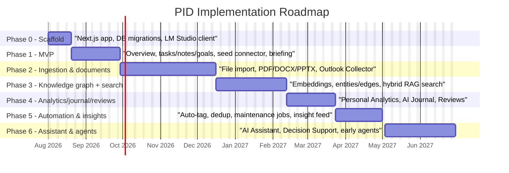
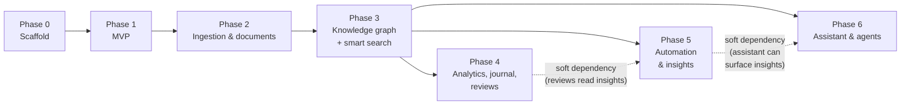

# 10 — Implementation Roadmap

Related: [README](../README.md) · [System architecture](01-system-architecture.md) ·
[Database schema](02-database-schema.md) · [Technology stack](04-technology-stack.md) ·
[API integrations](05-api-integrations.md) · [AI pipeline](07-ai-pipeline.md) ·
[Scalability](11-scalability.md) · [Deployment](12-deployment.md) ·
[Outlook collector](15-outlook-collector.md)

## Overview

This document sequences the design in docs 01–09, 13, and 15 into seven buildable phases, Phase 0
through Phase 6, each ending in something a single user can actually run against their own LM
Studio instance. The ordering follows one rule consistently: **prove the architecture before
scaling its content**. Phase 1 ships with exactly one connector (the seed/sample connector from
[05-api-integrations.md](05-api-integrations.md#the-seed-data-connector-reference-implementation-concept))
precisely so that every dashboard section, the background worker, and the AI Orchestration Service
are exercised end-to-end before a single real, credentialed connector — with all the auth,
rate-limiting, and dedupe complexity that implies — is written. Real ingestion (Phase 2), the
knowledge graph (Phase 3), and everything AI-native after it (Phases 4–6) are then additive on a
foundation that already works.

Effort estimates below are rough, single-developer, full-time-equivalent weeks — useful for
relative sizing between phases, not a committed schedule. A part-time solo effort should expect
roughly 2–3x these numbers in elapsed time.

## Phase summary

| Phase | Name | Primary output | Est. effort |
|---|---|---|---|
| 0 | Scaffold | A running Next.js app with a migrated, empty database and a working LM Studio client | 1–2 weeks |
| 1 | MVP | Executive Overview + tasks/notes/goals CRUD, running on seed data, with an AI daily briefing | 3–4 weeks |
| 2 | Ingestion & documents | File import, PDF/DOCX/PPTX parsing, and the Outlook Collector as the first real connector | 6–8 weeks |
| 3 | Knowledge graph + smart search | Embeddings, entities/edges, hybrid FTS5+vector RAG search UI | 5–6 weeks |
| 4 | Analytics, journal, reviews | Personal Analytics, AI Journal, Weekly/Monthly Reviews | 3–4 weeks |
| 5 | Automation & insights | Auto-tagging, cross-source dedup, scheduled maintenance jobs, AI Insights feed | 3–4 weeks |
| 6 | Assistant & agents | AI Assistant (conversational RAG), Decision Support, early autonomous agents | 5–6 weeks |

Total: roughly 26–34 developer-weeks (about 6–8 months full-time) to reach the full twelve-section
feature set described in the [README](../README.md#feature-set). **The product is genuinely useful
to its one user starting at the end of Phase 1** — see [Definition of MVP done](#definition-of-mvp-done)
below — everything after that is depth, not a gate to first use.

## Roadmap diagram

The phases are drawn sequentially above because each one's exit criteria are a prerequisite for the
next (Phase 3's entity/edge extraction needs Phase 2's real connectors producing real content to
extract from; Phase 6's AI Assistant needs Phase 3's hybrid search to ground its answers). In
practice, a solo developer can pull some Phase 4/5 work forward in parallel with the tail of Phase
3 once the graph and search primitives stabilize — the dependency graph below shows which phases
are hard blockers versus soft-parallelizable:

## Phase 0 — Scaffold

**Scope**: stand up the application skeleton with nothing user-facing yet — the goal is a
repository that runs, migrates a real database, and can talk to LM Studio, matching the stack
locked in [04-technology-stack.md](04-technology-stack.md).

**Deliverables**:

- Next.js 15 (App Router) + TypeScript strict-mode project scaffold; ESLint + Prettier configured.
- `better-sqlite3` + Drizzle ORM wired up; `PRAGMA journal_mode = WAL` and `PRAGMA foreign_keys = ON`
  set at connection time (see [11-scalability.md](11-scalability.md#wal-tuning)).
- Drizzle Kit migrations for every table group in
  [02-database-schema.md](02-database-schema.md) — core, graph, domain, app — plus the two raw-SQL
  virtual-table migrations for `items_fts` (FTS5) and `embeddings`/`entity_embeddings` (sqlite-vec).
- `settings` table seeded with defaults (`lmStudioBaseUrl`, `lmStudioChatModel`,
  `lmStudioEmbeddingModel`) and a minimal Settings page that reads/writes them.
- The LM Studio client: the `openai` SDK configured per
  [04-technology-stack.md](04-technology-stack.md#lm-studio-integration-in-detail), plus a
  `/api/health/lm-studio` route that pings the configured base URL and reports reachable/model-loaded
  status.
- Background worker skeleton: the `jobs` table and the poll-loop query from
  [04-technology-stack.md](04-technology-stack.md#background-jobs-in-detail), running but with no
  real job types registered yet.
- Local session auth stub (single passphrase gate, `127.0.0.1`-only binding) per
  [06-security-privacy-model.md](06-security-privacy-model.md#single-user-auth-for-the-local-web-ui).

**Exit criteria**:

- `pnpm install && pnpm db:migrate && pnpm dev` produces a running app with an empty, correctly
  shaped database (verifiable via `sqlite3 pid.sqlite ".schema"`).
- The health-check route correctly reports LM Studio status against a real local LM Studio
  instance, both when it's running and when it's not (degrade-loudly, not a crash).
- The worker poll loop starts, finds no queued jobs, and idles without error.

**Effort**: 1–2 weeks.

## Phase 1 — MVP

**Scope**: the smallest slice of the product that is genuinely useful without any real personal
data connected — Executive Overview, CRUD for the three app-owned domains a user interacts with
daily (tasks, notes, goals), the seed connector proving out the full ingestion pipeline shape, and
an AI-generated daily briefing proving out the LM Studio integration end to end.

**Deliverables**:

- The seed/sample connector
  ([05-api-integrations.md](05-api-integrations.md#the-seed-data-connector-reference-implementation-concept))
  implemented against the real `Connector` interface, registered as a `sources` row, and runnable
  via a `connector_sync` job — proving cursor persistence and resumability (kill the worker
  mid-sync, restart, confirm no duplicates and no gaps) before any real connector exists.
- Tasks, Notes, and Goals: full CRUD (service + API routes + UI), each writing through the
  `items` + domain-table pattern from [02-database-schema.md](02-database-schema.md#domain-tables)
  (tasks/notes) or the app-owned `goals`/`milestones` tables directly.
- Executive Overview dashboard section
  ([01-system-architecture.md](01-system-architecture.md#dashboard-sections-mapped-to-services)):
  today's/this-week's tasks and events, an AI-generated daily briefing summarizing what's urgent
  and what changed, sourced from the Overview Service.
- The `pipeline_chunk` and `pipeline_embed` job types running against seed-connector items, so
  `chunks` and `embeddings` are populated (even though Smart Search itself is a Phase 3 deliverable
  — this phase only needs the write path to work, not a search UI on top of it yet).
- Settings → Connections page showing the one enabled source (seed data) with its health status,
  proving the `ConnectionHealthList` pattern
  ([09-dashboard-components.md](09-dashboard-components.md)) before real connectors add rows to it.

**Exit criteria**: see [Definition of MVP done](#definition-of-mvp-done) below — this phase's exit
criteria *is* that definition.

**Effort**: 3–4 weeks.

## Phase 2 — Ingestion & documents

**Scope**: replace the seed connector's stand-in role with real data. This is the heaviest phase in
the roadmap because it contains the Outlook Collector — the most architecturally complex piece of
the whole system per [15-outlook-collector.md](15-outlook-collector.md) — as well as the file-parsing
pipeline every document-shaped source depends on.

**Deliverables**:

- File import: drag-and-drop / file-picker upload for documents, mapped into `items` (`type =
  'document'`) + `documents` rows.
- PDF parsing (`pdf-parse`), DOCX parsing (`mammoth`), PPTX parsing (`officeparser` + the
  JSZip/`fast-xml-parser` fallback) — all per
  [04-technology-stack.md](04-technology-stack.md#summary-table) — feeding the same
  chunk → embed → extract pipeline the seed connector already exercised in Phase 1.
- **The Outlook Collector, as the first real (credentialed, networked) connector**, built to the
  full spec in [15-outlook-collector.md](15-outlook-collector.md):
  - Detector + Account Classifier + Tap Selector (§3).
  - Backfill and Incremental engines, including the dual-tap backfill/switch-over case (§4).
  - `message_identity` / `item_external_ids` cross-tap dedupe (§5).
  - The collector's own staging SQLite database and the `outlook-collector` shim connector that
    reads it read-only and commits into the main app's `sync_state`/`items` via the ordinary
    `Connector.sync()` contract.
  - Degrade-loudly health surfacing (§7) wired into the same `ConnectionHealthList` component
    Phase 1 proved out.
  - This phase builds the collector's sync engine; **installing** it as a per-user logon Scheduled
    Task is a deployment concern, covered in
    [12-deployment.md](12-deployment.md#installing-the-outlook-collector).
- At least one additional real connector to validate the `Connector` interface generalizes beyond
  Outlook's unusually complex case — Google Drive or GitHub are the lowest-friction choices per
  their summaries in [05-api-integrations.md](05-api-integrations.md#summary-table).

**Exit criteria**:

- A real Outlook mailbox syncs unattended (no manual export/click after one-time consent), with
  `sync_state.status = 'ok'` sustained across a multi-day run, and dedupe verified (no duplicate
  `items` rows when both a backfill and incremental tap see the same message).
- At least one uploaded PDF and one uploaded DOCX produce correctly chunked, non-garbled text in
  `chunks`.
- Disabling the seed connector and enabling the real connectors requires no code change outside
  `sources` rows — the interface contract from Phase 1 holds.

**Effort**: 6–8 weeks (the Outlook Collector alone is roughly half of this).

## Phase 3 — Knowledge graph + smart search

**Scope**: turn the now-real corpus of ingested items into a queryable knowledge graph, and expose
hybrid search as a first-class dashboard section with RAG-backed answers.

**Deliverables**:

- The `pipeline_extract` job type: deterministic entity/edge extraction (email participants →
  `Person` entities, `mentions` edges) plus LLM-based extraction via LM Studio, per the three
  linking mechanisms in [03-knowledge-graph-design.md](03-knowledge-graph-design.md).
- Entity resolution/merge (`canonical_entity_id`), and `entity_embeddings` populated for the
  embedding-similarity linking mechanism.
- Knowledge Hub dashboard section: faceted browse over every ingested item type.
- Smart Search dashboard section: hybrid FTS5 keyword + sqlite-vec similarity search, combined into
  a single ranked result set with RAG-composed, citation-backed answers per
  [07-ai-pipeline.md](07-ai-pipeline.md).
- Cytoscape.js graph visualization for exploring entities/edges directly.

**Exit criteria**:

- A search for a real entity name (a person, a project) surfaces items across at least two
  different source types (e.g., an email and a note) linked by a shared entity.
- Every RAG-generated search answer includes citations resolvable back to specific `items` rows.
- Re-running extraction after a model change (re-embed maintenance job) does not duplicate
  entities.

**Effort**: 5–6 weeks.

## Phase 4 — Analytics, journal, weekly/monthly reviews

**Scope**: the time-series and reflective dashboard sections that depend on having a real,
multi-week corpus of ingested data to be meaningful — deliberately sequenced after Phase 2/3
rather than before, since building them against only seed data would validate charts, not insight.

**Deliverables**:

- Personal Analytics: trend charts (Recharts) over health, finance, and productivity domain tables.
- Goal Tracking depth: milestone progress visualization, habit streaks, AI-narrated progress
  summaries.
- AI Journal: guided journaling prompts drawn from the day's ingested context, reflection
  summarization.
- Weekly/Monthly Reviews: the `review_generation` scheduled job synthesizing a `reviews` row from
  the period's items, goals, and (once Phase 5 ships) insights.

**Exit criteria**: a full week of real ingested activity (Outlook + at least one other connector)
produces a coherent, non-generic weekly review a user would actually read.

**Effort**: 3–4 weeks.

## Phase 5 — Automation & insights

**Scope**: move PID from "shows you what happened" to "notices things for you" — background
intelligence that runs without a user-initiated query.

**Deliverables**:

- Auto-tagging: LLM-assisted tag/category suggestion applied to notes, tasks, and documents on
  ingest.
- Cross-source dedup beyond `message_identity` (e.g., the same contact appearing via Outlook
  contacts, vCard import, and email `from_address` collapsing to one `Person` entity).
- The remaining `maintenance_*` job types from [01-system-architecture.md](01-system-architecture.md#background-worker):
  re-embed on model change, vacuum, FTS rebuild, `sync_state` cleanup — scheduled per the cadence
  guidance in [11-scalability.md](11-scalability.md).
- AI Insights dashboard section: the `insight_generation` scheduled job scanning recent graph
  activity for patterns/anomalies, and the insight feed UI (`new | seen | dismissed | acted`
  lifecycle on `insights.status`).

**Exit criteria**: at least one insight generated from real cross-source correlation (e.g., "three
tasks tagged to a project that also appears in five recent emails with no reply") appears in the
feed without any user action beyond normal use.

**Effort**: 3–4 weeks.

## Phase 6 — Assistant & agents

**Scope**: the fully conversational layer, plus the first (deliberately constrained) autonomous
capabilities, closing out the twelve-section feature set.

**Deliverables**:

- AI Assistant: full conversational RAG over the entire knowledge graph and search index, with
  memory of past conversations (`ai_conversations`) feeding the AI Memory dashboard section.
- Decision Support: structured `decisions` records — options, criteria, AI-drafted rationale,
  graph-linked context.
- Early autonomous agents per the trajectory in
  [14-future-ai-capabilities.md](14-future-ai-capabilities.md): action-taking capability gated
  behind explicit user confirmation before execution, never triggered directly from unreviewed
  retrieved content, per the prompt-injection mitigations in
  [06-security-privacy-model.md](06-security-privacy-model.md#prompt-injection-mitigations).

**Exit criteria**: the AI Assistant answers a multi-hop question that requires combining at least
two dashboard sections' data (e.g., "what tasks are blocking the goal I discussed in last week's
review") with correct citations, and a confirmation-gated agent action (e.g., "create a task from
this email") requires and respects an explicit user approval step before writing anything.

**Effort**: 5–6 weeks.

## Definition of MVP done

PID has reached MVP when all of the following hold, without any real connector configured:

1. A fresh clone runs `pnpm install && pnpm db:migrate && pnpm dev`, producing a working app at
   `http://localhost:3000` gated by the local passphrase.
2. The seed/sample connector has synced, and Executive Overview shows non-empty, realistic-looking
   data (tasks due, events today, an AI-generated daily briefing) sourced entirely from it.
3. A user can create, edit, complete/delete a task; create, edit, delete a note; and create a goal
   with at least one milestone — all through the UI, all persisted correctly across a restart.
4. The daily briefing is generated by a real call to a locally running LM Studio instance (not a
   canned string) and updates when the underlying seed data changes.
5. Settings → Connections shows the seed connector's health status using the same status enum
   (`ok | stale | auth_failed | needs_consent | tap_unavailable`) every later real connector will
   also use.
6. Killing and restarting the background worker mid-sync does not duplicate or lose any seed-connector
   item — proving the crash-safe cursor contract every real connector in Phase 2 depends on.

This is intentionally a low bar on *content* (one fake connector) and a high bar on *architecture*
(every layer in [01-system-architecture.md](01-system-architecture.md) — UI, API, services, worker,
storage, AI Orchestration — is exercised for real). Phase 2 onward adds real data to a foundation
that Phase 1 has already proven correct.

## Cross-references

- [README.md](../README.md) — the twelve dashboard sections and locked decisions this roadmap
  sequences into phases.
- [01-system-architecture.md](01-system-architecture.md) — the layered architecture every phase
  builds within; module boundaries are not renegotiated per phase.
- [02-database-schema.md](02-database-schema.md) — the schema Phase 0 migrates in full, up front,
  rather than growing incrementally per phase.
- [05-api-integrations.md](05-api-integrations.md) — the `Connector` interface and per-source
  integration specs Phase 1's seed connector and Phase 2's real connectors both implement.
- [15-outlook-collector.md](15-outlook-collector.md) — the full design Phase 2 builds; this
  document only sequences it, it does not restate it.
- [11-scalability.md](11-scalability.md) — the growth assumptions and migration triggers that
  inform when (if ever) a phase beyond this roadmap's Phase 6 would need architectural change.
- [12-deployment.md](12-deployment.md) — how each phase's output actually gets installed and run,
  including the Outlook Collector's Scheduled Task installation, deliberately kept out of this
  roadmap's build-phase scope.
