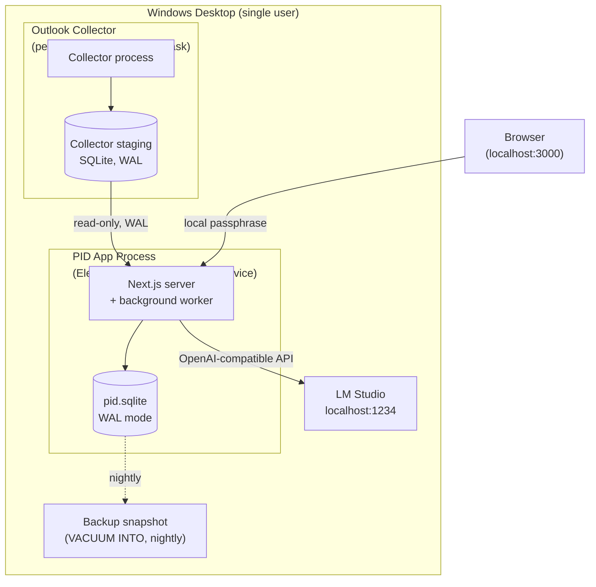
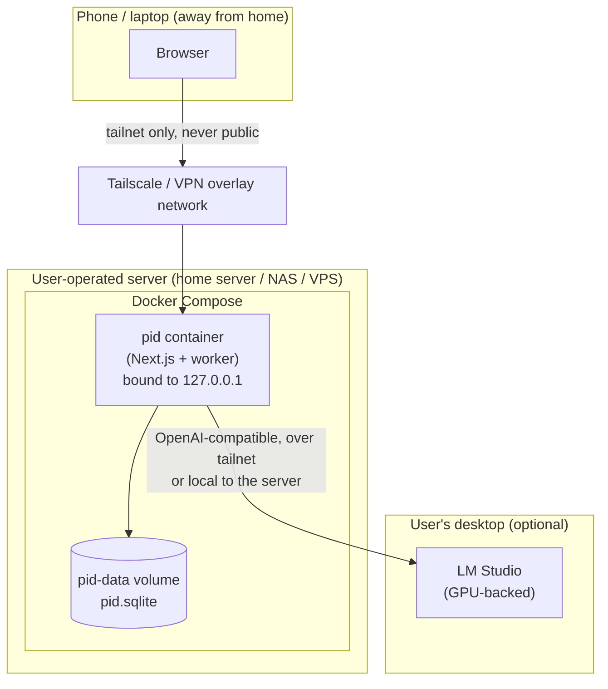

# 12 — Deployment

Related: [README](../README.md) · [System architecture](01-system-architecture.md) ·
[Technology stack](04-technology-stack.md) · [Security & privacy model](06-security-privacy-model.md) ·
[Scalability](11-scalability.md) · [Outlook collector](15-outlook-collector.md)

## Overview

PID has one **primary** deployment target and one **optional** one, and the two have meaningfully
different privacy postures:

| Target | Where it runs | Primary audience | Privacy posture |
|---|---|---|---|
| **Local (primary)** | The user's own Windows desktop, alongside a locally installed LM Studio | The default single user this whole product is designed for | Everything on one physical device the user owns — the strongest form of the [README](../README.md#vision)'s "all data stays on-device" claim |
| **Cloud/self-hosted (optional)** | A server the user operates (home server, VPS, NAS) via Docker Compose | Users who want dashboard access from a phone/laptop away from the desktop | Still no *PID-operated* cloud, but the trust boundary widens to a second machine — see [what changes about the privacy posture](#what-changes-about-the-privacy-posture) |

Both targets run the exact same application code from the same repository; nothing in
[01-system-architecture.md](01-system-architecture.md) or [02-database-schema.md](02-database-schema.md)
changes between them. This document covers *how the process is started, kept running, backed up,
and updated* — not a second architecture.

## Local deployment (primary)

### Two ways to run PID locally

[04-technology-stack.md](04-technology-stack.md#desktop-packaging-in-detail) already establishes two
run modes from the same codebase; this section adds the process-management detail for each.

| Mode | How it's kept running | Best for |
|---|---|---|
| **Packaged Electron app** | The Electron main process itself supervises the Next.js server; a tray icon exposes start/stop/status | Most users — double-click, tray icon, no terminal, matches the "download and double-click" experience |
| **Standalone Node process** (pm2 or NSSM + Task Scheduler) | An OS-level process manager restarts the Next.js server on crash/reboot, with **no GUI window** | Users who want PID always reachable in the background — e.g., to check the dashboard from a phone on the same LAN — without keeping a window open |

The standalone mode is the one worth detailing, since the Electron path is self-contained by design.

#### pm2

```bash
pnpm add -g pm2
pm2 start "pnpm start" --name pid --cwd "C:\Users\<user>\pid"
pm2 save
```

pm2's own `pm2 startup` auto-boot mechanism is Linux/macOS-oriented; on Windows it needs the
`pm2-windows-startup` companion package (`pnpm add -g pm2-windows-startup && pm2-startup install`)
to register itself for automatic start. pm2 is a reasonable cross-platform choice if the same
person also runs PID's cloud/self-hosted mode ([below](#optional-cloudself-hosted-deployment)) and
wants one familiar tool across both.

#### NSSM (Non-Sucking Service Manager) + Task Scheduler

NSSM is the more Windows-native option — it wraps the Node process as a genuine Windows Service:

```bash
nssm install PID "C:\Program Files\nodejs\node.exe" "C:\Users\<user>\pid\node_modules\.bin\next start"
nssm set PID AppDirectory "C:\Users\<user>\pid"
nssm set PID AppExit Default Restart
nssm start PID
```

**Important — the service must run as the actual user, not `LocalSystem`.** Every OAuth-based
connector's refresh token is sealed via DPAPI / Windows Credential Manager, scoped to the logged-in
user's security context, per
[06-security-privacy-model.md](06-security-privacy-model.md#secrets-handling). A `LocalSystem`
service cannot unprotect a DPAPI secret sealed under a different user's key. In NSSM's service
properties, set **Log on as → This account** to the specific Windows user account PID runs for
(NSSM prompts for that account's password so Windows can load its profile). This is a lighter
requirement than the Outlook Collector's constraint below — the main app doesn't need an
*interactive desktop*, only the *user's logon profile* to be loaded, which a "log on as this user"
service configuration satisfies. If this is skipped, connector sync silently fails
`AUTH_FAILED` on every token refresh even though the token itself is valid.

As a lighter-weight alternative to a full NSSM service, a **Task Scheduler task triggered "At log
on"** of the specific user (the same pattern the Outlook Collector uses, [below](#installing-the-outlook-collector))
works identically well for the main app and avoids installing NSSM at all — the tradeoff is that the
app only starts once that user logs in, not at machine boot before any interactive session exists.

### First-run setup

1. **Install Node.js LTS** (skip if using the packaged Electron installer, which bundles its own
   runtime).
2. **Install LM Studio** and download at least one chat-capable model and one embedding model whose
   output dimension matches the `FLOAT[768]` vector columns fixed in
   [02-database-schema.md](02-database-schema.md#core-tables) (the `nomic-embed-text` class of
   embedding model is the reference default).
3. **Start LM Studio's local server**: in LM Studio's Developer tab, toggle "Start Server" (default
   `http://localhost:1234`), and load both the chat model and the embedding model into memory.
4. **Install PID**: `pnpm install && pnpm db:migrate` — this creates the SQLite database file (in
   the app's configured data directory) fully migrated and empty, per
   [10-implementation-roadmap.md](10-implementation-roadmap.md#phase-0--scaffold).
5. **First launch**: set the local session passphrase
   ([06-security-privacy-model.md](06-security-privacy-model.md#single-user-auth-for-the-local-web-ui))
   — this gates every subsequent visit to `http://localhost:3000`.
6. **Settings → AI**: confirm `lmStudioBaseUrl` matches what LM Studio reported in step 3, and select
   the chat and embedding model names from step 2. The health-check route from
   [10-implementation-roadmap.md](10-implementation-roadmap.md#phase-0--scaffold) should report both
   reachable.
7. **Settings → Connections**: enable the seed connector (Phase 1) or real connectors (Phase 2+) per
   the [implementation roadmap](10-implementation-roadmap.md).

### LM Studio configuration reference

| Setting | Where | Value |
|---|---|---|
| Local server toggle | LM Studio → Developer tab | On |
| Server port | LM Studio → Developer tab | `1234` (default) — must match `settings.lmStudioBaseUrl` |
| Chat model loaded | LM Studio → My Models | Any instruction-tuned chat model the user's hardware can run |
| Embedding model loaded | LM Studio → My Models | Must produce 768-dimension vectors to match the schema, or the schema's `FLOAT[768]` columns and the [11-scalability.md](11-scalability.md#embedding-storage-math) sizing both need to change |
| Auto-start on login | LM Studio → Settings | Recommended, so LM Studio is already serving before PID's process manager starts the app |

### Installing the Outlook Collector

The Outlook Collector ([15-outlook-collector.md](15-outlook-collector.md)) is installed as a
**separate component from the main app**, because it is architecturally a distinct process with a
distinct lifecycle requirement:

> **Per-user, logon-triggered Scheduled Task — never a Windows Service.** COM/MAPI automation and
> Redemption's store logon require the interactive desktop and a loaded, per-user MAPI profile; a
> Session-0-isolated service has no interactive desktop and cannot unseal DPAPI-protected tokens tied
> to the logged-on user's security context, per
> [15-outlook-collector.md §6.3](15-outlook-collector.md#63-why-not-a-system-service). This is a
> *stricter* requirement than the main app's NSSM/pm2 case above — the main app only needs the
> user's profile loaded (a service running "as this user" is enough); the collector needs an actual
> interactive session because COM has no headless mode.

Concretely, the installer creates the task with these settings, matching
[15-outlook-collector.md §6.1](15-outlook-collector.md#61-launch-and-lifecycle):

| Task Scheduler setting | Value | Why |
|---|---|---|
| Trigger | "At log on" of the specific user SID | Only ever runs inside a real interactive desktop session — never "at system startup" |
| "Run whether user is logged on or not" | **Off** | That setting uses a batch logon with no interactive desktop, which breaks COM/MAPI entirely |
| "Run with highest privileges" | **Off** | Redemption's store logon needs no admin rights; requesting elevation triggers a UAC prompt every logon, breaking "unattended" |
| Restart on failure | 3 attempts at 1-minute intervals, then daily retry | Self-heals a transient crash within minutes without spinning forever on a persistently broken environment |

#### The Redemption dependency

The Classic-COM tap ([15-outlook-collector.md §3.5](15-outlook-collector.md#35-redemption-com-vs-graph--when-each-wins))
depends on **Redemption** (the third-party Dimastr RDO/Extended MAPI library) — not raw COM
Automation, specifically because raw Automation is policed by Outlook's Object Model Guard
(security prompts, antivirus-dependent behavior) and Redemption is not
([15-outlook-collector.md §9](15-outlook-collector.md#9-what-we-deliberately-do-not-do)). This is a
real installation dependency the deployment process must account for:

- Redemption ships in a free **"Safe" edition** (functionally sufficient for the RDO store-logon
  operations the collector needs, but periodically re-validates itself online) and a paid
  **unrestricted edition** (one-time per-seat license, no periodic re-validation) — the installer
  should let the user pick, since an unattended background collector is a poor fit for an edition
  that can prompt for online re-validation.
- The correct-bitness DLL (`Redemption64.dll` for 64-bit Outlook, the common case in 2026) must be
  registered once per machine — via Redemption's own installer, or `regsvr32`, which is the only
  step in this whole flow that may require administrator rights, and only once, at install time, not
  at every collector run.
- After registration, the collector's actual RDO store logon at runtime requires **no** elevation —
  it runs entirely under the standard user's security context, consistent with the "Run with highest
  privileges: off" setting above.

### Backup strategy for the SQLite file

Because the database is opened in WAL mode
([04-technology-stack.md](04-technology-stack.md#database--search-layer-in-detail)), a raw file copy
taken while the app is running can capture the main file mid-write without its WAL frames, producing
an inconsistent backup. PID's backup job (`maintenance` type, per
[01-system-architecture.md](01-system-architecture.md#background-worker)) instead uses SQLite's
own online-safe snapshot mechanism:

```sql
VACUUM INTO 'D:\Backups\pid\pid-2026-07-09.sqlite';
```

`VACUUM INTO` produces a fully consistent, compacted snapshot without blocking concurrent readers
and without requiring the app to pause. This is the mechanism referenced (without implementation
detail) in
[06-security-privacy-model.md](06-security-privacy-model.md#backup-and-export).

| Aspect | Default |
|---|---|
| Schedule | Nightly, via a scheduled `maintenance` job |
| Destination | A user-chosen local path or a local sync-client folder (e.g., the user's own OneDrive folder) — never a PID-operated destination, consistent with [06](06-security-privacy-model.md#backup-and-export) |
| Retention | Rolling window, e.g. last 14 daily + last 6 monthly snapshots, pruned by the same maintenance job |
| Restore | Stop the app, replace the live `.sqlite` file with a chosen backup snapshot, restart. Any connector whose OS-credential-store token didn't survive (e.g., restoring onto a new machine) surfaces as `needs_consent`, per [06](06-security-privacy-model.md#backup-and-export) |

If SQLCipher encryption is enabled ([06-security-privacy-model.md](06-security-privacy-model.md#data-at-rest)),
the passphrase is never included in the backup file or its destination — it is the user's own
responsibility to retain separately, exactly as documented there.

### Updating

1. Back up first — trigger the backup job manually (or wait for the next nightly run) before
   updating, so a bad migration has a clean rollback point.
2. Pull/download the new version, `pnpm install`, `pnpm db:migrate` — Drizzle Kit migrations are
   forward-only and idempotent, matching the migration model in
   [02-database-schema.md](02-database-schema.md#overview).
3. Restart the process: the Electron app's tray icon "Restart," `pm2 restart pid`, or
   `nssm restart PID` depending on which mode is in use.
4. **Rollback**, if a migration or new version misbehaves: stop the process, restore the pre-update
   backup snapshot, reinstall the previous version's code, restart. Because the entire durable state
   is one file ([02-database-schema.md](02-database-schema.md#overview)), rollback is exactly as
   simple as backup.
5. The packaged Electron app's auto-update, if enabled, checks the project's own public release
   artifacts directly (e.g., GitHub Releases) — not a PID-operated update service, consistent with
   the "no PID cloud" principle in the [README](../README.md#vision).

### Local deployment topology



## Optional cloud/self-hosted deployment

This mode is for a user who wants the dashboard reachable from more than one device — a laptop or
phone away from the desktop the primary data lives on — and is willing to operate a small server
themselves. It is explicitly **not** a PID-operated cloud; the server is the user's own (a home
server, a NAS, a personal VPS), and the same "no telemetry, opt-in egress only" principles from
[06-security-privacy-model.md](06-security-privacy-model.md#principles) still apply — only the
*physical location* of the one device holding the data changes.

### Docker Compose

```yaml
services:
  pid:
    image: pid:latest
    restart: unless-stopped
    ports:
      - "127.0.0.1:3000:3000"   # bind to loopback; reverse proxy/Tailscale exposes it, not Docker directly
    volumes:
      - pid-data:/data           # holds pid.sqlite and any imported document files
    environment:
      - PID_DB_PATH=/data/pid.sqlite
      - LM_STUDIO_BASE_URL=http://host.docker.internal:1234/v1   # or a tailnet address, see below

volumes:
  pid-data:
```

A single `pid` service is deliberate: the app and the background worker still run as one process
(the same "in-process worker, single writer" model from
[04-technology-stack.md](04-technology-stack.md#background-jobs-in-detail) and
[11-scalability.md](11-scalability.md#write-concurrency-with-one-worker)) rather than splitting into
separate `web`/`worker` containers, which would reintroduce the multi-writer risk that document
explicitly says to avoid without a real trigger. There is deliberately no `postgres` service here —
SQLite on a named Docker volume remains the default even in this mode, per
[11-scalability.md](11-scalability.md#graduated-migration-paths); Postgres is a separate,
independently-triggered migration, not something Docker Compose mode implies.

### Reverse proxy + auth

**Recommended: a private overlay network (Tailscale or another WireGuard-based VPN), not public
exposure.** This is the explicit recommendation carried over from
[06-security-privacy-model.md](06-security-privacy-model.md#single-user-auth-for-the-local-web-ui):

- Install Tailscale on the host running Docker Compose; the `pid` container stays bound to
  `127.0.0.1` on the host (as in the compose file above) and is reached only via the host's tailnet
  address (e.g., `http://home-server.tailnet-name.ts.net:3000`) — never a port forwarded on the
  public router.
- If a reverse proxy (Caddy, nginx, Traefik) is used for a friendlier hostname or TLS termination,
  it should terminate **on the tailnet interface only**, not a public-facing one.
- The app-level local passphrase from [06](06-security-privacy-model.md#single-user-auth-for-the-local-web-ui)
  still applies on top of the network-level restriction — defense in depth, not a replacement for it.
- Public exposure (a port forward, a public reverse-proxy hostname with no VPN) is explicitly
  discouraged: it turns a single-user local-first tool into an internet-facing service with none of
  the operational hardening (rate limiting, WAF, intrusion detection) a real public service would
  need, for a product that was never designed to be one.

### What changes about the privacy posture

Moving off the primary desktop changes exactly two things from the threat model in
[06-security-privacy-model.md](06-security-privacy-model.md#threat-model); everything else — opt-in
egress, no telemetry, OS-credential-store secrets, prompt-injection mitigations — is unchanged
because it's a property of the application, not the machine:

| What changes | Detail |
|---|---|
| **Physical security assumption widens** | [06](06-security-privacy-model.md#data-at-rest) assumes OS disk encryption on "the user's own disk." In this mode, that assumption now has to hold on the server too — the user is trusting a second physical device (their home server, NAS, or VPS provider's hypervisor) with the same data. This is still not a third party the user doesn't control (unless the "server" is a VPS, in which case the VPS provider is a new trust boundary worth being explicit about), but it's a materially different claim than "only my personal laptop ever has this file." |
| **The `127.0.0.1`-only default is deliberately relaxed** | [06](06-security-privacy-model.md#single-user-auth-for-the-local-web-ui) calls binding to loopback-only the default posture, with LAN/remote exposure as something the user "deliberately reconfigures" — this deployment mode *is* that deliberate reconfiguration, which is exactly why the Tailscale/VPN recommendation above, not a wider bind address, is the way it's done. |

Nothing about connector egress, LM Studio's OpenAI-compatible-only AI policy, or credential storage
changes — a self-hosted PID instance still talks to each connector's own provider directly, per the
[egress ledger](06-security-privacy-model.md#egress-and-the-privacy-inversion), and still stores no
secret in the SQLite file.

### How LM Studio is replaced or tunneled

A headless server has no guarantee of the GPU or desktop environment LM Studio typically runs in, so
this mode needs one of three options, all of which are just different values for the same
`lmStudioBaseUrl` setting already established in
[04-technology-stack.md](04-technology-stack.md#lm-studio-integration-in-detail) — no code change,
by design:

| Option | Setup | When to use |
|---|---|---|
| **LM Studio on the server itself** | Install and run LM Studio directly on the host (or a sibling container with GPU passthrough), `lmStudioBaseUrl = http://host.docker.internal:1234/v1` | The server has its own capable GPU |
| **LM Studio on the user's desktop, tunneled over the tailnet** | Keep running LM Studio on the desktop as usual; point the server's `lmStudioBaseUrl` at the desktop's tailnet address, e.g. `http://desktop.tailnet-name.ts.net:1234/v1` | The desktop already has the GPU and the user doesn't want a second copy of every model; this is the same "LAN-hosted LM Studio" carve-out [06](06-security-privacy-model.md#lm-studio-locality) already describes as staying local-first, since it never leaves a network the user controls |
| **A different OpenAI-compatible local server** | Run Ollama or llama.cpp's server mode as a sidecar Compose service; same `openai` SDK client, only the base URL and model name change | The server hardware or OS makes LM Studio itself awkward to run there, but an equivalent local/self-hosted inference server is available |

In every option, the one constraint that must not be relaxed is the one already stated in
[06-security-privacy-model.md](06-security-privacy-model.md#lm-studio-locality): the base URL must
point at a machine the user controls, on a network the user controls — pointing it at a third-party
cloud inference API is technically possible given the same configurability, but breaks the
local-first guarantee this entire deployment model otherwise preserves.

### Cloud/self-hosted deployment topology



## Cross-references

- [04-technology-stack.md](04-technology-stack.md) — the Electron/standalone run-mode split and the
  LM Studio client this document configures for each target.
- [06-security-privacy-model.md](06-security-privacy-model.md) — the threat model, secrets handling,
  and local-only-by-default posture both deployment targets are built to preserve.
- [11-scalability.md](11-scalability.md) — the backup file-size and `VACUUM`/maintenance-job cadence
  guidance this document's backup strategy schedules concretely.
- [15-outlook-collector.md](15-outlook-collector.md) — the full collector design; this document only
  covers installing and scheduling it, not its internal sync logic.
- [10-implementation-roadmap.md](10-implementation-roadmap.md) — Phase 0's scaffold is what
  "first-run setup" above actually installs.
