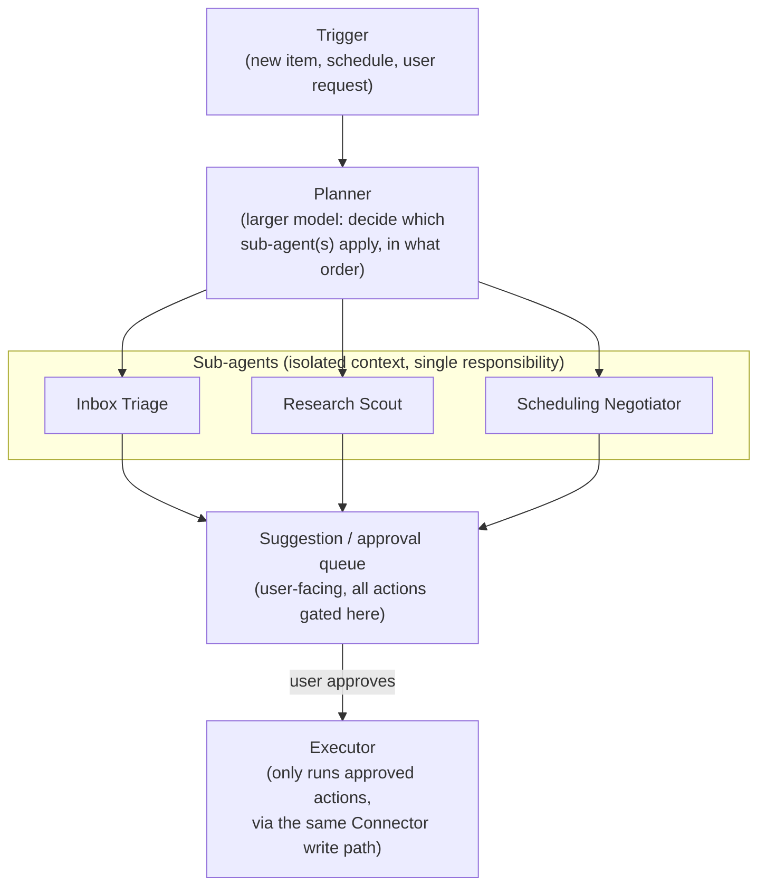

# 14 — Future AI Capabilities

Related: [README](../README.md) · [AI pipeline](07-ai-pipeline.md) ·
[Knowledge graph design](03-knowledge-graph-design.md) ·
[Security & privacy model](06-security-privacy-model.md) ·
[Implementation roadmap](10-implementation-roadmap.md)

## Overview

Everything in [07-ai-pipeline.md](07-ai-pipeline.md) is *reactive*: PID answers a query, extracts
from an item, or generates an artifact when a scheduled trigger or the user asks. This document is
the beyond-MVP vision — capabilities where PID starts to act *on the user's behalf* (autonomous
agents), *ahead of* an explicit request (predictive intelligence, proactive interventions), or
*adapts to the user specifically* (local fine-tuning) — all still bound by the two non-negotiable
constraints from the [README](../README.md#locked-decisions-canon): data stays on-device, and AI
stays local to LM Studio (or another local OpenAI-compatible endpoint the user points it at).

Every capability below is ordered **by feasibility**, not by ambition — read top-to-bottom as a
rough build sequence, not a wish list. The dividing line that matters most is the one drawn in
[06-security-privacy-model.md](06-security-privacy-model.md#prompt-injection-mitigations): the MVP
pipeline's RAG-answering path has *no tool-execution capability* by design, so every capability here
that *takes an action* (sends a message, modifies a calendar, moves money) is a new category of
system, not an extension of the existing chat/RAG surface, and each one earns its own explicit
consent gate before it ships.

## Feasibility-ordered capability map

| Tier | Capability | Depends on | New risk surface vs. docs/07 |
|---|---|---|---|
| 1 — Near-term | [Insights/anomaly detection tuning](07-ai-pipeline.md#generation-jobs) hardening, [AI Memory](07-ai-pipeline.md#ai-memory-in-detail) maturity (already MVP-scoped) | Nothing new | None — these are MVP features maturing, listed here only as the feasibility floor the rest of this doc builds from |
| 2 — Near-term | [Habit-drift alerts](#habit-drift-alerts) | `habits`/`habit_logs` history, insights job | Low — read-only, same as existing insights |
| 3 — Near-term | [Spend prediction](#spend-prediction) | `transactions` history | Low — read-only, same as existing analytics |
| 4 — Medium | [Workload forecasting](#workload-forecasting) | Tasks/events/goals history, calibration over time | Low — read-only, but wrong forecasts have real planning cost, needs visible confidence |
| 5 — Medium | [Inbox triage agent](#inbox-triage-agent) (suggest-only mode) | Tool-use loop, email domain rules | Medium — reads sensitive content at higher frequency, but suggest-only has no action risk |
| 6 — Medium | [Research scout](#research-scout) | Scheduled search jobs, opt-in outbound feed/API polling | Medium — first capability that proactively fetches *new* external content, not just user-ingested content |
| 7 — Medium-high | [Proactive interventions](#proactive-interventions) (notification layer) | Insights + forecasting + a notification/quiet-hours system | Medium — no actions taken, but wrong timing/tone directly affects trust |
| 8 — High | [Inbox triage agent](#inbox-triage-agent) (act mode: archive/label/draft-reply) | Consent-gated action execution, undo log | High — first capability that mutates external state |
| 9 — High | [Multi-agent orchestration](#multi-agent-orchestration-patterns) | Tool-use loop, sub-agent isolation, larger context budgets | High — compounds every risk below it; a bug in orchestration can chain multiple actions |
| 10 — High | [Scheduling negotiator](#scheduling-negotiator) | Calendar write access, multi-party negotiation logic | High — acts on the user's behalf toward *other people*, not just their own data |
| 11 — Speculative | [Local fine-tuning / LoRA](#local-fine-tuning-lora-on-personal-writing-style) | Training infra, personal-writing-sample corpus, model-versioning story | Medium risk, high engineering cost — a new local subsystem (training pipeline) with its own resource/privacy footprint |

## Autonomous agents

Agents differ from the MVP's generation jobs in one structural way: they run a **tool-use loop**
(observe -> decide -> call a tool -> observe the result -> decide again) rather than a single
prompt-in/structured-output-out call. That loop is exactly the capability
[06-security-privacy-model.md](06-security-privacy-model.md#prompt-injection-mitigations) calls out
as deliberately absent from the MVP RAG-answering path — so every agent below is designed
**suggest-first**: it proposes an action, the user approves or edits it, and only an explicit,
logged approval triggers the tool call. "Autonomous" describes the *reasoning* loop, not unattended
*execution* — a distinction this document holds firm throughout.

### Inbox triage agent

| Aspect | Design |
|---|---|
| What it does | Watches newly ingested email, classifies by urgency/category (small model, cheap per-message), and — in **suggest mode** — proposes triage actions (archive, label, "needs reply by Friday," draft a reply) in a review queue; in **act mode** (opt-in, later), executes approved-category actions automatically (e.g. auto-archive newsletters matched by a user-confirmed rule) while everything ambiguous still queues for review. |
| Retrieval/context | The message itself, sender history (via the `Person` entity's mention history, [03-knowledge-graph-design.md](03-knowledge-graph-design.md)), any open `tasks`/`decisions` the message might relate to. |
| Trigger | Real-time, immediately after `pipeline_extract` for `type='email'` items. |
| Tools required | Read: email metadata/body (already ingested). Write (act mode only): connector-specific mutation calls (Graph `PATCH` to move/label, IMAP `STORE`/`COPY`) — new capability, not present in the read-only [Connector interface](05-api-integrations.md) today. |
| Guardrails | Suggest-mode ships first and is the permanent default; act-mode is opt-in per rule category, every rule is user-authored or user-approved-from-suggestion (never silently learned), every automated action is logged to an undo-capable audit trail, and act-mode never covers "send" actions (only organize/label/draft) — sending on the user's behalf is deliberately excluded from this capability and left to a human clicking send on a drafted reply. |
| Feasibility | Suggest-mode: medium (tier 5). Act-mode: high (tier 8) — gated behind a working suggest-mode track record. |

### Research scout

| Aspect | Design |
|---|---|
| What it does | Given the user's `Topic`/`Project` entities and recently-ingested papers, periodically checks configured external feeds (arXiv API, an RSS the user already added, Semantic Scholar if a key is provided) for new papers matching the user's existing interest graph, and surfaces candidates in Research Assistant as "you might want to ingest this" — it never auto-ingests, only recommends. |
| Retrieval/context | The user's `Topic`/`Paper` entities and their `similar_to`/`relates_to` edges ([03-knowledge-graph-design.md](03-knowledge-graph-design.md#edge-relation-type-taxonomy)) define the interest profile; candidate papers are scored by embedding similarity to that profile. |
| Trigger | Scheduled (e.g. weekly), same job-queue mechanism as [insight generation](07-ai-pipeline.md#generation-jobs). |
| Tools required | Outbound polling of external, source-appropriate APIs — a genuinely new egress pattern versus every existing connector, which only ever fetches content the user explicitly connected an *account* for. This must be added to the [egress-per-account-tap ledger](06-security-privacy-model.md#egress-and-the-privacy-inversion) as its own row (e.g. "Research scout -> arXiv API -> public paper metadata, no account, opt-in per feed"), not silently folded into an existing connector. |
| Guardrails | Off by default; opt-in per external source, exactly like every other connector's `sources.enabled`; scout results are recommendations only (no auto-ingest) until the user acts; the topic/interest profile driving it is derived entirely from the user's own graph, never from a third-party recommendation service. |
| Feasibility | Medium (tier 6) — the reasoning is straightforward similarity scoring; the work is mostly the new egress-ledger and consent-UI plumbing, not the AI. |

### Scheduling negotiator

| Aspect | Design |
|---|---|
| What it does | Given a meeting request (from an email thread or a direct ask — "find 30 minutes with Jane next week"), proposes candidate times against the user's calendar, and — with explicit per-negotiation approval — sends/responds to scheduling emails or calendar invites to converge on a time with another person. |
| Retrieval/context | The user's `events` (availability), the counterpart's `Person` entity and any known scheduling preferences (AI Memory-style facts, [07-ai-pipeline.md](07-ai-pipeline.md#ai-memory-in-detail)), thread history for context. |
| Trigger | On-demand (user asks) or suggested from an email the inbox triage agent classified as a scheduling request. |
| Tools required | Calendar write access, email send capability — both new, both act *on other people*, which is a qualitatively higher-stakes tool grant than anything ingestion-only connectors need. |
| Guardrails | This is the one capability in this document with the strictest guardrail: **every outbound message to another person requires explicit per-message user approval**, with no "approve this pattern going forward" shortcut, because the blast radius of a bad autonomous scheduling email includes someone outside the user's control entirely. Candidate-time proposals (read-only) can ship well ahead of the send-capable version. |
| Feasibility | High (tier 10) — the read-only "propose times" half is nearly medium-tier; the send-capable negotiation half is the highest-stakes item short of local fine-tuning's engineering cost, hence its placement. |

## Predictive personal intelligence

Unlike agents, these are still purely **read/analyze/surface** — no tool-execution loop, just
statistical/LLM-assisted forecasting over the user's own historical data, extending the existing
[insights/anomaly detection job](07-ai-pipeline.md#generation-jobs) rather than replacing it.

### Workload forecasting

Projects near-term load (tasks due, meeting density, goal-deadline pressure) from historical
completion-rate patterns in `tasks`/`events`/`habit_logs`, surfaced as "your next two weeks look
{light|typical|heavy} compared to your average" with the specific drivers cited (which
tasks/events/goals contribute). Confidence is reported explicitly (variance widens quickly beyond a
1–2 week horizon for a single user's noisy personal data) and the UI treats a forecast as a hint, not
a claim — this is the tier-4 item precisely because a *wrong* forecast that reads as confident is
worse than no forecast, so the harder engineering problem is calibration, not the model call itself.

### Habit-drift alerts

Extends `habit_logs` trend analysis already implicit in the Goal Tracking section: detects when a
habit's cadence is slipping (completion rate trending down over a rolling window vs. the habit's
established baseline) and surfaces it as an `insights` row of kind `anomaly`, using the same schema
and job mechanism already defined in [07-ai-pipeline.md](07-ai-pipeline.md#prompt-template-catalog)
— genuinely closer to "finish the MVP insights job's coverage" than a new capability, which is why
it's tier 2.

### Spend prediction

Projects near-term spend from `transactions` category/merchant/cadence history (recurring bills,
seasonal patterns) and flags projected-vs-budget deltas the same way habit-drift flags a slipping
habit. Like workload forecasting, confidence must be explicit and visible — a personal budget
forecast is exactly the kind of output a user will act on financially, so an overconfident wrong
prediction has real cost; unlike workload forecasting, transaction data is typically cleaner/more
regular (recurring bills are genuinely recurring), which is why it's ranked tier 3, ahead of
workload forecasting's noisier inputs.

## Proactive interventions

The layer that decides **when and how to surface** anything from insights, forecasting, or an
agent's suggestion queue as an actual interruption (a notification, a dashboard badge, a digest
entry) rather than something the user only sees if they happen to open that section. This is
listed as its own tier (7) because getting *timing and tone* right is a genuinely separate design
problem from generating the underlying content correctly:

- **Batching over interrupting.** Default posture is a daily/periodic digest (reusing the
  [daily briefing](07-ai-pipeline.md#generation-jobs) delivery slot) rather than real-time push for
  anything below a configurable urgency threshold — a local-first single-user tool has no growth
  incentive to maximize engagement, so the default should err toward *fewer* interruptions, the
  opposite bias from a typical SaaS notification system.
- **User-configurable quiet hours and channels**, mirroring the local-session/LAN-only posture in
  [06-security-privacy-model.md](06-security-privacy-model.md#single-user-auth-for-the-local-web-ui) —
  notifications stay on-device (OS notification API) or route through a channel the user explicitly
  configured (e.g. a self-hosted push endpoint), never a PID-operated push service, since that would
  reintroduce exactly the cloud dependency the README rules out.
- **Every proactive surface is dismissible and tunable per category** (an insight type, an agent's
  suggestion category) so a false-positive-prone forecast can be muted without disabling proactive
  intervention entirely — feeding the same [feedback loop](07-ai-pipeline.md#feedback-loop) already
  defined for generation jobs.
- **No proactive surface ever triggers a tool-executing action by itself** — a proactive nudge can
  say "you might want to triage 12 new emails," never silently triage them; it can only open the
  relevant suggest-mode review queue.

## Multi-agent orchestration patterns

Once more than one agent-shaped capability exists (inbox triage, research scout, scheduling
negotiator), a **planner/executor** pattern coordinates them rather than letting each poll
independently and collide (e.g. both proposing calendar actions for the same meeting request):

Design principles this pattern commits to, extending the AI Orchestration Service's existing
single-chokepoint role in [01-system-architecture.md](01-system-architecture.md#module-boundaries):

| Principle | Why |
|---|---|
| **Model tiering carries over from docs/07.** The planner (routing/decomposition) and any sub-agent's final synthesis use the larger chat model; per-message classification inside a sub-agent's loop (e.g. "is this email urgent") uses the small model — same cost logic as the [recommended model classes](07-ai-pipeline.md#recommended-model-classes) table. | Avoids paying large-model latency for every tool-loop step. |
| **Sub-agents are isolated by responsibility, not just by prompt.** Each sub-agent only receives the context and tool grants its task needs (the scheduling negotiator's context never includes unrelated inbox content) — the same least-privilege principle already applied to OAuth scopes in [06-security-privacy-model.md](06-security-privacy-model.md#threat-model). | Limits blast radius of a single agent's mistake or a successful prompt injection to that agent's narrow tool surface. |
| **The approval queue is the only path to the executor.** No sub-agent calls a write-capable tool directly; every proposed action lands in the same user-facing queue regardless of which sub-agent produced it, and the executor is a thin, auditable layer that only replays *approved* actions through the existing Connector write path. | Keeps the "no tool-execution inside an untrusted-content-influenced path" guarantee from [06](06-security-privacy-model.md#prompt-injection-mitigations) intact even as the number of agents grows — one queue, one gate, however many planners/sub-agents feed it. |
| **The planner can be wrong about routing without being unsafe about acting.** A misrouted request (planner sends a scheduling ask to the research scout) produces a visibly wrong or empty suggestion, not an action — because *nothing* acts without the same approval gate. | Orchestration bugs degrade to "wrong suggestion," never "wrong action," by construction. |

This is tier 9, ranked above any individual agent, because it only becomes necessary — and only
becomes testable — once at least two agents exist to coordinate; building it before that point would
be premature abstraction.

## Local fine-tuning / LoRA on personal writing style

The most speculative capability: training a small **LoRA adapter** on the user's own writing (sent
emails, journal entries, notes) so generated drafts (a triaged reply, a journal continuation, a
decision write-up) sound like the user rather than like a generic instruct-tuned assistant.

| Aspect | Design |
|---|---|
| Training data | Exclusively the user's own authored content already in the database (`emails.from_address = self`, `journal_entries`, `notes`) — never third-party content the user merely received, and never leaves the device for training. |
| Training process | Runs as a local, opt-in, explicitly-triggered job (not continuous/automatic background training) using a lightweight LoRA/QLoRA fine-tune of the currently configured chat model, via a local training toolchain (e.g. MLX on Apple Silicon, or a llama.cpp/PEFT-based CPU/GPU path on other platforms) — packaged so LM Studio can load the resulting adapter alongside the base model, keeping the "one local AI runtime" story intact rather than introducing a second inference stack. |
| Versioning | Adapters are versioned artifacts on disk (`settings`-tracked, like `ai.chatModel`) so the user can roll back to the base model instantly if a fine-tune degrades quality — this is a strict requirement given how much harder a bad fine-tune is to diagnose than a bad prompt. |
| Guardrails | Opt-in and off by default; training data provenance is auditable (the same `provenance` discipline used for graph edges applies conceptually — the user can see what corpus a given adapter was trained on); the adapter never trains on content from other people (received email bodies, others' notes) to avoid the model learning to imitate or leak someone else's writing; evaluated against a small held-out set of the user's own writing before being offered as the active adapter, not swapped in blind. |
| Feasibility | Tier 11 (last) — not because the risk is highest (multi-agent orchestration and the scheduling negotiator carry higher *action* risk), but because it requires an entirely new local subsystem (a training pipeline, evaluation harness, adapter packaging) with real hardware/time cost, versus every other capability in this document being reachable by composing the existing LM Studio inference + job-queue + Connector-write primitives. |

## Safety and consent guardrails — summary

Every capability above resolves to one of three guardrail patterns; this table exists so a reviewer
can check any future capability proposal against the same three, rather than re-deriving consent
design from scratch each time:

| Pattern | Applies to | Consent mechanism |
|---|---|---|
| **Read/analyze/surface only** | Workload forecasting, habit-drift alerts, spend prediction, research scout's recommendations, proactive interventions' notification layer | No per-action consent needed beyond the feature's own opt-in toggle (`settings`) — nothing is mutated outside PID's own tables. |
| **Suggest, require explicit approval to act** | Inbox triage (default mode), scheduling negotiator's time proposals, any multi-agent sub-agent's output before the executor | Per-action approval in a review queue; approved actions are logged with an undo path where the underlying tool supports it (e.g. un-archive). |
| **Act on approved standing rules, with audit + undo** | Inbox triage's opt-in act-mode for narrowly-scoped, user-authored rules | Rule creation is itself an explicit, reviewable action (not learned silently); every automated execution is logged; the scheduling negotiator's send-capable path is explicitly **excluded** from ever reaching this tier per its own guardrail above — outbound communication to another person always requires per-message approval, never a standing rule. |

Across all three patterns, the [prompt-injection mitigations](06-security-privacy-model.md#prompt-injection-mitigations)
already defined for the MVP RAG-answering path remain load-bearing: retrieved/ingested content is
always data an agent reasons *about*, never an instruction stream it follows, and that boundary is
what keeps a maliciously crafted email from ever being able to talk its way past the approval queue
into the executor.

## Cross-references

- [07-ai-pipeline.md](07-ai-pipeline.md) — the retrieval, generation-job, and feedback-loop
  primitives every capability in this document builds on rather than replaces.
- [03-knowledge-graph-design.md](03-knowledge-graph-design.md) — the entity/edge model that agent
  context (interest profiles, scheduling counterparts, sender history) is drawn from.
- [06-security-privacy-model.md](06-security-privacy-model.md) — the threat model, egress ledger, and
  prompt-injection mitigations every new tool grant and external-egress pattern above must extend,
  not bypass.
- [10-implementation-roadmap.md](10-implementation-roadmap.md) — where these capabilities are
  expected to be sequenced relative to the MVP feature set.
