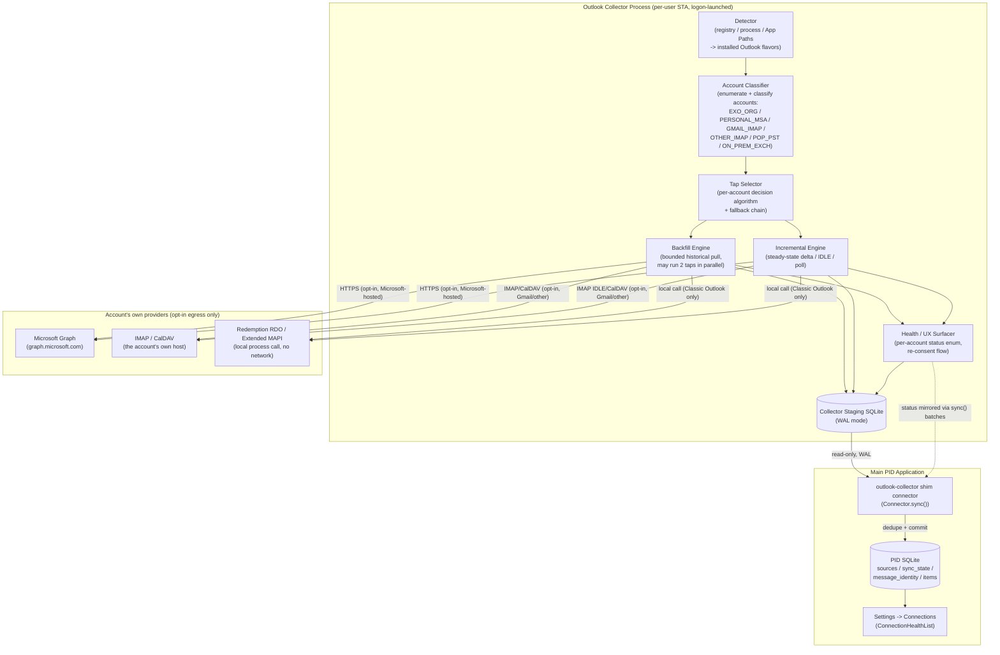
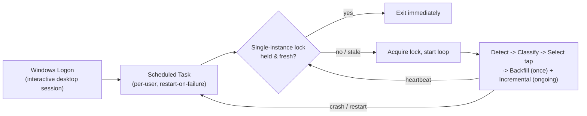
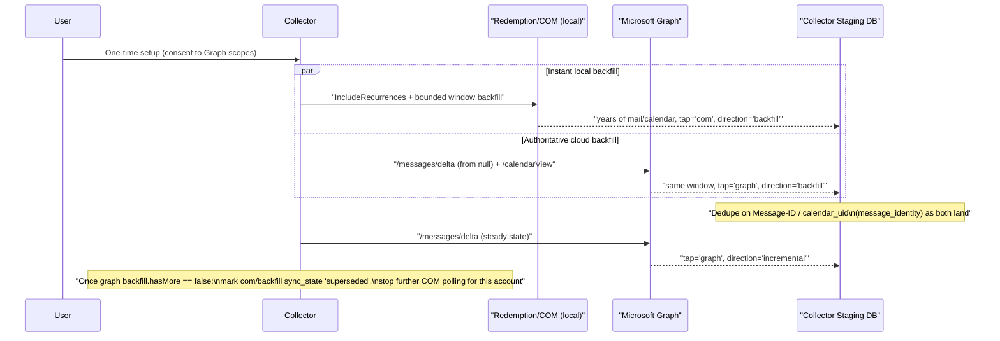
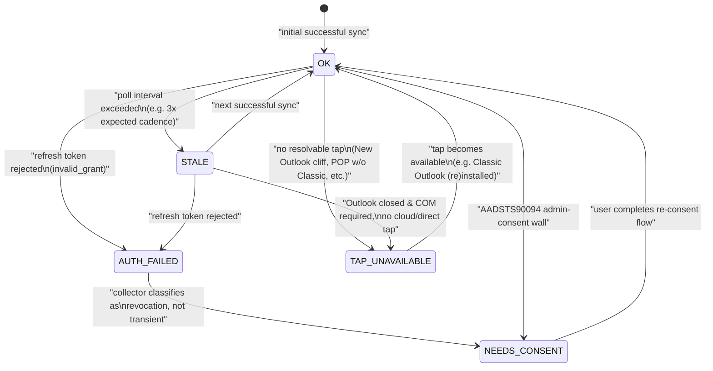

# 15 — Outlook Collector

Related: [README](../README.md) · [System architecture](01-system-architecture.md) ·
[Database schema](02-database-schema.md) · [API integrations](05-api-integrations.md) ·
[Security & privacy model](06-security-privacy-model.md)

## 1. Purpose and scope

Outlook is not one integration — it is `(Outlook flavor) x (account type)`, and the correct way to
read a mailbox differs per cell of that matrix. This document is the full design of the **companion
collector**: the small, per-user process introduced in
[01-system-architecture.md](01-system-architecture.md#the-companion-collector) and summarized in
[05-api-integrations.md](05-api-integrations.md#outlook-email-and-calendar--design-spec-self-configuring-collector)
that owns every part of that problem — detecting what's installed, classifying each configured
account, picking a tap (with fallbacks), running backfill and incremental sync (possibly on
different taps at once), de-duplicating across taps, expanding calendar recurrence uniformly, and
surfacing honest health status instead of ever serving stale data as fresh.

This is a **design document** — pseudocode, schemas, and state machines, not application code.

**Non-negotiables this design is built around** (see [README](../README.md#locked-decisions-canon)):
no mocked data, no manual export/click after one-time account setup, no third-party cloud
middleman or MCP-style broker sitting between the collector and the account's own provider,
unattended and incremental once configured, and every byte of data plus every bit of AI processing
stays on the user's disk and local LM Studio.

**Local-first is defined by where data lands and is processed, not by which wire is read.** A
Microsoft Graph or IMAP call made *by this on-device collector, to the account's own provider* is
compliant — often *more* private than scraping a local app cache — because processing and storage
never leave the machine. See
[06-security-privacy-model.md](06-security-privacy-model.md#egress-and-the-privacy-inversion) for
why this distinction matters concretely for Gmail-under-New-Outlook.

## 2. Architecture overview

The collector runs as a single **per-user, STA (single-threaded apartment), logon-launched**
process — never a SYSTEM service (see [§6](#6-unattended-scheduling-model) for why). It owns its
own local SQLite staging database (WAL mode), separate from the main PID database. The main app's
`outlook-collector` shim connector ([05-api-integrations.md](05-api-integrations.md#the-connector-interface))
opens that staging database read-only and treats new/changed staging rows exactly like any other
connector's `sync()` result — this *is* the "local-only channel (localhost HTTP or IPC)" named in
[01-system-architecture.md](01-system-architecture.md#the-companion-collector): a WAL-mode SQLite
file readable concurrently by a second process on the same machine is the concrete implementation
of that IPC. The collector never writes directly into the main app's database — only the shim
connector's `sync()` call, running inside the main app's own worker, commits into `items`,
`sync_state`, `message_identity`, and `item_external_ids` ([02-database-schema.md](02-database-schema.md)),
so the same crash-safe cursor-persistence contract every other connector gets applies to Outlook
too.

### 2.1 Component diagram



### 2.2 Process model



Only the dotted-equivalent, opt-in HTTPS/IMAP edges above leave the machine, and only for accounts
the user has configured — identical in spirit to the egress rule in
[01-system-architecture.md](01-system-architecture.md#component-diagram). The MAPI edge never
leaves the machine at all.

## 3. Per-account decision algorithm

Detection, classification, and tap selection run once at collector startup and are re-run
periodically (e.g., every 30 minutes, and on any Windows session-unlock event) to catch newly added
accounts, an Outlook flavor being installed/uninstalled, or a policy change (e.g., admin consent
finally granted).

### 3.1 Detect installed flavor(s)

Both flavors can be installed simultaneously in 2026; the algorithm does not assume exclusivity.

```
function detectFlavors() -> Set<OutlookFlavor>:
    flavors = {}

    // New Outlook (olk.exe): sandboxed WinAppSDK/AppX package, no COM surface.
    if AppxPackage("Microsoft.OutlookForWindows") is installed
       or ProcessPath("olk.exe") resolves via Start Menu shortcut:
        flavors.add(NEW_OUTLOOK)

    // Classic Outlook (outlook.exe): traditional MSI/C2R install with a MAPI subsystem.
    if RegistryKey(HKLM, "SOFTWARE\Microsoft\Windows\CurrentVersion\App Paths\OUTLOOK.EXE") exists
       and RegistryKey(HKCU, "Software\Microsoft\Office\<version>\Outlook") exists:
        flavors.add(CLASSIC_OUTLOOK)

    return flavors   // may be {}, {NEW_OUTLOOK}, {CLASSIC_OUTLOOK}, or both
```

### 3.2 Enumerate candidate accounts

New Outlook exposes no enumeration API at all (sandboxed Office.js only) — its accounts are only
discoverable indirectly, via the Windows Account Manager (WAM) broker cache or by asking the user
once during setup. Classic Outlook accounts are enumerable via a MAPI profile logon.

```
function enumerateCandidateAccounts(flavors) -> List<RawAccount>:
    accounts = []

    if CLASSIC_OUTLOOK in flavors:
        // Redemption RDO store logon — NOT raw COM Automation. The Object Model Guard does not
        // police Redemption, so this never triggers a security-prompt dialog and does not depend
        // on antivirus "programmatic access" state. No admin rights required.
        session = Redemption.RDOSession.LogonWithProfile(defaultProfile)   // no prompts
        for store in session.Stores:
            accounts.push(RawAccount{
                source: "mapi", storeId: store.StoreID, displayName: store.DisplayName,
                accountType: store.ExchangeMailboxType,   // "Exchange" | "IMAP" | "POP3" | null
                serverHost: store.ServerName,
            })

    // WAM-cached Microsoft identity accounts (covers both New- and Classic-Outlook-registered
    // Microsoft accounts, since both flavors register into the same OS-level account broker).
    for waAccount in WindowsAccountManager.CachedAccounts(scope: "Mail"):
        accounts.push(RawAccount{ source: "wam", upn: waAccount.upn, tenantId: waAccount.tenantId })

    // Accounts that have no OS-level discovery path at all (a bare Gmail/IMAP/POP account under
    // New Outlook, which never surfaces those credentials to anything outside its sandbox) are
    // added exactly once via the one-time setup wizard — never a recurring manual step afterward.
    accounts.push(...loadUserConfiguredAccounts())   // persisted, not re-prompted

    return dedupeByAddress(accounts)
```

### 3.3 Classify each account

```
enum AccountFlavor { EXO_ORG, PERSONAL_MSA, GMAIL_IMAP, OTHER_IMAP, POP_PST, ON_PREM_EXCH }

function classify(account: RawAccount) -> AccountFlavor:
    if account.accountType == "POP3":
        return POP_PST                      // calendar lives ONLY in the local PST, regardless of mail tap

    if account.accountType == "IMAP":
        if account.serverHost matches /(^|\.)imap\.gmail\.com$/ or account.oauthIssuer == "accounts.google.com":
            return GMAIL_IMAP
        return OTHER_IMAP

    if account.accountType == "Exchange" or account.source == "wam":
        if account.upn ends with "@outlook.com" | "@hotmail.com" | "@live.com"
           and account.tenantId == CONSUMER_TENANT ("9188040d-6c67-4c5b-b112-36a304b66dad"):
            return PERSONAL_MSA

        autodiscoverResult = probeAutodiscover(account.upn)
        if autodiscoverResult.host matches /\.outlook\.office365\.com$/ or /\.outlook\.com$/:
            return EXO_ORG
        else:
            return ON_PREM_EXCH              // on-prem Exchange, hybrid, or unresolvable -> treat as on-prem

    return OTHER_IMAP                        // conservative default; never silently drop an account
```

### 3.4 Choose a tap, with fallbacks

This is the heart of the design. It is evaluated per account, per resource (`mail`, `calendar`),
and re-evaluated on any health-status change (e.g., a `NEEDS_CONSENT` account that gets consent
granted moves back onto Graph automatically on the next evaluation pass).

```
function chooseTap(account: ClassifiedAccount, flavors: Set<OutlookFlavor>) -> TapDecision:

    switch account.flavor:

      case EXO_ORG:
        result = tryGraphAuth(account)                       // auth-code+PKCE loopback or device code
        if result.ok:
            return TapDecision{ mail: GRAPH, calendar: GRAPH, status: OK }
        if result.error == "AADSTS90094":                    // tenant admin-consent wall
            if CLASSIC_OUTLOOK in flavors and hasLiveMapiProfile(account):
                return TapDecision{ mail: COM, calendar: COM, status: OK,
                                     reason: "AADSTS90094 fallback to Classic Outlook COM" }
            return TapDecision{ mail: NONE, calendar: NONE, status: NEEDS_CONSENT,
                                 reason: "Tenant admin consent required for Mail.Read/Calendars.Read" }
        return TapDecision{ mail: NONE, calendar: NONE, status: AUTH_FAILED, reason: result.error }

      case PERSONAL_MSA:
        // Consumer consent is fully self-service — no tenant admin wall is possible here.
        result = tryGraphAuth(account)
        if result.ok: return TapDecision{ mail: GRAPH, calendar: GRAPH, status: OK }
        return TapDecision{ mail: NONE, calendar: NONE, status: AUTH_FAILED, reason: result.error }

      case GMAIL_IMAP:
        // NEVER read via New Outlook's local cache — see the privacy-inversion note in §9 and
        // docs/06. Always tap Google directly.
        imap = tryImapAuth(account, preferOAuth: true, fallback: "app_password")
        if not imap.ok: return TapDecision{ mail: NONE, calendar: NONE, status: AUTH_FAILED, reason: imap.error }
        calDav = probeCalDav(account)                        // Google CalDAV endpoint
        return TapDecision{ mail: IMAP, calendar: calDav.found ? CALDAV : NONE, status: OK }

      case OTHER_IMAP:
        imap = tryImapAuth(account, preferOAuth: true, fallback: "app_password")
        if not imap.ok: return TapDecision{ mail: NONE, calendar: NONE, status: AUTH_FAILED, reason: imap.error }
        calDav = probeCalDav(account)                        // provider-dependent; may not exist
        return TapDecision{ mail: IMAP, calendar: calDav.found ? CALDAV : NONE, status: OK,
                             reason: calDav.found ? null : "No CalDAV discovered; mail only" }

      case POP_PST:
        // Structurally necessary, not merely preferred: POP has no cloud calendar tap at all.
        if CLASSIC_OUTLOOK not in flavors or not hasLiveMapiProfile(account):
            return TapDecision{ mail: NONE, calendar: NONE, status: TAP_UNAVAILABLE,
                                 reason: "POP account requires Classic Outlook (COM); none available" }
        return TapDecision{ mail: COM, calendar: COM, status: OK, mandatory: true }

      case ON_PREM_EXCH:
        hybrid = tryGraphAuth(account)                        // works if hybrid modern auth is configured
        if hybrid.ok: return TapDecision{ mail: GRAPH, calendar: GRAPH, status: OK }
        onPremEws = probeOnPremEws(account)                   // on-prem EWS is NOT sunsetting; EXO EWS is
        if onPremEws.reachable: return TapDecision{ mail: EWS_ONPREM, calendar: EWS_ONPREM, status: OK }
        if CLASSIC_OUTLOOK in flavors and hasLiveMapiProfile(account):
            return TapDecision{ mail: COM, calendar: COM, status: OK }
        return TapDecision{ mail: NONE, calendar: NONE, status: TAP_UNAVAILABLE,
                             reason: "No Graph hybrid, no on-prem EWS, no Classic Outlook profile" }

    // Cross-cutting New Outlook overlay, applied to every branch above: COM is categorically
    // impossible when the account is only reachable via a New-Outlook-only install (New Outlook
    // does not run a MAPI store; there is nothing for Redemption to log into).
    if chosen.tap == COM and CLASSIC_OUTLOOK not in flavors:
        return TapDecision{ mail: NONE, calendar: NONE, status: TAP_UNAVAILABLE,
                             reason: "Account only resolvable via COM, but Classic Outlook is not installed" }
```

### 3.5 Redemption (COM) vs. Graph — when each wins

| | **Graph wins when** | **Redemption/COM wins when** |
|---|---|---|
| Consent | Consumer account, or org account with admin consent already granted | Org account hit `AADSTS90094` **and** Classic Outlook has a live profile for it |
| Account type | `EXO_ORG`, `PERSONAL_MSA`, hybrid `ON_PREM_EXCH` | `POP_PST` (structurally the *only* option — calendar exists only in the local PST) |
| Outlook install state | Works even with **no** Outlook client installed at all | Requires Classic Outlook installed **and running** (or launchable) with a loaded MAPI profile |
| Resilience to Outlook's decline | Unaffected by New Outlook migration or Classic's eventual retirement (~2029) | A **legacy fallback**: Classic's support horizon is finite (enterprise opt-out through Mar 2027) |
| Backfill speed | Rate-limited by Graph throttling for years of history | Instant — the mail is already on local disk in the OST/PST |
| Network requirement | Needs connectivity to `graph.microsoft.com` | Zero network egress — a local process call |
| Steady state | Preferred: DPAPI-sealed refresh token survives unattended for months | Not preferred long-term; used to bridge until Graph consent is resolved, or permanently for POP |

Graph is the **strategic primary** for every Microsoft-hosted account; COM is deliberately never
the first choice — only a fallback triggered by a specific, detectable condition (`AADSTS90094`,
POP's structural requirement, or on-prem reachability failure).

## 4. Backfill vs. incremental: taps can differ

Backfill (bulk historical pull) and incremental (steady-state delta) sync are independent
`sync_state` rows — same `source_id`/`resource`, different `tap`/`direction` — and are allowed to
run on **different taps at once**. This is the mechanism that lets a brand-new Classic-Outlook
account get years of history on disk *instantly* while a slower, authoritative cloud backfill and a
live delta feed both run in the background.

### 4.1 Example: a new `EXO_ORG` account on a machine with Classic Outlook installed



### 4.2 Merge and switch-over algorithm

```
function runDualTapBackfill(account, tapDecision):
    if tapDecision.mail == GRAPH and CLASSIC_OUTLOOK available and hasLiveMapiProfile(account):
        // Fire both backfills concurrently; each owns its own sync_state row.
        startBackfill(account, tap: COM,   direction: backfill, resource: mail)      // fast, local
        startBackfill(account, tap: GRAPH, direction: backfill, resource: mail)      // authoritative
    else:
        startBackfill(account, tap: tapDecision.mail, direction: backfill, resource: mail)

    // Steady state always starts immediately on the chosen primary tap — it does not wait for
    // backfill to finish, so nothing arriving after setup is ever missed.
    startIncremental(account, tap: tapDecision.mail, direction: incremental, resource: mail)

function onBackfillBatchCommitted(account, tap, batch):
    for item in batch.items:
        canonicalKey = item.messageId or normalizedContentHash(item)     // see §5
        existing = messageIdentity.lookup(canonicalKey)
        if existing == null:
            canonicalItem = createItem(item)
            messageIdentity.insert(canonicalKey, canonicalItem.id, firstSeenTap: tap)
        else:
            // Same physical email already landed via the other tap — do not create a duplicate
            // items row; just record that this tap has also seen it.
            messageIdentity.appendSeenTap(canonicalKey, tap)
            itemExternalIds.upsert(existing.canonical_item_id, tap, item.externalId, item.rawIdentifiers)

function onBackfillComplete(account, tap):
    if tap == COM and a GRAPH backfill for the same (source_id, resource) also completed or is >90%
       through its own window:
        sync_state.update(source_id, resource, tap: COM, direction: backfill, status: 'superseded')
        stop scheduling further COM backfill polls for this account
        // COM incremental was never started for this account in the first place — Graph is already
        // steady-state from the moment setup finished (§4.2's startIncremental call above).
```

The COM backfill exists purely to shorten the "time to a useful knowledge graph" — it is discarded
(marked `superseded`, not deleted; its `items` rows remain, now owned by the canonical dedupe key)
the moment the authoritative Graph backfill catches up, so Graph is always what steady-state history
ultimately reconciles against.

## 5. Identity and watermark handling

### 5.1 Per-tap native identifiers

| Tap | Native identifier | Stability caveat |
|---|---|---|
| Graph | `id` (message/event resource id) | Stable within Graph, but not comparable across tenants/accounts; store alongside `internetMessageId` for the email case |
| IMAP | `UIDVALIDITY` + `UID` + `MODSEQ` | `UID` is only valid for a given `UIDVALIDITY`; a `UIDVALIDITY` change (rare, e.g. mailbox rebuild) invalidates all previously stored UIDs for that folder and forces a resync of that folder |
| MAPI (Redemption) | `EntryID` + `StoreID` | `EntryID` can change when an item moves between folders in the same store or after store compaction; `PR_SEARCH_KEY` is stored alongside as a more move-resistant secondary identifier |

None of these are comparable across taps — a Graph `id` and a MAPI `EntryID` for the *same physical
email* share no native identifier. That is exactly why a tap-agnostic canonical key is required.

### 5.2 Canonical cross-tap key

- **Primary:** the RFC 5322 `Message-ID` header (email) or the iCalendar `UID` (calendar,
  `events.calendar_uid` in [02-database-schema.md](02-database-schema.md#domain-tables)).
- **Fallback:** a normalized content hash — `sha256(normalize(from) + normalize(to) + subject +
  floor(sentAt, 1 minute) + sha256(bodyText))` — used only when `Message-ID` is missing or
  malformed (some internal Exchange system messages, and a minority of IMAP servers strip or
  rewrite it). The fallback hash is intentionally coarser than `items.content_hash` (which drives
  change detection) because its job is cross-tap *identity*, not change detection.

### 5.3 Canonical schemas (main PID database — authoritative, from docs/02)

These are **not new tables** — they are the exact `sync_state`, `message_identity`, and
`item_external_ids` DDL already defined in
[02-database-schema.md](02-database-schema.md#app-tables), reproduced here only to make this
document's algorithms self-contained. The Outlook collector is the primary reason these tables
exist in that shape (`tap` and `direction` as first-class dimensions of the sync cursor); any
Outlook-specific values below are legal enum members within schemas shared by every connector.

```sql
-- One row per (source, resource, tap, direction) — the mechanism that lets COM backfill and
-- Graph backfill and Graph incremental all track independent cursors for one Outlook account.
CREATE TABLE sync_state (
    id               INTEGER PRIMARY KEY AUTOINCREMENT,
    source_id        TEXT NOT NULL REFERENCES sources(id) ON DELETE CASCADE,
    resource         TEXT NOT NULL,     -- 'mail' | 'calendar' for Outlook
    tap              TEXT NOT NULL,     -- 'graph' | 'imap' | 'com' (Outlook's legal tap values)
    direction        TEXT NOT NULL DEFAULT 'incremental',   -- 'backfill' | 'incremental'
    cursor_type      TEXT,               -- 'delta_link' (Graph) | 'uidvalidity_uid_modseq' (IMAP) | 'watermark' (COM)
    cursor_value     TEXT,
    status           TEXT NOT NULL DEFAULT 'ok',   -- ok|stale|auth_failed|needs_consent|tap_unavailable
    status_reason    TEXT,
    last_attempt_at  INTEGER,
    last_success_at  INTEGER,
    created_at       INTEGER NOT NULL,
    updated_at       INTEGER NOT NULL,
    UNIQUE (source_id, resource, tap, direction)
);

-- Cross-tap dedupe. message_id is the RFC 5322 Message-ID (email) OR the iCalendar UID (calendar,
-- mirrored here even though calendar's own uniqueness also lives in events.calendar_uid, so a
-- single canonical-identity table covers both resource types the same way).
CREATE TABLE message_identity (
    message_id            TEXT PRIMARY KEY,
    canonical_item_id     TEXT NOT NULL REFERENCES items(id) ON DELETE CASCADE,
    content_hash          TEXT NOT NULL,   -- fallback identity when Message-ID is missing/malformed
    first_seen_tap        TEXT NOT NULL,
    first_seen_source_id  TEXT REFERENCES sources(id),
    seen_taps             TEXT NOT NULL DEFAULT '[]',  -- JSON string[]; e.g. '["com","graph"]'
    created_at            INTEGER NOT NULL,
    updated_at            INTEGER NOT NULL
);

-- Every native id, from every tap, that has ever resolved to this item — the audit trail behind
-- message_identity's collapse-to-one-row behavior.
CREATE TABLE item_external_ids (
    id               INTEGER PRIMARY KEY AUTOINCREMENT,
    item_id          TEXT NOT NULL REFERENCES items(id) ON DELETE CASCADE,
    source_id        TEXT NOT NULL REFERENCES sources(id) ON DELETE CASCADE,
    tap              TEXT NOT NULL,     -- 'graph' | 'imap' | 'com'
    external_id      TEXT NOT NULL,
    raw_identifiers  TEXT,   -- JSON: {"uidvalidity":.,"uid":.,"modseq":.} or {"entryId":.,"storeId":.,"searchKey":.}
    first_seen_at    INTEGER NOT NULL,
    last_seen_at     INTEGER NOT NULL,
    UNIQUE (source_id, tap, external_id)
);
```

### 5.4 Collector-local staging schema

This is an **implementation-internal** schema owned exclusively by the collector process (single
writer), never queried directly by the main app. Its job is (a) to let the collector resume cleanly
across its own crashes without re-hitting a provider for data it already fetched, and (b) to
pre-dedupe across its own concurrent taps before the handoff, so the main app's `sync()` call sees
a clean incremental batch rather than raw duplicate provider payloads.

```sql
-- Mirrors sync_state's shape locally, one row per (account, resource, tap, direction) — the
-- collector's own watermark, kept in step with (but distinct from) the main app's sync_state row
-- for the same tuple, since a shim-connector sync() batch may only partially commit before a crash.
CREATE TABLE collector_sync_state (
    account_id    TEXT NOT NULL,
    resource      TEXT NOT NULL,
    tap           TEXT NOT NULL,
    direction     TEXT NOT NULL,
    cursor_type   TEXT,
    cursor_value  TEXT,
    updated_at    INTEGER NOT NULL,
    PRIMARY KEY (account_id, resource, tap, direction)
);

-- Normalized rows waiting to be picked up by the shim connector's next sync() call. Cleared once
-- the main app's sync_state.cursor_value has advanced past a row's handoff_seq.
CREATE TABLE collector_staging_items (
    handoff_seq    INTEGER PRIMARY KEY AUTOINCREMENT,
    account_id     TEXT NOT NULL,
    canonical_key  TEXT NOT NULL,     -- Message-ID / calendar_uid, or content-hash fallback (see 5.2)
    tap            TEXT NOT NULL,
    external_id    TEXT NOT NULL,
    raw_identifiers TEXT,             -- JSON, same shape as item_external_ids.raw_identifiers
    normalized_item TEXT NOT NULL,    -- JSON, matches the NormalizedItem shape (docs/05)
    is_deleted     INTEGER NOT NULL DEFAULT 0,
    staged_at      INTEGER NOT NULL
);
CREATE INDEX collector_staging_canonical_idx ON collector_staging_items(canonical_key);

-- Local pre-dedupe mirror of message_identity, scoped to this collector instance only — lets two
-- taps racing inside the SAME collector process (e.g. §4's dual backfill) collapse to one staged
-- row before the handoff, rather than relying solely on the main app to do it after the fact.
CREATE TABLE collector_message_identity (
    canonical_key   TEXT PRIMARY KEY,
    handoff_seq     INTEGER NOT NULL REFERENCES collector_staging_items(handoff_seq),
    seen_taps       TEXT NOT NULL DEFAULT '[]'
);

-- Per-account health, mirrored into sources.status / sync_state.status by the shim connector on
-- every sync() call (see §7).
CREATE TABLE collector_account_health (
    account_id       TEXT PRIMARY KEY,
    resource         TEXT NOT NULL,
    status           TEXT NOT NULL,   -- ok|stale|auth_failed|needs_consent|tap_unavailable
    status_reason    TEXT,
    last_success_at  INTEGER,
    updated_at       INTEGER NOT NULL
);
```

### 5.5 Calendar recurrence per tap

All three taps must converge on the same storage shape defined in
[02-database-schema.md](02-database-schema.md#domain-tables): a recurrence **master** row
(`events.recurrence_rule` = an RFC 5545 `RRULE` string, `recurrence_master_item_id` = `NULL`) plus
bounded, windowed **instance** rows (`recurrence_master_item_id` pointing at the master,
`recurrence_rule` = `NULL`, each with its own `calendar_uid`).

| Tap | How recurrence is obtained |
|---|---|
| **Graph** | `/calendarView` with a bounded `startDateTime`/`endDateTime` window (rolling, e.g. -90/+365 days) performs **server-side expansion** — each returned instance carries `seriesMasterId`. The master itself (with its `recurrence` pattern/range object) is fetched separately via `/events/{seriesMasterId}` and translated deterministically into an `RRULE` string for storage. **Known bug to guard against:** the `/calendarView/delta` pagination has a documented dedupe issue where an instance whose start time lands exactly on a page boundary can be returned twice across `@odata.nextLink` pages — the collector never trusts delta-page uniqueness alone; it upserts on `(seriesMasterId, occurrence start)` so a repeat within one poll cycle is a no-op. |
| **COM (Redemption)** | `RDOFolder.Items` with `IncludeRecurrences = true`, but only after `Sort("[Start]")` and a bounded `Restrict("[Start] >= ? AND [Start] <= ?")` — Redemption requires the collection be sorted by start date first for `IncludeRecurrences` expansion to behave reliably. The master's pattern comes from `RDOAppointmentItem.GetRecurrencePattern()` (interval, day-of-week mask, start/end/no-end, exception list), translated to `RRULE`; each exception in the pattern becomes its own windowed instance row exactly like a Graph exception instance. |
| **IMAP + CalDAV** | A CalDAV `calendar-query` `REPORT` returns raw `VEVENT` components including the `RRULE` directly — no server-side expansion. The collector performs its **own** bounded expansion (an RRULE library, same rolling window as the Graph case) so all three taps still produce the uniform master-plus-instances shape regardless of source-side expansion semantics. |

## 6. Unattended/scheduling model

### 6.1 Launch and lifecycle

- **Trigger:** Windows Scheduled Task, "At log on" of the specific user SID — not "at system
  startup," so the task only ever runs inside a real interactive desktop session.
- **Run context:** standard user, **no** "Run with highest privileges" — Redemption's store logon
  needs no admin rights, and requesting elevation would trigger a UAC prompt on every logon,
  breaking the "unattended" requirement outright.
- **"Run whether user is logged on or not" is deliberately NOT used** — that setting runs the task
  under a batch logon with no interactive desktop, which breaks COM/MAPI (see §6.3).
- **Restart policy:** restart on failure, e.g. 3 attempts at 1-minute intervals, then fall back to a
  daily retry — so a transient crash self-heals within minutes, but a persistently broken
  environment doesn't spin.

### 6.2 Single-instance lock

A named OS mutex (or, equivalently, a lock row in `collector_sync_state`'s database with a
heartbeat timestamp) prevents duplicate collector instances — relevant on fast user switching,
manual re-logon, or a lingering process from a previous session.

```
function acquireSingleInstanceLock():
    lock = readLockFile()
    if lock exists and (now - lock.heartbeat_at) < LOCK_STALE_THRESHOLD (e.g. 90s):
        exit(0)   // another healthy instance is already running
    writeLockFile({ pid: currentPid, heartbeat_at: now })
    startHeartbeatTimer(interval: 30s)   // refreshes heartbeat_at; a crash simply stops refreshing it
```

### 6.3 Why not a SYSTEM service

COM/MAPI automation and Redemption's store logon require the **interactive desktop** and a loaded,
per-user **MAPI profile**. A Session-0-isolated SYSTEM service (the Windows security boundary in
place since Vista) has no interactive desktop, cannot unseal the user's DPAPI-protected refresh
tokens (DPAPI user-scoped keys are tied to the logged-on user's security context, not `SYSTEM`), and
has no MAPI profile to log into at all. Running as a service would work for the Graph and IMAP taps
in isolation, but would silently and permanently break the COM fallback the whole POP/AADSTS90094
design depends on — so the collector is a per-user logon-launched process across the board, for one
consistent process model rather than two.

### 6.4 Poll cadences and backoff

| Tap | Cadence | Mechanism |
|---|---|---|
| Graph (mail + calendar) | 1–5 min, default 2 min | Poll `/messages/delta` / `/calendarView/delta` (no webhooks — see §9) |
| IMAP | Push | `IDLE`, re-issued every ~29 min per RFC 2177's server timeout; `CONDSTORE` (`MODSEQ`) drives the reconciliation poll if IDLE drops |
| CalDAV | 15 min | No push standard; plain poll |
| COM/Redemption | 5 min, default | No push wired into this design's baseline (Redemption does expose `RDOStore`-level `Advise` notifications as a future optimization, not required for correctness) |

Backoff: exponential with jitter on transient errors (network unreachable, HTTP 429/503), capped at
a maximum interval (e.g. 30 minutes), reset to the base cadence on the next success.
`AUTH_FAILED`/`NEEDS_CONSENT` accounts are excluded from the backoff loop entirely — they stop
being polled until the user re-consents (see §7), so a dead token never spins forever.

## 7. Degrade-loudly UX

### 7.1 Health state machine

Exactly the `status` enum already defined on `sources` and `sync_state` in
[02-database-schema.md](02-database-schema.md#core-tables): `ok | stale | auth_failed |
needs_consent | tap_unavailable`. Every account carries `last_success_at` and a human-readable
`status_reason` at all times — there is no "silent" state.



### 7.2 Re-consent flow

```
function onAuthRejected(account, error):
    if error is transient (network, 5xx):
        sync_state.update(status: 'stale', status_reason: error.message)   // keep retrying with backoff
        return

    // invalid_grant / revoked refresh token — this will never self-heal by retrying.
    sync_state.update(status: 'needs_consent', status_reason: "Sign-in expired; reconnect required")
    stop polling this (account, resource, tap) until the user acts
    surface in Settings -> Connections: action = "Reconnect"

function onUserClicksReconnect(account):
    result = runAuthCodePkceLoopback(account.scopes)   // same one-time flow as initial setup
    if result.ok:
        sealToken(result.refreshToken)   // DPAPI / Windows Credential Manager, see §8
        sync_state.update(status: 'ok', status_reason: null)
        resume polling from the LAST DURABLE cursor — never forces a fresh backfill
    else:
        sync_state.update(status: 'needs_consent', status_reason: result.error)
```

### 7.3 Explicit messaging for the two named cliffs

- **`AADSTS90094` (tenant admin-consent wall):** surfaced distinctly from a generic auth failure —
  *"Your organization hasn't approved PID's mail/calendar access. Ask your admin to grant consent,
  or we'll read via Outlook desktop (Classic) instead if it's installed."* — with a "Copy admin
  consent URL" action. If Classic Outlook is installed, the account silently (from the user's
  perspective — but fully logged in `status_reason`) continues on the COM fallback while still
  showing this message, since the fallback is itself a degraded, legacy path worth surfacing.
- **New Outlook cliff:** when an account resolves to `TAP_UNAVAILABLE` specifically because it is
  only reachable via New Outlook and has no cloud/direct tap (e.g. an on-prem account with no Graph
  hybrid and no on-prem EWS, on a machine with only New Outlook installed) — *"This account's mail
  and calendar can't be read locally: New Outlook doesn't expose a local mailbox API. Connect via
  Microsoft Graph or direct IMAP if this account supports it, or install Classic Outlook for
  fallback access."* This is never silently retried forever; it is a terminal status until the
  environment changes.

### 7.4 Never serve stale data as fresh

Every dashboard section consuming Outlook-sourced `items` reads the owning `sources.status` /
`sync_state.status` alongside the data (per the shared convention in
[01-system-architecture.md](01-system-architecture.md#dashboard-sections-mapped-to-services)) and
renders a staleness badge whenever status is not `ok`, or `last_success_at` is older than roughly
twice the tap's expected cadence — even if the underlying `items` rows themselves look complete.
This mirrors the "degrade loudly" rule already stated for every connector in
[05-api-integrations.md](05-api-integrations.md#rate-limiting-backoff-and-error-handling).

## 8. Security and privacy

### 8.1 Token storage

Every OAuth refresh token (Graph, IMAP OAuth) is sealed via **DPAPI / Windows Credential Manager**
— never written to `sources.config`, the collector's staging database, or any log file, per the
platform-secrets table in
[06-security-privacy-model.md](06-security-privacy-model.md#secrets-handling). The collector holds
only an opaque account reference; the OS resolves it back to the secret at call time, scoped to the
logged-in user's account — so a copied SQLite file (staging or main) is never sufficient on its own
to authenticate as the user. This is what makes months-long unattended sync possible without a
re-prompt.

### 8.2 Egress-per-account-tap ledger (Outlook-scoped detail)

This is the detailed, Outlook-specific version of the ledger summarized in
[06-security-privacy-model.md](06-security-privacy-model.md#egress-per-account-tap-ledger):

| Account flavor | Tap | Endpoint contacted | What leaves the PC |
|---|---|---|---|
| `EXO_ORG` / `PERSONAL_MSA` | Graph | `graph.microsoft.com` | Mail/calendar delta requests only — Microsoft, the account's own host |
| `EXO_ORG` (AADSTS90094 fallback) | COM/Redemption | None | Nothing — local process call to the running Classic Outlook client |
| `GMAIL_IMAP` | IMAP + CalDAV | `imap.gmail.com` / Google's CalDAV endpoint | IMAP/CalDAV traffic to Google directly — **never** routed through Microsoft |
| `OTHER_IMAP` | IMAP (+ CalDAV) | The provider's own host | Standard mail-client protocol traffic to that provider only |
| `POP_PST` | COM/Redemption | None | Nothing — no network egress for this tap at all |
| `ON_PREM_EXCH` (hybrid) | Graph | `graph.microsoft.com` | Same as above, via hybrid modern auth |
| `ON_PREM_EXCH` (no hybrid) | EWS (on-prem only) | The org's own on-prem Exchange host | Standard EWS traffic to infrastructure the org already operates |
| `ON_PREM_EXCH` (no hybrid, no EWS) | COM/Redemption | None | Nothing |

### 8.3 The New-Outlook-routes-Gmail privacy inversion

New Outlook's own Gmail/IMAP support works by proxying the account's mail through a
Microsoft-operated backend. A collector that ingested Gmail by reading New Outlook's local state
would therefore be **laundering Google mail content through Microsoft's cloud** — worse than simply
speaking IMAP to Google directly. This is precisely why §3.4's `GMAIL_IMAP` branch never considers a
New-Outlook-adjacent tap under any fallback condition; it is a hard rule, not a preference. Full
discussion: [06-security-privacy-model.md](06-security-privacy-model.md#egress-and-the-privacy-inversion).

## 9. What we deliberately do NOT do

- **Do not build cloud ingestion on EWS.** Exchange Online default-disables EWS October 1, 2026 and
  shuts it down entirely April 1, 2027. On-prem EWS is unaffected and remains a legitimate fallback
  for `ON_PREM_EXCH` only.
- **Do not read New Outlook's EBWebView local cache.** ~7-day retention, undocumented and
  schema-drifting between builds, and single-process-locked — not a durable or safe source under
  any circumstance.
- **Do not use raw COM Automation against the Object Model Guard.** Always Redemption RDO /
  Extended MAPI store logon, which the Guard does not police — no security prompts, no dependence
  on antivirus "programmatic access" state, no admin rights.
- **Do not run as a Session-0 SYSTEM service.** COM/MAPI needs the interactive desktop and a
  per-user DPAPI context that a SYSTEM service structurally cannot have (§6.3).
- **Do not use VSS as the baseline read path.** VSS snapshot + `libpff` offline parsing is reserved
  strictly for the narrow case of an orphaned or offline PST/OST when Outlook cannot be logged into
  at all — a one-shot degraded backfill, never the steady-state mechanism.
- **Do not use webhooks/push subscriptions for Graph or Teams.** PID runs no public HTTPS endpoint
  for any account, ever, so Graph/Teams subscriptions (which require one) are architecturally out
  regardless of convenience — polling is the only option and is treated as such from day one.
- **Do not scrape the `.ost`/`.pst` file directly as a "simple" shortcut.** The whole point of this
  design is that "Outlook ingestion" is a tap-selection problem across six account flavors and two
  client flavors — naive file scraping is exactly the failure mode this document exists to avoid.
- **Do not require any manual export or click once setup is complete.** Backfill, incremental sync,
  recurrence expansion, and cross-tap dedupe are all unattended; only the one-time
  auth-code+PKCE/device-code consent (and IMAP app-password entry where OAuth isn't available) is
  ever user-initiated.
- **Do not route any account through a third-party cloud middleman or MCP-style broker.** Every tap
  in §3.4 talks directly to the account's own provider (or nothing at all, for COM) — there is no
  PID-operated or third-party relay anywhere in this design.

## 10. Cross-references

- [01-system-architecture.md](01-system-architecture.md#the-companion-collector) — where the
  collector sits in the overall system, and the local-only-channel contract with the Connector
  Manager.
- [02-database-schema.md](02-database-schema.md#app-tables) — canonical DDL for `sync_state`,
  `message_identity`, and `item_external_ids`, reproduced in §5.3 for self-containedness.
- [05-api-integrations.md](05-api-integrations.md#outlook-email-and-calendar--design-spec-self-configuring-collector) —
  the `Connector`/`NormalizedItem`/`ConnectorError` contracts the `outlook-collector` shim connector
  implements, and the summarized tap-precedence rules this document expands in full.
- [06-security-privacy-model.md](06-security-privacy-model.md#egress-and-the-privacy-inversion) —
  the threat model, secrets handling, and the general-purpose egress ledger this document's §8.2
  specializes for Outlook accounts.
